**Code Authors**: Mark E. Pepin, MD, PhD, MS **Contact**:
[pepinme\@gmail.com](mailto:mepepin@bwh.harvard.edu){.email}\
**Institution**: Brigham and Women's Hospital, Harvard Medical School\
**Location**: Boston, MA

## Parameters

Define the parameters used, along with the conditions required for the current analysis. This segment must be modified for each analysis performed.


```r
##Set the experimental conditions [MUST DO THIS MANUALLY]
ETIOLOGY=c("CON","HFpEF")
# LOCATION=c("Frederico", "CON")
BATCH=c("p8202022")
SEX=c("M", "F")
STATISTIC = 0.05 #P statistic threshold used in this combination.
COMPARISON= paste0(ETIOLOGY[2], ".vs.", ETIOLOGY[1], "_", BATCH[1]) # p8202022 p8032022 p27052022 

# Candidate Gene Selection (RNA-sequencing) EDIT THIS LIST BASED ON INTERESTS.
GENES=c("DNMT3A", "DNMT3B", "TET1", "TET3","GADD45B", "GADD45G")
VAR1="Etiology"

# Create the countData (Input to DESeq2)
colData_all<-openxlsx::read.xlsx("../1_Input/colData_3.xlsx")
colData_all$Etiology<-factor(colData_all$Etiology, levels = c("CON", "HFrEF", "HFimpEF", "HFmrEF", "HFpEF"))
colData_all<-dplyr::filter(colData_all, Sample_ID!="")
colData_all<-colData_all[!is.na(colData_all$Sample_ID),]
#Select the patient characteristics needed for the current comparison.
colData<-dplyr::filter(colData_all, Etiology %in% ETIOLOGY) %>% dplyr::select(Sample_ID, Etiology, Gender, Age)
# colData$Response<-factor(colData$Response, levels = c("CON", "NR", "R"))
colData$Etiology<-factor(colData$Etiology, levels = c("CON", "HFrEF", "HFimpEF", "HFmrEF", "HFpEF"))
colData$Sample_ID<-as.character(colData$Sample_ID)

# Create Output Folder Structure
ifelse(!dir.exists(file.path(paste0("../2_Output/"))), dir.create(file.path(paste0("../2_Output/"))), FALSE)
```

```
## [1] FALSE
```

## Packages


```r
if (!require("pacman")) install.packages("pacman")
pacman::p_load(dplyr, Hmisc, openxlsx, corrplot, RColorBrewer, kableExtra, ggplot2, gridExtra, ggpubr, ggsignif, DESeq2, data.table, GenomicFeatures, biomaRt, Haplin, pheatmap, calibrate, ggrepel, tidyr, gtools)
```

# Whole-Genome Bisulfite Sequencing (WGBS) Analysis

## Genome Assembly and Alignment

The first task is to align the bisulfite reduced and sequenced reads to
a genome assembly. To accomplish this, I prepared the genome assembly
based on Gencode annotation (gencode.v28.annotation.gtf) and sequence
(GRCh38.p12.genome.fa). For whole-genome bisulfite sequencing via the
Bismark (v0.20.0) aligner and genome preparation, a CT- and GA-converted
assemblies are created.

### Genome Assembly

`./bismark_genome_preparation --path_to_bowtie ../bowtie2-2.3.4.2-linux-x86_64 -- verbose ../../Input/Genome/GRCh38.p12.genome.fa`

### Adapter Trimming

Once the genome assembly was created, adapter sequences were trimmed and
sequencing quality assessed via trim_galore and FastQC, respectively.

`module load SAMtools/1.6-intel-2017a`
`module load Bowtie2/2.3.3-intel-2017a`
`module load Trim_Galore/0.4.4-foss-2016b`
`module load FastQC/0.11.7-Java-1.8.0_74`

`trim_galore -o $INPUT_DIR/fastq_trimmed/ --paired --rrbs --non_directional --length 20 --fastqc`
`$INPUT_DIR/fastq/${VAR}_1.txt.gz $INPUT_DIR/fastq/${VAR}_2.txt.gz`

### Read Alignment

We then aligned all 34 paired-end .fastq files to the genome assemblies
using the following command:

`$BISMARK/bismark \` `--bowtie2 --bam $GENOME_DIR \`
`-1 $INPUT_DIR/fastq_trimmed/${VAR}_1.txt.gz_val_1.fq.gz -2 $INPUT_DIR/fastq_trimmed/${VAR}_2.txt.gz_val_2.fq.gz \`
`--output_dir $RESULTS_DIR/WGBS`

### Deduplication

Once aligned, we need to "deduplicate" the aligned .bam files to reduce
PCR bias.

`$BISMARK/deduplicate_bismark \`
`--output_dir $RESULTS_DIR/WGBS/deduplicate_bismark \` `--bam -p \`
`$RESULTS_DIR/WGBS/${VAR}_1.txt.gz_val_1_bismark_bt2_pe.bam`

### Methylation Extraction

Once finished, the CpG methylation was extracted as both bedgraph file
(for UCSC genome browser) and bed file, which was then used to identify
differentially-methylated cytosines (DMCs) and differentially-methylated
regions (DMRs).

`$BISMARK/bismark_methylation_extractor \`
`-p --no_overlap --report --bedGraph --gzip \`
`$RESULTS_DIR/WGBS/deduplicate_bismark/${VAR}_1.txt.gz_val_1_bismark_bt2_pe.deduplicated.bam`

The "bismark.cov" files that resulted from this were then read into R ()
and combined into a single "object" for differential methylation
analysis

## Differential Methylation Analysis

### Combining sample methylation


```r
library(openxlsx)
library(methylKit)
library(dplyr)
files.vector <- list.files(path = "../1_Input/RRBS", pattern = "*.cov", full.names = TRUE, all.files = TRUE)
#Generate Column names (remove the extra nonsense from the path names)
colnames <- gsub( "*_R1_001_val_1_bismark_bt2_pe.bismark.cov", "", files.vector) # delete generic areas
colnames <- gsub( paste0("[.][.]/1_Input/RRBS/"), "", colnames) # Delete path from name
colnames<-gsub("\\_.*","",colnames) # delete all characters after "_"
sample_id<-as.list(colnames)
# Index.raw$Sex<-factor(Index.raw$Sex, levels = c("M", "F"))
## Sort the index according to the .bed file ordering (as imported).
Index_sorted<-subset(colData_all, Sample_ID %in% colnames)
Test<-setdiff(colnames,Index_sorted$Sample_ID)
Index_filtered<-subset(Index_sorted, Etiology %in% ETIOLOGY & Batch %in% BATCH)
Index_filtered<-Index_filtered[order(Index_filtered$Sample_ID),]
meth_names<-as.list(Index_filtered$Sample_ID)
##Create a methlRawlistDB
file.list<-as.list(unique(grep(paste(paste0(colData$Sample_ID, "_"), collapse="|"),
  files.vector, value=TRUE)))
myobj<-methRead(location = file.list, sample.id = as.list(colData$Sample_ID), assembly = "hg38", treatment=colData$Etiology, pipeline = "bismarkCoverage", header = FALSE, context = "CpG")
myobj_filtered<-methylKit::reorganize(myobj, sample.ids = Index_filtered$Sample_ID, treatment = Index_filtered$Etiology)
############ Methylation Stats
library(graphics)
getMethylationStats(myobj_filtered[[2]], plot = T, both.strands = F)
```

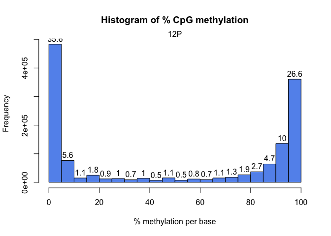<!-- -->

```r
getCoverageStats(myobj_filtered[[2]], plot = T, both.strands = F)
```

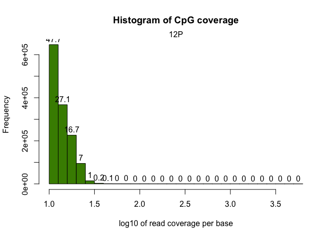<!-- -->

```r
#Save these files in an output folder
ifelse(!dir.exists(file.path("../2_Output/", COMPARISON)), dir.create(file.path("../2_Output/", COMPARISON)), FALSE)
```

```
## [1] FALSE
```

```r
pdf(file=paste0("../2_Output/", COMPARISON, "/", COMPARISON, "_Methylation.Stats.pdf"))
getMethylationStats(myobj_filtered[[2]], plot = T, both.strands = F)
dev.off()
```

```
## quartz_off_screen 
##                 2
```

```r
pdf(file=paste0("../2_Output/", COMPARISON, "/", COMPARISON, "_Coverage.Stats.pdf"))
getCoverageStats(myobj_filtered[[2]], plot = T, both.strands = F)
dev.off()
```

```
## quartz_off_screen 
##                 2
```

```r
#remove exceedingly high-coverage (risk of PCR bias) or low-coverage DMPs (low statistical power) 
filtered.myobj <- filterByCoverage(myobj_filtered, lo.count = 10, lo.perc = NULL, hi.count = NULL, hi.perc = 99.9)
```

### DMPs


```r
#destrand and unite the sample data
meth<-methylKit::unite(filtered.myobj, destrand = FALSE) #When calculating DMRs, it is not helpful to "destrand"
clusterSamples(meth, dist = "correlation", method = "ward.D2", plot = TRUE)
```

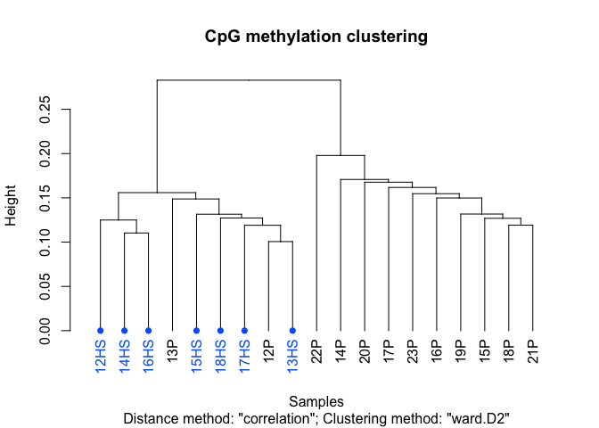<!-- -->

```
## 
## Call:
## hclust(d = d, method = HCLUST.METHODS[hclust.method])
## 
## Cluster method   : ward.D2 
## Distance         : pearson 
## Number of objects: 19
```

```r
PCASamples(meth)
```

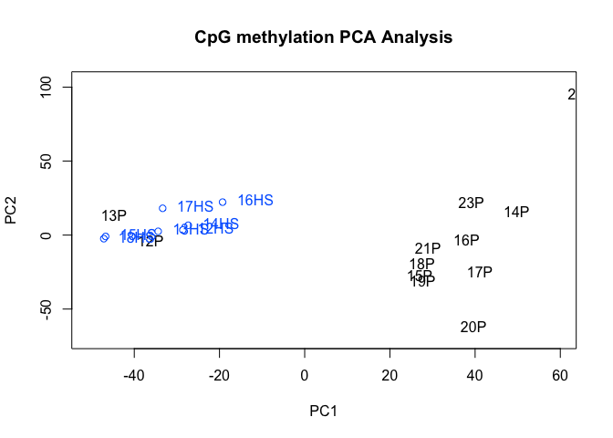<!-- -->

```r
#Create a folder in which to generate all documents/tables for this analysyis
ifelse(!dir.exists(file.path("../2_Output/", COMPARISON)), dir.create(file.path("../2_Output/", COMPARISON)), FALSE)
```

```
## [1] FALSE
```

```r
#Create dendrogram and PCA plots
pdf(file=paste0("../2_Output/", COMPARISON, "/", COMPARISON, "_Clustering_DMPs.pdf"))
clusterSamples(meth, dist = "correlation", method = "ward.D2", plot = TRUE)
```

```
## 
## Call:
## hclust(d = d, method = HCLUST.METHODS[hclust.method])
## 
## Cluster method   : ward.D2 
## Distance         : pearson 
## Number of objects: 19
```

```r
PCASamples(meth)
dev.off()
```

```
## quartz_off_screen 
##                 2
```

```r
myDiff=calculateDiffMeth(meth, overdispersion = "MN", test = "Chisq", mc.cores = 10) # expect this to take awhile...
myDiff_DMPs.md<-as.data.frame(as(myDiff,"methylDiff"))
Methylation_DMPs<-as.data.frame(meth)
class(Methylation_DMPs) <- 'data.frame'
f = function(Cyt, cov, col_name) {
  require(lazyeval)
  require(dplyr)
    mutate_call = lazyeval::interp(~ (a / b)*100, a = as.name(Cyt), b = as.name(cov))
    Methylation_DMPs %>% mutate_(.dots = setNames(list(mutate_call), col_name))
}
for(i in seq_along(Index_filtered$Sample_ID)){
  COVERAGE=paste0("coverage", i)
  mC=paste0("numCs", i)
  perc.mC=paste0("perc.mC_", Index_filtered$Sample_ID[i])
  print(COVERAGE)
  print(mC)
  print(perc.mC)
  Methylation_DMPs<-f(Cyt=mC, cov=COVERAGE, col_name=perc.mC)
}
```

```
## [1] "coverage1"
## [1] "numCs1"
## [1] "perc.mC_12HS"
## [1] "coverage2"
## [1] "numCs2"
## [1] "perc.mC_12P"
## [1] "coverage3"
## [1] "numCs3"
## [1] "perc.mC_13HS"
## [1] "coverage4"
## [1] "numCs4"
## [1] "perc.mC_13P"
## [1] "coverage5"
## [1] "numCs5"
## [1] "perc.mC_14HS"
## [1] "coverage6"
## [1] "numCs6"
## [1] "perc.mC_14P"
## [1] "coverage7"
## [1] "numCs7"
## [1] "perc.mC_15HS"
## [1] "coverage8"
## [1] "numCs8"
## [1] "perc.mC_15P"
## [1] "coverage9"
## [1] "numCs9"
## [1] "perc.mC_16HS"
## [1] "coverage10"
## [1] "numCs10"
## [1] "perc.mC_16P"
## [1] "coverage11"
## [1] "numCs11"
## [1] "perc.mC_17HS"
## [1] "coverage12"
## [1] "numCs12"
## [1] "perc.mC_17P"
## [1] "coverage13"
## [1] "numCs13"
## [1] "perc.mC_18HS"
## [1] "coverage14"
## [1] "numCs14"
## [1] "perc.mC_18P"
## [1] "coverage15"
## [1] "numCs15"
## [1] "perc.mC_19P"
## [1] "coverage16"
## [1] "numCs16"
## [1] "perc.mC_20P"
## [1] "coverage17"
## [1] "numCs17"
## [1] "perc.mC_21P"
## [1] "coverage18"
## [1] "numCs18"
## [1] "perc.mC_22P"
## [1] "coverage19"
## [1] "numCs19"
## [1] "perc.mC_23P"
```

```r
Methylation_DMPs<-dplyr::select(Methylation_DMPs, chr, start, end, contains("perc.mC"))

#Merge with the percent methylation (by cytosine)
myDiff_DMPs.filtered<-left_join(myDiff_DMPs.md, Methylation_DMPs)
class(myDiff_DMPs.filtered)<-'data.frame'
#Subset by statistical threshold
myDiff.DMPs_p05<-dplyr::filter(myDiff_DMPs.filtered, pvalue<0.05)
myDiff.DMPs_q05<-dplyr::filter(myDiff_DMPs.filtered, qvalue<0.05)

#Save a copy of the differential Methylation analysis
wb_countData<-createWorkbook()
addWorksheet(wb_countData, "P_0.05")
  writeData(wb_countData, "P_0.05", myDiff.DMPs_p05, rowNames = F)
addWorksheet(wb_countData, "Q_0.05")
  writeData(wb_countData, "Q_0.05", myDiff.DMPs_q05, rowNames = F)
saveWorkbook(wb_countData, file = paste0("../2_Output/", COMPARISON, "/", COMPARISON, "_DMPs.xlsx"), overwrite = TRUE)

myDiff.files_q05_GR<-makeGRangesFromDataFrame(myDiff.DMPs_q05, seqnames.field = "chr", strand.field="strand", start.field = "start", end.field = "end", keep.extra.columns = T)

############################
##ANNOTATION
############################
library(openxlsx)
library(annotatr)
library(AnnotationHub)
library(rtracklayer)
library(TxDb.Hsapiens.UCSC.hg38.knownGene)
#convert to GRanges object (correct format for annotatr)
myDiff.DMPs_p05_GR<-makeGRangesFromDataFrame(myDiff.DMPs_p05, seqnames.field = "chr", strand.field="strand", start.field = "start", end.field = "end", keep.extra.columns = T)
#create annotations from the following sources
annots = c('hg38_cpgs', 'hg38_basicgenes')
# Build the annotations (a single GRanges object)
annotations = build_annotations(genome = 'hg38', annotations = annots)
# myDiff_GR<-as(myDiff, "GRanges")
# Intersect the regions read in with the annotations
dm_annotated.DMPs = annotate_regions(
    regions = myDiff.DMPs_p05_GR,
    annotations = annotations,
    ignore.strand = TRUE,
    quiet = FALSE)
#convert to a data.frame
df_dm_annotated.DMPs = data.frame(dm_annotated.DMPs)
# A GRanges object is returned
print(dm_annotated.DMPs)
```

```
## GRanges object with 19570 ranges and 23 metadata columns:
##           seqnames    ranges strand |     pvalue    qvalue meth.diff
##              <Rle> <IRanges>  <Rle> |  <numeric> <numeric> <numeric>
##       [1]     chr1   1001545      * |   0.014803  0.328348   13.6732
##       [2]     chr1   1001545      * |   0.014803  0.328348   13.6732
##       [3]     chr1   1001545      * |   0.014803  0.328348   13.6732
##       [4]     chr1   1001545      * |   0.014803  0.328348   13.6732
##       [5]     chr1   1001545      * |   0.014803  0.328348   13.6732
##       ...      ...       ...    ... .        ...       ...       ...
##   [19566]     chrX 150345270      * | 0.01177356  0.295138   7.06742
##   [19567]     chrX 150345304      * | 0.00953478  0.271731   7.79115
##   [19568]     chrX 150345315      * | 0.00555865  0.210278   8.36029
##   [19569]     chrX 150345348      * | 0.03984648  0.493698   6.41052
##   [19570]     chrX 150345360      * | 0.01651020  0.348032   7.54705
##           perc.mC_12HS perc.mC_12P perc.mC_13HS perc.mC_13P perc.mC_14HS
##              <numeric>   <numeric>    <numeric>   <numeric>    <numeric>
##       [1]      26.6667          20      13.0435     15.3846      17.9487
##       [2]      26.6667          20      13.0435     15.3846      17.9487
##       [3]      26.6667          20      13.0435     15.3846      17.9487
##       [4]      26.6667          20      13.0435     15.3846      17.9487
##       [5]      26.6667          20      13.0435     15.3846      17.9487
##       ...          ...         ...          ...         ...          ...
##   [19566]      75.5556     86.6667      75.5102     77.7778      77.3333
##   [19567]      82.2222     81.8182      73.4694     72.2222      66.6667
##   [19568]      80.0000     80.0000      76.5957     66.6667      68.8312
##   [19569]      75.0000     84.8485      60.4167     72.2222      75.6410
##   [19570]      73.3333     75.7576      73.4694     77.7778      67.9487
##           perc.mC_14P perc.mC_15HS perc.mC_15P perc.mC_16HS perc.mC_16P
##             <numeric>    <numeric>   <numeric>    <numeric>   <numeric>
##       [1]     39.1304           10          45      29.4118          30
##       [2]     39.1304           10          45      29.4118          30
##       [3]     39.1304           10          45      29.4118          30
##       [4]     39.1304           10          45      29.4118          30
##       [5]     39.1304           10          45      29.4118          30
##       ...         ...          ...         ...          ...         ...
##   [19566]          70      86.6667     90.0000      76.3158     79.4872
##   [19567]          85      73.3333     84.3137      73.4177     75.0000
##   [19568]          80      58.6207     76.4706      76.6234     77.5000
##   [19569]          85      80.0000     92.3077      74.6835     75.0000
##   [19570]          85      70.0000     82.6923      67.0886     62.5000
##           perc.mC_17HS perc.mC_17P perc.mC_18HS perc.mC_18P perc.mC_19P
##              <numeric>   <numeric>    <numeric>   <numeric>   <numeric>
##       [1]      27.2727     33.3333           20     23.8095     33.3333
##       [2]      27.2727     33.3333           20     23.8095     33.3333
##       [3]      27.2727     33.3333           20     23.8095     33.3333
##       [4]      27.2727     33.3333           20     23.8095     33.3333
##       [5]      27.2727     33.3333           20     23.8095     33.3333
##       ...          ...         ...          ...         ...         ...
##   [19566]      82.2222     88.8889      73.0769     86.4407     84.0909
##   [19567]      68.8889     78.5714      80.0000     75.8065     81.8182
##   [19568]      71.1111     82.1429      73.0769     82.2581     88.0952
##   [19569]      81.8182     82.1429      76.9231     80.3279     81.8182
##   [19570]      66.6667     82.1429      73.0769     80.6452     84.0909
##           perc.mC_20P perc.mC_21P perc.mC_22P perc.mC_23P
##             <numeric>   <numeric>   <numeric>   <numeric>
##       [1]          50     56.7568     33.3333     15.3846
##       [2]          50     56.7568     33.3333     15.3846
##       [3]          50     56.7568     33.3333     15.3846
##       [4]          50     56.7568     33.3333     15.3846
##       [5]          50     56.7568     33.3333     15.3846
##       ...         ...         ...         ...         ...
##   [19566]     75.0000     90.1961     87.5000     88.2353
##   [19567]     87.5000     84.6154     80.0000     80.5556
##   [19568]     78.7879     80.7692     91.6667     86.1111
##   [19569]     72.7273     84.6154     66.6667     80.0000
##   [19570]     75.7576     72.5490     76.0000     72.2222
##                              annot
##                          <GRanges>
##       [1]    chr1:999052-1003051:-
##       [2]   chr1:1001173-1005172:-
##       [3]   chr1:1001098-1005097:-
##       [4]   chr1:1001097-1005096:-
##       [5]   chr1:1000982-1004981:-
##       ...                      ...
##   [19566] chrX:149942706-150357272
##   [19567] chrX:149942706-150357272
##   [19568] chrX:149942706-150357272
##   [19569] chrX:149942706-150357272
##   [19570] chrX:149942706-150357272
##   -------
##   seqinfo: 34 sequences from an unspecified genome; no seqlengths
```

```r
##The issue with this annotation is that each DMP has multiple repeated rows if different annotations. To simplify this, we can condense the annotations into strings. This makes the resulting file more manageable based on the differential-methylation data.
DiffMeth_Annotated.DMPs<-df_dm_annotated.DMPs %>% 
  tidyr::fill(annot.symbol) %>% dplyr::distinct() %>%
  dplyr::group_by(seqnames, start, end, meth.diff, pvalue, qvalue, annot.symbol) %>% 
  dplyr::summarise(CpG_Location=paste(unique(annot.type), collapse = ";"), Genic_Region=paste(unique(annot.id), collapse = ";"))
#Add %Methylation
DiffMeth_Annotated.DMPs<-dplyr::rename(DiffMeth_Annotated.DMPs, chr=seqnames)
DiffMeth_Annotated.DMPs<-dplyr::left_join(DiffMeth_Annotated.DMPs, Methylation_DMPs)
#subset the Differential Methylation by statistics
DiffMeth_Annotated.DMPs_p05<-subset(DiffMeth_Annotated.DMPs, pvalue<0.05)
DiffMeth_Annotated.DMPs_q05<-subset(DiffMeth_Annotated.DMPs, qvalue<0.05)
#Write out the annotated DMP file 
library(openxlsx)
ifelse(!dir.exists(file.path("../2_Output/", COMPARISON, "/")), dir.create(file.path("../2_Output/", COMPARISON, "/")), FALSE)
```

```
## [1] FALSE
```

```r
wb_WGBS_Annotate<-createWorkbook()
addWorksheet(wb_WGBS_Annotate, "P_0.05")
  writeData(wb_WGBS_Annotate, "P_0.05", DiffMeth_Annotated.DMPs_p05, rowNames = F)
addWorksheet(wb_WGBS_Annotate, "Q_0.05")
  writeData(wb_WGBS_Annotate, "Q_0.05", DiffMeth_Annotated.DMPs_q05, rowNames = F)
saveWorkbook(wb_WGBS_Annotate, file = paste0("../2_Output/", COMPARISON, "/", COMPARISON, "_Annotated_DMPs.xlsx"), overwrite = TRUE)
#Provide a summary of the annotation
dm_annsum.tile = summarize_annotations(
    annotated_regions = dm_annotated.DMPs,
    quiet = TRUE)
print(dm_annsum.tile)
```

```
## # A tibble: 10 × 2
##    annot.type               n
##    <chr>                <int>
##  1 hg38_cpg_inter         443
##  2 hg38_cpg_islands      1456
##  3 hg38_cpg_shelves        55
##  4 hg38_cpg_shores        404
##  5 hg38_genes_1to5kb      840
##  6 hg38_genes_3UTRs        68
##  7 hg38_genes_5UTRs       418
##  8 hg38_genes_exons      1002
##  9 hg38_genes_introns    1332
## 10 hg38_genes_promoters  1043
```

```r
#Plot the annotation distribution
dm_vs_kg_annotations.tile = plot_annotation(
    annotated_regions = dm_annotated.DMPs,
    plot_title = '# of Sites Tested for DM annotated on chr9',
    x_label = 'knownGene Annotations',
    y_label = 'Count')
print(dm_vs_kg_annotations.tile)
```

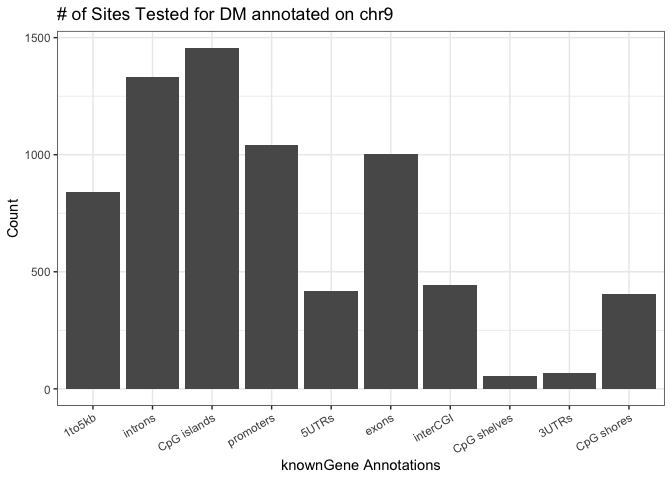<!-- -->

```r
annots_order = c(
    'hg38_genes_1to5kb',
    'hg38_genes_promoters',
    'hg38_genes_5UTRs',
    'hg38_genes_exons',
    'hg38_genes_introns',
    'hg38_genes_3UTRs')
dm_vs_kg_annotations = plot_annotation(
    annotated_regions = dm_annotated.DMPs,
    annotation_order = annots_order,
    plot_title = '# of Sites Tested for DM annotated on chr9',
    x_label = 'knownGene Annotations',
    y_label = 'Count')
print(dm_vs_kg_annotations)
```

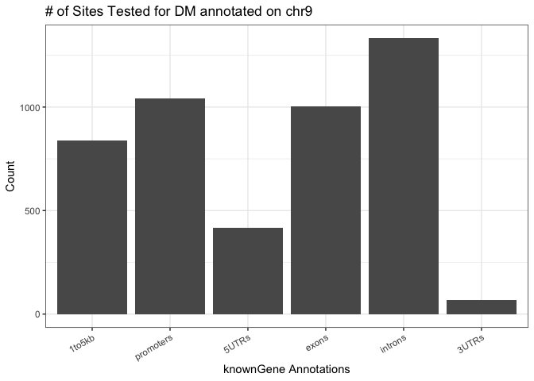<!-- -->

### DMRs


```r
##################################
#Differential Methylation of Tiles
##################################
tiles = tileMethylCounts(myobj_filtered, win.size = 500, step.size = 500) #expect this to take awhile...
meth_tile<-methylKit::unite(tiles, destrand = FALSE) #When calculating DMRs, it is not helpful to "destrand"
myDiff_tiles=calculateDiffMeth(meth_tile, overdispersion = "MN", test = "Chisq", mc.cores = 10) # expect this to take awhile...
myDiff_tile.md<-as.data.frame(as(myDiff_tiles,"methylDiff"))

#Check clustering of samples by DMR correlation
clusterSamples(meth_tile, dist = "correlation", method = "ward.D2", plot = TRUE)
```

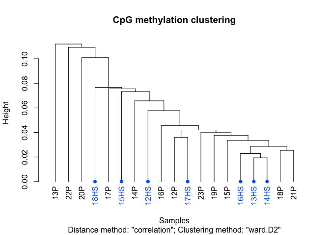<!-- -->

```
## 
## Call:
## hclust(d = d, method = HCLUST.METHODS[hclust.method])
## 
## Cluster method   : ward.D2 
## Distance         : pearson 
## Number of objects: 19
```

```r
PCASamples(meth_tile)
```

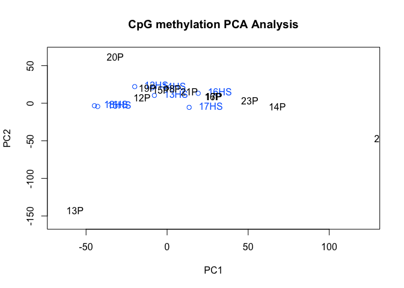<!-- -->

```r
#Create dendrogram and PCA plots
pdf(file=paste0("../2_Output/", COMPARISON, "/", COMPARISON, "_Clustering_DMRs.pdf"))
clusterSamples(meth_tile, dist = "correlation", method = "ward", plot = TRUE)
```

```
## 
## Call:
## hclust(d = d, method = HCLUST.METHODS[hclust.method])
## 
## Cluster method   : ward.D 
## Distance         : pearson 
## Number of objects: 19
```

```r
PCASamples(meth_tile)
dev.off()
```

```
## quartz_off_screen 
##                 2
```

```r
##############################################
#Calculate percent methylation for each sample/site
##############################################
Methylation_DMRs<-as.data.frame(meth_tile)
class(Methylation_DMRs) <- 'data.frame'
f = function(Cyt, cov, col_name) {
  require(lazyeval)
  require(dplyr)
    mutate_call = lazyeval::interp(~ (a / b)*100, a = as.name(Cyt), b = as.name(cov))
    Methylation_DMRs %>% mutate_(.dots = setNames(list(mutate_call), col_name))
}
for(i in seq_along(Index_filtered$Sample_ID)){
  COVERAGE=paste0("coverage", i)
  mC=paste0("numCs", i)
  perc.mC=paste0("perc.mC_", Index_filtered$Sample_ID[i])
  print(COVERAGE)
  print(mC)
  print(perc.mC)
  Methylation_DMRs<-f(Cyt=mC, cov=COVERAGE, col_name=perc.mC)
}
```

```
## [1] "coverage1"
## [1] "numCs1"
## [1] "perc.mC_12HS"
## [1] "coverage2"
## [1] "numCs2"
## [1] "perc.mC_12P"
## [1] "coverage3"
## [1] "numCs3"
## [1] "perc.mC_13HS"
## [1] "coverage4"
## [1] "numCs4"
## [1] "perc.mC_13P"
## [1] "coverage5"
## [1] "numCs5"
## [1] "perc.mC_14HS"
## [1] "coverage6"
## [1] "numCs6"
## [1] "perc.mC_14P"
## [1] "coverage7"
## [1] "numCs7"
## [1] "perc.mC_15HS"
## [1] "coverage8"
## [1] "numCs8"
## [1] "perc.mC_15P"
## [1] "coverage9"
## [1] "numCs9"
## [1] "perc.mC_16HS"
## [1] "coverage10"
## [1] "numCs10"
## [1] "perc.mC_16P"
## [1] "coverage11"
## [1] "numCs11"
## [1] "perc.mC_17HS"
## [1] "coverage12"
## [1] "numCs12"
## [1] "perc.mC_17P"
## [1] "coverage13"
## [1] "numCs13"
## [1] "perc.mC_18HS"
## [1] "coverage14"
## [1] "numCs14"
## [1] "perc.mC_18P"
## [1] "coverage15"
## [1] "numCs15"
## [1] "perc.mC_19P"
## [1] "coverage16"
## [1] "numCs16"
## [1] "perc.mC_20P"
## [1] "coverage17"
## [1] "numCs17"
## [1] "perc.mC_21P"
## [1] "coverage18"
## [1] "numCs18"
## [1] "perc.mC_22P"
## [1] "coverage19"
## [1] "numCs19"
## [1] "perc.mC_23P"
```

```r
Methylation_DMRs<-dplyr::select(Methylation_DMRs, chr, start, end, contains("perc.mC"))

#Merge with the percent Methylation_DMRs (by cytosine)
myDiff_tiles.filtered<-left_join(myDiff_tile.md, Methylation_DMRs)
class(myDiff_tiles.filtered)<-'data.frame'
#Subset by statistical threshold
myDiff.tiles_p05<-dplyr::filter(myDiff_tiles.filtered, pvalue<0.05)
myDiff.tiles_q05<-dplyr::filter(myDiff_tiles.filtered, qvalue<0.05)

#Save a copy of the differential Methylation analysis
wb_countData<-createWorkbook()
addWorksheet(wb_countData, "P_0.05")
  writeData(wb_countData, "P_0.05", myDiff.tiles_p05, rowNames = F)
addWorksheet(wb_countData, "Q_0.05")
  writeData(wb_countData, "Q_0.05", myDiff.tiles_q05, rowNames = F)
saveWorkbook(wb_countData, file = paste0("../2_Output/", COMPARISON, "/", COMPARISON, "_DMRs.xlsx"), overwrite = TRUE)

myDiff.files_q05_GR<-makeGRangesFromDataFrame(myDiff.tiles_q05, seqnames.field = "chr", strand.field="strand", start.field = "start", end.field = "end", keep.extra.columns = T)

write.table(myDiff.tiles_q05, file = "../2_Output/DMRs_Q05_DiffMeth.bed", sep = "\t", row.names = F, col.names = F, quote = F)
############################
##ANNOTATION
############################
library(openxlsx)
library(annotatr)
library(AnnotationHub)
library(rtracklayer)
library(TxDb.Hsapiens.UCSC.hg38.knownGene)
#convert to GRanges object (correct format for annotatr)
myDiff.tiles_p05_GR<-makeGRangesFromDataFrame(myDiff.tiles_p05, seqnames.field = "chr", strand.field="strand", start.field = "start", end.field = "end", keep.extra.columns = T)
#create annotations from the following sources
annots = c('hg38_cpgs', 'hg38_basicgenes')
# Build the annotations (a single GRanges object)
annotations = build_annotations(genome = 'hg38', annotations = annots)
# myDiff_GR<-as(myDiff, "GRanges")
# Intersect the regions read in with the annotations
dm_annotated.tiles = annotate_regions(
    regions = myDiff.tiles_p05_GR,
    annotations = annotations,
    ignore.strand = TRUE,
    quiet = FALSE)
#convert to a data.frame
df_dm_annotated.tiles = data.frame(dm_annotated.tiles)
# A GRanges object is returned
print(dm_annotated.tiles)
```

```
## GRanges object with 52814 ranges and 23 metadata columns:
##           seqnames        ranges strand |      pvalue     qvalue meth.diff
##              <Rle>     <IRanges>  <Rle> |   <numeric>  <numeric> <numeric>
##       [1]     chr1 631501-632000      * |   0.0492673   0.372897  -5.32365
##       [2]     chr1 631501-632000      * |   0.0492673   0.372897  -5.32365
##       [3]     chr1 631501-632000      * |   0.0492673   0.372897  -5.32365
##       [4]     chr1 631501-632000      * |   0.0492673   0.372897  -5.32365
##       [5]     chr1 631501-632000      * |   0.0492673   0.372897  -5.32365
##       ...      ...           ...    ... .         ...        ...       ...
##   [52810]     chrM   13001-13500      * | 2.72227e-05 0.00576966  -7.27663
##   [52811]     chrM   13001-13500      * | 2.72227e-05 0.00576966  -7.27663
##   [52812]     chrM   13001-13500      * | 2.72227e-05 0.00576966  -7.27663
##   [52813]     chrM   13001-13500      * | 2.72227e-05 0.00576966  -7.27663
##   [52814]     chrM   13001-13500      * | 2.72227e-05 0.00576966  -7.27663
##           perc.mC_12HS perc.mC_12P perc.mC_13HS perc.mC_13P perc.mC_14HS
##              <numeric>   <numeric>    <numeric>   <numeric>    <numeric>
##       [1]      26.9663     24.4216      39.7306     15.7447      18.9588
##       [2]      26.9663     24.4216      39.7306     15.7447      18.9588
##       [3]      26.9663     24.4216      39.7306     15.7447      18.9588
##       [4]      26.9663     24.4216      39.7306     15.7447      18.9588
##       [5]      26.9663     24.4216      39.7306     15.7447      18.9588
##       ...          ...         ...          ...         ...          ...
##   [52810]      24.6398     14.4231      19.4539     10.8696      28.4946
##   [52811]      24.6398     14.4231      19.4539     10.8696      28.4946
##   [52812]      24.6398     14.4231      19.4539     10.8696      28.4946
##   [52813]      24.6398     14.4231      19.4539     10.8696      28.4946
##   [52814]      24.6398     14.4231      19.4539     10.8696      28.4946
##           perc.mC_14P perc.mC_15HS perc.mC_15P perc.mC_16HS perc.mC_16P
##             <numeric>    <numeric>   <numeric>    <numeric>   <numeric>
##       [1]     22.5519      36.3144     19.2922      21.2121     25.9259
##       [2]     22.5519      36.3144     19.2922      21.2121     25.9259
##       [3]     22.5519      36.3144     19.2922      21.2121     25.9259
##       [4]     22.5519      36.3144     19.2922      21.2121     25.9259
##       [5]     22.5519      36.3144     19.2922      21.2121     25.9259
##       ...         ...          ...         ...          ...         ...
##   [52810]     15.4882      15.2866     17.6552      26.8293     15.7303
##   [52811]     15.4882      15.2866     17.6552      26.8293     15.7303
##   [52812]     15.4882      15.2866     17.6552      26.8293     15.7303
##   [52813]     15.4882      15.2866     17.6552      26.8293     15.7303
##   [52814]     15.4882      15.2866     17.6552      26.8293     15.7303
##           perc.mC_17HS perc.mC_17P perc.mC_18HS perc.mC_18P perc.mC_19P
##              <numeric>   <numeric>    <numeric>   <numeric>   <numeric>
##       [1]      34.2105     23.5897      23.7037     28.4123     28.8184
##       [2]      34.2105     23.5897      23.7037     28.4123     28.8184
##       [3]      34.2105     23.5897      23.7037     28.4123     28.8184
##       [4]      34.2105     23.5897      23.7037     28.4123     28.8184
##       [5]      34.2105     23.5897      23.7037     28.4123     28.8184
##       ...          ...         ...          ...         ...         ...
##   [52810]       10.241     19.6923      14.5038     19.8312     15.2466
##   [52811]       10.241     19.6923      14.5038     19.8312     15.2466
##   [52812]       10.241     19.6923      14.5038     19.8312     15.2466
##   [52813]       10.241     19.6923      14.5038     19.8312     15.2466
##   [52814]       10.241     19.6923      14.5038     19.8312     15.2466
##           perc.mC_20P perc.mC_21P perc.mC_22P perc.mC_23P                annot
##             <numeric>   <numeric>   <numeric>   <numeric>            <GRanges>
##       [1]     22.0994     17.5695     20.7055     19.6984 chr1:631757-632756:+
##       [2]     22.0994     17.5695     20.7055     19.6984 chr1:631205-632204:-
##       [3]     22.0994     17.5695     20.7055     19.6984 chr1:631151-632150:-
##       [4]     22.0994     17.5695     20.7055     19.6984 chr1:627757-631756:+
##       [5]     22.0994     17.5695     20.7055     19.6984 chr1:628535-632534:+
##       ...         ...         ...         ...         ...                  ...
##   [52810]     17.2603     15.6156     17.2414     18.4375     chrM:-3329-670:+
##   [52811]     17.2603     15.6156     17.2414     18.4375    chrM:9747-13746:+
##   [52812]     17.2603     15.6156     17.2414     18.4375   chrM:10888-14887:+
##   [52813]     17.2603     15.6156     17.2414     18.4375   chrM:12337-14148:+
##   [52814]     17.2603     15.6156     17.2414     18.4375       chrM:1-16569:*
##   -------
##   seqinfo: 72 sequences from an unspecified genome; no seqlengths
```

```r
##The issue with this annotation is that each DMP has multiple repeated rows if different annotations. To simplify this, we can condense the annotations into strings. This makes the resulting file more manageable based on the differential-methylation data.
DiffMeth_Annotated.tiles<-df_dm_annotated.tiles %>% 
  tidyr::fill(annot.symbol) %>% dplyr::distinct() %>%
  dplyr::group_by(seqnames, start, end, meth.diff, pvalue, qvalue, annot.symbol) %>% 
  dplyr::summarise(CpG_Location=paste(unique(annot.type), collapse = ";"), Genic_Region=paste(unique(annot.id), collapse = ";"))
#Add %Methylation
DiffMeth_Annotated.tiles<-dplyr::rename(DiffMeth_Annotated.tiles, chr=seqnames)
DiffMeth_Annotated.tiles<-dplyr::left_join(DiffMeth_Annotated.tiles, Methylation_DMRs)
#subset the Differential Methylation by statistics
DiffMeth_Annotated.tiles_p05<-subset(DiffMeth_Annotated.tiles, pvalue<0.05)
DiffMeth_Annotated.tiles_q05<-subset(DiffMeth_Annotated.tiles, qvalue<0.05)
#Write out the annotated DMP file 
library(openxlsx)
ifelse(!dir.exists(file.path("../2_Output/", COMPARISON, "/")), dir.create(file.path("../2_Output/", COMPARISON, "/")), FALSE)
```

```
## [1] FALSE
```

```r
wb_WGBS_Annotate<-createWorkbook()
addWorksheet(wb_WGBS_Annotate, "P_0.05")
  writeData(wb_WGBS_Annotate, "P_0.05", DiffMeth_Annotated.tiles_p05, rowNames = F)
addWorksheet(wb_WGBS_Annotate, "Q_0.05")
  writeData(wb_WGBS_Annotate, "Q_0.05", DiffMeth_Annotated.tiles_q05, rowNames = F)
saveWorkbook(wb_WGBS_Annotate, file = paste0("../2_Output/", COMPARISON, "/", COMPARISON, "_Annotated_DMRs.xlsx"), overwrite = TRUE)
#Provide a summary of the annotation
dm_annsum.tile = summarize_annotations(
    annotated_regions = dm_annotated.tiles,
    quiet = TRUE)
print(dm_annsum.tile)
```

```
## # A tibble: 10 × 2
##    annot.type               n
##    <chr>                <int>
##  1 hg38_cpg_inter         930
##  2 hg38_cpg_islands      2337
##  3 hg38_cpg_shelves       113
##  4 hg38_cpg_shores       1795
##  5 hg38_genes_1to5kb     1565
##  6 hg38_genes_3UTRs       191
##  7 hg38_genes_5UTRs      1403
##  8 hg38_genes_exons      2177
##  9 hg38_genes_introns    2584
## 10 hg38_genes_promoters  2050
```

```r
#Plot the annotation distribution
dm_vs_kg_annotations.tile = plot_annotation(
    annotated_regions = dm_annotated.tiles,
    plot_title = '# of Sites Tested for DM annotated on chr9',
    x_label = 'knownGene Annotations',
    y_label = 'Count')
print(dm_vs_kg_annotations.tile)
```

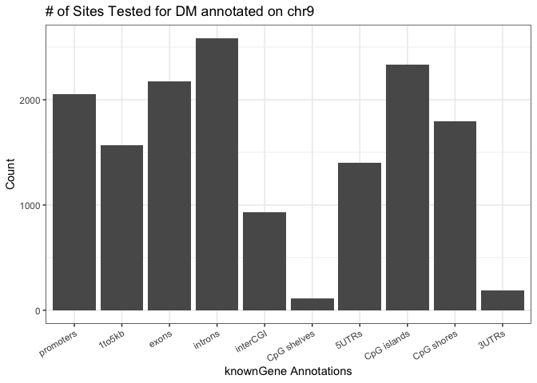<!-- -->

```r
annots_order = c(
    'hg38_genes_1to5kb',
    'hg38_genes_promoters',
    'hg38_genes_5UTRs',
    'hg38_genes_exons',
    'hg38_genes_introns',
    'hg38_genes_3UTRs')
dm_vs_kg_annotations = plot_annotation(
    annotated_regions = dm_annotated.tiles,
    annotation_order = annots_order,
    plot_title = '# of Sites Tested for DM annotated on chr9',
    x_label = 'knownGene Annotations',
    y_label = 'Count')
print(dm_vs_kg_annotations)
```

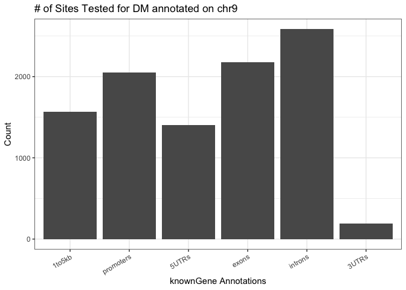<!-- -->

## Heatmap of Differential Methylation


```r
library(pheatmap)
DiffMeth_hm<-DiffMeth_Annotated.tiles_p05 # %>% dplyr::filter(grepl("promoter", Annotation))
hm_Data<-as.data.frame(DiffMeth_hm)
##Make heatmap
STATISTIC=0.01
hm_Data<-dplyr::filter(hm_Data, pvalue<STATISTIC)
hm_Data<-dplyr::select(hm_Data, contains("perc.mC"))
hm_Data<-data.matrix(hm_Data)
##
##Index file for annotating samples
hm_Index<-Index_filtered
hm_Index$Sample_ID<-paste0("perc.mC_", hm_Index$Sample_ID)
rownames(hm_Index)<-hm_Index$Sample_ID
hm_Index<-as.data.frame(hm_Index)
hm_Index<-dplyr::select(hm_Index, Etiology)

paletteLength <- 100
myColor <- colorRampPalette(c("dodgerblue4", "white", "gold2"))(paletteLength)
pheatmap(hm_Data,
         cluster_cols=T, 
         border_color=NA, 
         cluster_rows=T, 
         scale = 'row',
         show_colnames = T, 
         show_rownames = T, 
         color = myColor,
         annotation_col = hm_Index,
         filename = paste0("../2_Output/", COMPARISON, "/", COMPARISON, "_Heatmap.p05.pdf"))
pheatmap(hm_Data,
         cluster_cols=T, 
         border_color=NA, 
         cluster_rows=T, 
         scale = 'row',
         show_colnames = T, 
         show_rownames = T, 
         color = myColor,
         annotation_col = hm_Index)
```

## Volcano Plot


```r
# Load packages
library(ggplot2)
library(ggrepel)
library(openxlsx)
myDiff_tiles.filtered<-left_join(myDiff_tile.md, Methylation_DMRs)
#convert to GRanges object (correct format for annotatr)
# myDiff.tiles_p05_GR<-makeGRangesFromDataFrame(myDiff_tiles.filtered, seqnames.field = "chr", strand.field="strand", start.field = "start", end.field = "end", keep.extra.columns = T)
#create annotations from the following sources
annots = c('hg38_cpgs', 'hg38_basicgenes')
# Build the annotations (a single GRanges object)
annotations = build_annotations(genome = 'hg38', annotations = annots)
# myDiff_GR<-as(myDiff, "GRanges")
# Intersect the regions read in with the annotations
dm_annotated.tiles = annotate_regions(
    regions = myDiff.tiles_p05_GR,
    annotations = annotations,
    ignore.strand = TRUE,
    quiet = FALSE)
#convert to a data.frame
df_dm_annotated.tiles = data.frame(dm_annotated.tiles)
# Read data from the web
options(ggrepel.max.overlaps = Inf)
results <- dplyr::select(df_dm_annotated.tiles, annot.symbol, meth.diff, pvalue) %>% mutate(., sig=ifelse(pvalue<0.05 & meth.diff>5, "P_0.05 and Methylation > 5%", ifelse(pvalue<0.05 & meth.diff< -5,"P_0.05 and Methylation < 5%", "Not Sig")), minuslogpvalue = -log(pvalue), Methylation=meth.diff) %>% distinct()
max(results$minuslogpvalue, na.rm = TRUE)
```

```
## [1] 35.74444
```

```r
max(results$Methylation, na.rm = TRUE)
```

```
## [1] 30.59917
```

```r
min(results$Methylation, na.rm = TRUE)
```

```
## [1] -42.18398
```

```r
p = ggplot(results, aes(Methylation, minuslogpvalue)) + theme(panel.background = element_rect("white", colour = "black", size=2), panel.grid.major = element_line(colour = "gray50", size=.75), panel.grid.minor = element_line(colour = "gray50", size=0.4)) +
geom_point(aes(fill=sig, size = minuslogpvalue), colour="grey", shape=21, stroke = 0, alpha = 8/10) + labs(x=expression(Methylation), y=expression(-Log[10](P-value))) + xlim(min(results$Methylation, na.rm = TRUE),max(results$Methylation, na.rm = TRUE))+ ylim(-0, max(results$minuslogpvalue, na.rm = TRUE)) + geom_hline(yintercept = 0, size = 1) + geom_vline(xintercept=0, size=1)+
  scale_fill_manual(values=c("grey","darkcyan", "tomato")) +
  scale_size_continuous(range = c(.1, 2))
  p+
  geom_text_repel(data=top_n(filter(results, pvalue<0.05), 15, Methylation), aes(label=annot.symbol)) +
  geom_text_repel(data=top_n(filter(results, pvalue<0.05), 15, -Methylation), aes(label=annot.symbol))
```

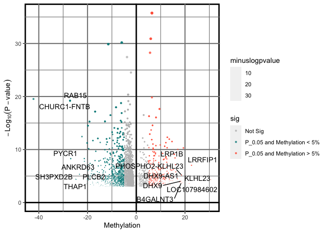<!-- -->

```r
pdf(file = paste0("../2_Output/", COMPARISON, "/", COMPARISON, "Volcano.Plot.pdf"))
  p+
  geom_text_repel(data=top_n(filter(results, pvalue<0.05), 15, Methylation), aes(label=annot.symbol)) +
  geom_text_repel(data=top_n(filter(results, pvalue<0.05), 15, -Methylation), aes(label=annot.symbol))
dev.off()
```

```
## quartz_off_screen 
##                 2
```

#**EnrichedHeatmap**


```r
#Import the genomic annotation file
library(EnrichedHeatmap)
library(RColorBrewer)
library(annotatr)
library(TxDb.Hsapiens.UCSC.hg38.knownGene)
library(dplyr)
ht_opt$message = FALSE
# Annotate
annots = c("hg38_basicgenes", "hg38_genes_promoters", "hg38_genes_intergenic",
           "hg38_genes_intronexonboundaries", "hg38_cpgs", "hg38_cpg_islands", "hg38_cpg_shores", "hg38_cpg_shelves", "hg38_cpg_inter")
annotations=build_annotations(genome = "hg38", annotations = annots)
annotations<-keepStandardChromosomes(annotations, pruning.mode = "coarse") #Remove nonstandard chromosomes
# create a column with absolute methylation
myDiff.DMPs_p05<-dplyr::mutate(myDiff.DMPs_p05, absolute.meth=abs(meth.diff)) %>% filter(grepl("chr", chr)) %>% mutate(end=start+1)
myDiff_p05_GR<-as(myDiff.DMPs_p05, "GRanges")
#Annotate GRanges using hg38 genome
dm_annotated = annotate_regions(
  regions = myDiff_p05_GR,
  annotations = annotations,
  ignore.strand = TRUE)
#create data.frame
df_dm_annotated <- as.data.frame(dm_annotated) %>% filter(annot.symbol!="NA")
#
library(GenomicFeatures)
genes<-genes(TxDb.Hsapiens.UCSC.hg38.knownGene)
tss = promoters(genes, upstream = 0, downstream = 1)
tss_table<-as.data.frame(tss)
mat1 = normalizeToMatrix(myDiff_p05_GR, tss, value_column = "absolute.meth", extend = 5000, mean_mode="w0", w=50)

png(file = "../2_Output/Gene.Distribution.png", height = 3, width = 5)
EnrichedHeatmap(mat1, use_raster=FALSE, col = c("white", "black","black"))
dev.off()
```

```
## quartz_off_screen 
##                 2
```

# Motif Enrichment


```r
###### Working example (from BED file)
library(monaLisa)
library(GenomicRanges)
library(SummarizedExperiment)
library(openxlsx)
library(dplyr)
library(BSgenome.Hsapiens.UCSC.hg38)
library("TFBSTools")
library(JASPAR2020)
mcparams <- BiocParallel::MulticoreParam(10L) #parallelization (10-core)

DMPs<-openxlsx::read.xlsx(paste0("../2_Output/", COMPARISON,"/",COMPARISON, "_Annotated_DMRs.xlsx"), sheet ="P_0.05")

bed<-DMPs %>% dplyr::select(chr, start, end, meth.diff) %>% dplyr::transmute(seqnames=chr, start=start, end=end, width = end - start, strand = "*", deltaMeth=meth.diff)
bed_mr<-as(bed, "GRanges")
# define bins by differential methylation
bins <- bin(x = bed_mr$deltaMeth, binmode = "equalWidth", nBins = 3, minAbsX = 5)
table(bins)
```

```
## bins
## [-42.2,-23.6]    (-23.6,-5]     (-5,30.6] 
##             7          1058          4188
```

```r
pdf(paste0("../2_Output/", COMPARISON, "/", COMPARISON, "_clusterBins.pdf"), width = 7.5, height = 5)
plotBinDensity(bed_mr$deltaMeth, bins, legend = "topright")
dev.off()
```

```
## quartz_off_screen 
##                 2
```

```r
# get PWMs from JASPAR
pwms <- getMatrixSet(JASPAR2020,
                     opts = list(matrixtype = "PWM",
                                 tax_group = "vertebrates"))
# trim bed file for sequenes that are consistent
lmrsel <- trim(resize(bed_mr, width = median(width(bed_mr)), fix = "center"))
lmrsel<-bed_mr
# get sequences from mouse genome
lmrseqs <- getSeq(BSgenome.Hsapiens.UCSC.hg38, bed_mr)
# GC proportion (bias)
plotBinDiagnostics(seqs = lmrseqs, bins = bins, aspect = "GCfrac")
```

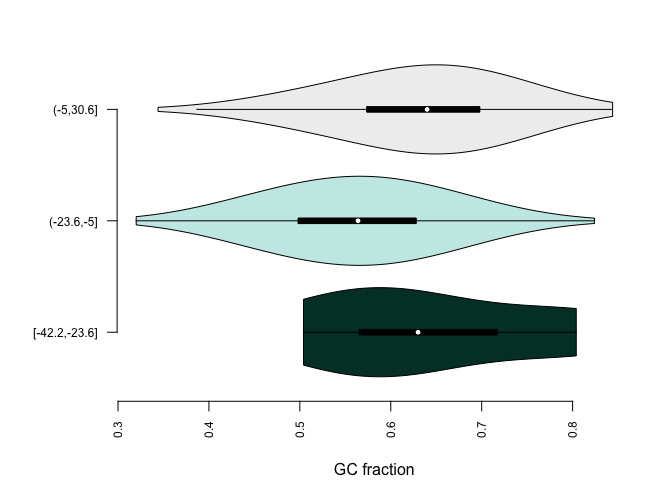<!-- -->

```r
plotBinDiagnostics(seqs = lmrseqs, bins = bins, aspect = "dinucfreq")
```

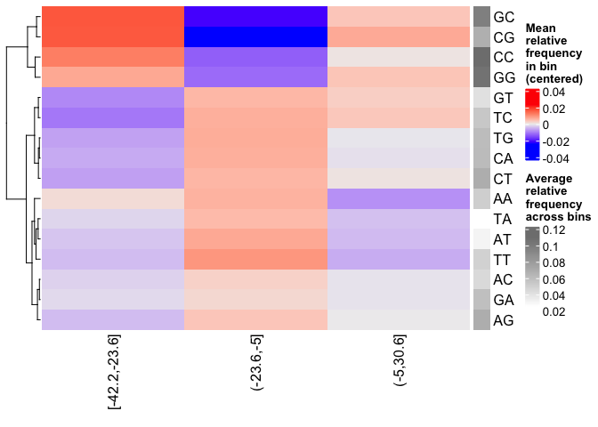<!-- -->

```r
# run motif enrichment
se <- calcBinnedMotifEnrR(seqs = lmrseqs, bins = bins, pwmL = pwms, BPPARAM = BiocParallel::MulticoreParam(10))
# Filter results
Test<-as.data.frame(assays(se))
sel <- apply(assay(se, "negLog10P"), 1, 
             function(x) max(abs(x), 0, na.rm = TRUE)) > 2.0
sum(sel)
```

```
## [1] 95
```

```r
#> [1] 59
seSel <- se[sel, ]

# plot
pdf(paste0("../2_Output/", COMPARISON, "/", COMPARISON, "_clusterMotifs.pdf"), width = 11, height = 10)
plotMotifHeatmaps(x = seSel, which.plots = c("log2enr", "negLog10P"), 
                  width = 2.0, cluster = TRUE, maxEnr = 2, maxSig = 10, 
                  show_motif_GC = TRUE, show_dendrogram = T,show_seqlogo = TRUE)
dev.off()
```

```
## quartz_off_screen 
##                 2
```

# Pathway Enrichment Analysis


```r
library(dplyr)
library(pathview)
library(biomaRt)
library(openxlsx)
library(VennDiagram)
library(enrichR)
# DMPs
DMPs<-read.xlsx(paste0("../2_Output/", COMPARISON, "/", COMPARISON, "_Annotated_DMPs.xlsx"), sheet = "P_0.05")
DMPs_UP<-filter(DMPs, meth.diff>0)
DMPs_DOWN<-filter(DMPs, meth.diff<0)
##Enrichr
dbs <- c("KEGG_2021_Human")
enriched_DMP<-enrichr(DMPs$annot.symbol, dbs)
```

```
## Uploading data to Enrichr... Done.
##   Querying KEGG_2021_Human... Done.
## Parsing results... Done.
```

```r
enrich_DMP<-enriched_DMP[[dbs]]
enriched_DMP_up <- enrichr(DMPs_UP$annot.symbol, dbs)
```

```
## Uploading data to Enrichr... Done.
##   Querying KEGG_2021_Human... Done.
## Parsing results... Done.
```

```r
enrich_DMP_up<-enriched_DMP_up[[dbs]]
enriched_DMP_down <- enrichr(DMPs_DOWN$annot.symbol, dbs)
```

```
## Uploading data to Enrichr... Done.
##   Querying KEGG_2021_Human... Done.
## Parsing results... Done.
```

```r
enrich_DMP_down<-enriched_DMP_down[[dbs]]

# DMR
DMRs<-read.xlsx(paste0("../2_Output/", COMPARISON, "/", COMPARISON, "_Annotated_DMRs.xlsx"), sheet = "P_0.05")
DMRs_UP<-filter(DMRs, meth.diff>0)
DMRs_DOWN<-filter(DMRs, meth.diff<0)
##Enrichr
dbs <- c("KEGG_2021_Human")
enriched_DMR<-enrichr(DMRs$annot.symbol, dbs)
```

```
## Uploading data to Enrichr... Done.
##   Querying KEGG_2021_Human... Done.
## Parsing results... Done.
```

```r
enrich_DMR<-enriched_DMR[[dbs]]
enriched_DMR_up <- enrichr(DMRs_UP$annot.symbol, dbs)
```

```
## Uploading data to Enrichr... Done.
##   Querying KEGG_2021_Human... Done.
## Parsing results... Done.
```

```r
enrich_DMR_up<-enriched_DMR_up[[dbs]]
enriched_DMR_down <- enrichr(DMRs_DOWN$annot.symbol, dbs)
```

```
## Uploading data to Enrichr... Done.
##   Querying KEGG_2021_Human... Done.
## Parsing results... Done.
```

```r
enrich_DMR_down<-enriched_DMR_down[[dbs]]

library(openxlsx)
wb_DESeq<-createWorkbook()
#Unfiltered
  addWorksheet(wb_DESeq, "DMPs ALL P_0.05")
  writeData(wb_DESeq, "DMPs ALL P_0.05", enrich_DMP, startCol = 1)
  addWorksheet(wb_DESeq, "DMPs UP P_0.05")
  writeData(wb_DESeq, "DMPs UP P_0.05", enrich_DMP_up, startCol = 1)
  addWorksheet(wb_DESeq, "DMPs DOWN P_0.05")
  writeData(wb_DESeq, "DMPs DOWN P_0.05", enrich_DMP_down, startCol = 1)
    addWorksheet(wb_DESeq, "DMRs ALL P_0.05")
  writeData(wb_DESeq, "DMRs ALL P_0.05", enrich_DMR, startCol = 1)
    addWorksheet(wb_DESeq, "DMRs UP P_0.05")
  writeData(wb_DESeq, "DMRs UP P_0.05", enrich_DMR_up, startCol = 1)
      addWorksheet(wb_DESeq, "DMRs DOWN P_0.05")
  writeData(wb_DESeq, "DMRs DOWN P_0.05", enrich_DMR_down, startCol = 1)
saveWorkbook(wb_DESeq, file = paste0("../2_Output/", COMPARISON, "/", COMPARISON, "_Pathway.Enrichment.xlsx"), overwrite = TRUE)
```


# Comparing HFrEF and HFpEF
## Volcano Plots


```r
library(ggpmisc)
DMPs_HFpEF<-read.xlsx(paste0("../2_Output/HFpEF.vs.CON_",BATCH, "/HFpEF.vs.CON_", BATCH, "_DMRs.xlsx")) %>% dplyr::select(chr, start, end, pvalue_HFpEF=pvalue, qvalue_HFpEF=qvalue, meth.diff_HFpEF=meth.diff)
DMPs_HFrEF<-read.xlsx(paste0("../2_Output/HFrEF.vs.CON_",BATCH, "/HFrEF.vs.CON_", BATCH, "_DMRs.xlsx")) %>% dplyr::select(chr, start, end, pvalue_HFrEF=pvalue, qvalue_HFrEF=qvalue, meth.diff_HFrEF=meth.diff)

# Build Annotations
annots = c('hg38_basicgenes')
annotations = build_annotations(genome = 'hg38', annotations = annots)

# Overlapping Annotation
DMPs_Overlapping<-inner_join(DMPs_HFrEF, DMPs_HFpEF, by = c("chr", "start", "end"))
DMPs_Overlapping_GR<-makeGRangesFromDataFrame(DMPs_Overlapping, seqnames.field = "chr", strand.field="strand", start.field = "start", end.field = "end", keep.extra.columns = T)
DMPs_Overlapping_annot.GR = annotate_regions(
    regions = DMPs_Overlapping_GR,
    annotations = annotations,
    ignore.strand = TRUE,
    quiet = FALSE)
DMPs_Overlapping_annot = data.frame(DMPs_Overlapping_annot.GR)
DMPs_Overlapping_annot<-DMPs_Overlapping_annot %>% dplyr::select(-annot.seqnames, -annot.start, -annot.end, -annot.width, -annot.strand, -annot.tx_id, -annot.gene_id, -annot.type, -annot.id) %>% distinct()
#################

results_Overlapping <- dplyr::mutate(DMPs_Overlapping_annot, annot.symbol, meth.diff_HFrEF, meth.diff_HFpEF, minuslogpvalue_HFrEF=-log10(pvalue_HFrEF))
max(results_Overlapping$meth.diff_HFrEF, na.rm = TRUE)
```

```
## [1] 28.75011
```

```r
min(results_Overlapping$meth.diff_HFrEF, na.rm = TRUE)
```

```
## [1] -36.20827
```

```r
max(results_Overlapping$meth.diff_HFpEF, na.rm = TRUE)
```

```
## [1] 18.57713
```

```r
min(results_Overlapping$meth.diff_HFpEF, na.rm = TRUE)
```

```
## [1] -26.90025
```

```r
p = ggplot(results_Overlapping, aes(x=meth.diff_HFrEF, y=meth.diff_HFpEF)) + 
  theme_classic() +
  theme(axis.line = element_blank(),
        axis.ticks = element_blank()
  ) +
  geom_point(aes(size = abs(minuslogpvalue_HFrEF)), colour="black", shape=19, stroke = 0, alpha = 7/10) +
  labs(x=expression(HFrEF_Methylation), y=expression(HFpEF_Methylation)) + 
  xlim(min(results_Overlapping$meth.diff_HFrEF, na.rm = TRUE),max(results_Overlapping$meth.diff_HFrEF, na.rm = TRUE)) + 
 ylim(min(results_Overlapping$meth.diff_HFpEF, na.rm = TRUE),max(results_Overlapping$meth.diff_HFpEF, na.rm = TRUE)) + 
  geom_hline(yintercept = 0, size = 1) + 
  geom_vline(xintercept=0, size=1) +
  stat_poly_line() +
  stat_poly_eq(aes(label = paste(after_stat(eq.label),
                                 after_stat(rr.label), sep = "*\", \"*")))
p
```

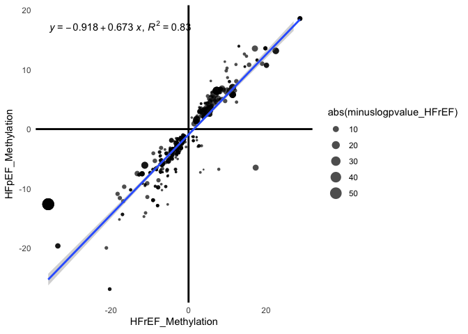<!-- -->

```r
pdf(file = paste0("../2_Output/Overlapping.DMPs_Volcano.Plot.pdf"), width = 8, height = 5)
p +
  geom_text_repel(data=top_n(results_Overlapping, 10, meth.diff_HFrEF), aes(label=annot.symbol)) +
  geom_text_repel(data=top_n(results_Overlapping, 10, -meth.diff_HFrEF), aes(label=annot.symbol))
dev.off()
```

```
## quartz_off_screen 
##                 2
```

```r
################
# HFrEF ONLY
DMPs_HFrEF.ONLY<-anti_join(DMPs_HFrEF, DMPs_HFpEF)
DMPs_HFrEF.ONLY_GR<-makeGRangesFromDataFrame(DMPs_HFrEF.ONLY, seqnames.field = "chr", strand.field="strand", start.field = "start", end.field = "end", keep.extra.columns = T)
DMPs_HFrEF.ONLY_annot.GR = annotate_regions(
    regions = DMPs_HFrEF.ONLY_GR,
    annotations = annotations,
    ignore.strand = TRUE,
    quiet = FALSE)
DMPs_HFrEF.ONLY_annot = data.frame(DMPs_HFrEF.ONLY_annot.GR)
DMPs_HFrEF.ONLY_annot<-DMPs_HFrEF.ONLY_annot %>% dplyr::select(-annot.seqnames, -annot.start, -annot.end, -annot.width, -annot.strand, -annot.tx_id, -annot.gene_id, -annot.type, -annot.id) %>% distinct()
results_DMPs_HFrEF.ONLY <- dplyr::mutate(DMPs_Overlapping_annot, annot.symbol, meth.diff_HFrEF, meth.diff_HFpEF, minuslogpvalue_HFrEF=-log10(pvalue_HFrEF))
max(results_Overlapping$meth.diff_HFrEF, na.rm = TRUE)
```

```
## [1] 28.75011
```

```r
min(results_Overlapping$meth.diff_HFrEF, na.rm = TRUE)
```

```
## [1] -36.20827
```

```r
max(results_Overlapping$meth.diff_HFpEF, na.rm = TRUE)
```

```
## [1] 18.57713
```

```r
min(results_Overlapping$meth.diff_HFpEF, na.rm = TRUE)
```

```
## [1] -26.90025
```

```r
p = ggplot(results_DMPs_HFrEF.ONLY, aes(meth.diff_HFrEF, minuslogpvalue_HFrEF)) + 
  theme_classic() +
  theme(axis.line = element_blank(),
        axis.ticks = element_blank()
  ) +
  geom_point(colour="black", shape=19, stroke = 0, alpha = 7/10) +
  labs(x=expression(Methylation), y=expression(-Log[10](P-value))) + 
  xlim(min(results_DMPs_HFrEF.ONLY$meth.diff_HFrEF, na.rm = TRUE),max(results_DMPs_HFrEF.ONLY$meth.diff_HFrEF, na.rm = TRUE)) + 
  ylim(-0, max(results_DMPs_HFrEF.ONLY$minuslogpvalue_HFrEF, na.rm = TRUE)) + geom_hline(yintercept = 0, size = 1) + 
  geom_vline(xintercept=0, size=1) +
  scale_fill_manual(values=c("grey","darkcyan", "tomato")) +
  scale_size_continuous(range = c(.1, 3))

  p+
  geom_text_repel(data=top_n(filter(results_DMPs_HFrEF.ONLY, pvalue_HFrEF<0.05), 10, meth.diff_HFrEF), aes(label=annot.symbol)) +
  geom_text_repel(data=top_n(filter(results_DMPs_HFrEF.ONLY, pvalue_HFrEF<0.05), 10, -meth.diff_HFrEF), aes(label=annot.symbol))
```

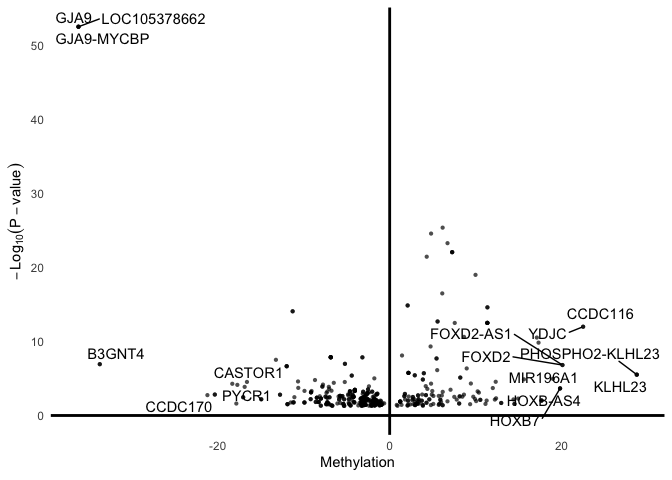<!-- -->

```r
pdf(file = paste0("../2_Output/HFrEF.vs.CON_", BATCH, "/HFrEF.vs.CON_", BATCH, "_HFrEF_Volcano.Plot.pdf"))
  p+
  geom_text_repel(data=top_n(filter(results_DMPs_HFrEF.ONLY, pvalue_HFrEF<0.05), 15, meth.diff_HFrEF), aes(label=annot.symbol)) +
  geom_text_repel(data=top_n(filter(results_DMPs_HFrEF.ONLY, pvalue_HFrEF<0.05), 15, -meth.diff_HFrEF), aes(label=annot.symbol))
dev.off()
```

```
## quartz_off_screen 
##                 2
```

```r
# HFpEF ONLY
DMPs_HFpEF.ONLY<-anti_join(DMPs_HFrEF, DMPs_HFpEF)
DMPs_HFpEF.ONLY_GR<-makeGRangesFromDataFrame(DMPs_HFpEF.ONLY, seqnames.field = "chr", strand.field="strand", start.field = "start", end.field = "end", keep.extra.columns = T)
DMPs_HFpEF.ONLY_annot.GR = annotate_regions(
    regions = DMPs_HFpEF.ONLY_GR,
    annotations = annotations,
    ignore.strand = TRUE,
    quiet = FALSE)
DMPs_HFpEF.ONLY_annot = data.frame(DMPs_HFpEF.ONLY_annot.GR)
DMPs_HFpEF.ONLY_annot<-DMPs_HFpEF.ONLY_annot %>% dplyr::select(-annot.seqnames, -annot.start, -annot.end, -annot.width, -annot.strand, -annot.tx_id, -annot.gene_id, -annot.type, -annot.id) %>% distinct()
results_DMPs_HFpEF.ONLY <- dplyr::mutate(DMPs_Overlapping_annot, annot.symbol, meth.diff_HFpEF, meth.diff_HFpEF, minuslogpvalue_HFpEF=-log10(pvalue_HFpEF))
max(results_Overlapping$meth.diff_HFpEF, na.rm = TRUE)
```

```
## [1] 18.57713
```

```r
min(results_Overlapping$meth.diff_HFpEF, na.rm = TRUE)
```

```
## [1] -26.90025
```

```r
max(results_Overlapping$meth.diff_HFpEF, na.rm = TRUE)
```

```
## [1] 18.57713
```

```r
min(results_Overlapping$meth.diff_HFpEF, na.rm = TRUE)
```

```
## [1] -26.90025
```

```r
p = ggplot(results_DMPs_HFpEF.ONLY, aes(meth.diff_HFpEF, minuslogpvalue_HFpEF)) + 
  theme_classic() +
  theme(axis.line = element_blank(),
        axis.ticks = element_blank(),
        panel.background = element_rect(fill='transparent'),
        plot.background = element_rect(fill='transparent', color=NA)
  ) +
  geom_point(colour="black", shape=19, stroke = 0, alpha = 7/10) +
  labs(x="Methylation (%)", y=expression(-Log[10](P-value))) + 
  xlim(min(results_DMPs_HFpEF.ONLY$meth.diff_HFpEF, na.rm = TRUE),max(results_DMPs_HFpEF.ONLY$meth.diff_HFpEF, na.rm = TRUE)) + 
  ylim(-0, max(results_DMPs_HFpEF.ONLY$minuslogpvalue_HFpEF, na.rm = TRUE)) + geom_hline(yintercept = 0, size = 1) + 
  geom_vline(xintercept=0, size=1) +
  scale_fill_manual(values=c("grey","darkcyan", "tomato")) +
  scale_size_continuous(range = c(.1, 3))

  p+
  geom_text_repel(data=top_n(filter(results_DMPs_HFpEF.ONLY, pvalue_HFpEF<0.05), 10, meth.diff_HFpEF), aes(label=annot.symbol)) +
  geom_text_repel(data=top_n(filter(results_DMPs_HFpEF.ONLY, pvalue_HFpEF<0.05), 10, -meth.diff_HFpEF), aes(label=annot.symbol))
```

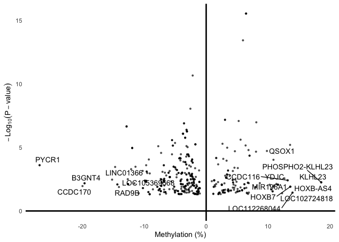<!-- -->

```r
pdf(file = paste0("../2_Output/HFpEF.vs.CON_", BATCH, "/HFpEF.vs.CON_", BATCH, "_HFpEF_Volcano.Plot.pdf"))
  p+
  geom_text_repel(data=top_n(filter(results_DMPs_HFpEF.ONLY, pvalue_HFpEF<0.05), 10, meth.diff_HFpEF), aes(label=annot.symbol)) +
  geom_text_repel(data=top_n(filter(results_DMPs_HFpEF.ONLY, pvalue_HFpEF<0.05), 10, -meth.diff_HFpEF), aes(label=annot.symbol))
dev.off()
```

```
## quartz_off_screen 
##                 2
```

## Combined Pathway Enrichment Analysis


```r
library(dplyr)
library(pathview)
library(biomaRt)
library(openxlsx)
library(VennDiagram)
library(enrichR)
# HFrEF
HFrEF.DMRs<-read.xlsx(paste0("../2_Output/HFrEF.vs.CON_", BATCH, "/", "HFrEF.vs.CON_", BATCH, "_Annotated_DMRs.xlsx"), sheet = "P_0.05")
HFrEF.DMRs_UP<-filter(HFrEF.DMRs, meth.diff>0)
HFrEF.DMRs_DOWN<-filter(HFrEF.DMRs, meth.diff<0)
# HFpEF
HFpEF.DMRs<-read.xlsx(paste0("../2_Output/HFpEF.vs.CON_", BATCH, "/", "HFpEF.vs.CON_", BATCH, "_Annotated_DMRs.xlsx"), sheet = "P_0.05")
HFpEF.DMRs_UP<-filter(HFpEF.DMRs, meth.diff>0)
HFpEF.DMRs_DOWN<-filter(HFpEF.DMRs, meth.diff<0)

########### VENN DIAGRAM
x<-list(HFrEF = HFrEF.DMRs$annot.symbol, HFpEF = HFpEF.DMRs$annot.symbol)
venn.diagram(x,fill = c("red", "grey"), alpha = c(0.75, 0.75), lty = 'blank', main = paste0("Etiology-Specific Heart Failure DMPs for the ", BATCH, " cohort"),filename = paste0("../2_Output/", BATCH, "_HF_Overlap.png"), na = "remove", disable.logging = T)
```

```
## INFO [2022-11-22 10:07:39] [[1]]
## INFO [2022-11-22 10:07:39] x
## INFO [2022-11-22 10:07:39] 
## INFO [2022-11-22 10:07:39] $fill
## INFO [2022-11-22 10:07:39] c("red", "grey")
## INFO [2022-11-22 10:07:39] 
## INFO [2022-11-22 10:07:39] $alpha
## INFO [2022-11-22 10:07:39] c(0.75, 0.75)
## INFO [2022-11-22 10:07:39] 
## INFO [2022-11-22 10:07:39] $lty
## INFO [2022-11-22 10:07:39] [1] "blank"
## INFO [2022-11-22 10:07:39] 
## INFO [2022-11-22 10:07:39] $main
## INFO [2022-11-22 10:07:39] paste0("Etiology-Specific Heart Failure DMPs for the ", BATCH, 
## INFO [2022-11-22 10:07:39]     " cohort")
## INFO [2022-11-22 10:07:39] 
## INFO [2022-11-22 10:07:39] $filename
## INFO [2022-11-22 10:07:39] paste0("../2_Output/", BATCH, "_HF_Overlap.png")
## INFO [2022-11-22 10:07:39] 
## INFO [2022-11-22 10:07:39] $na
## INFO [2022-11-22 10:07:39] [1] "remove"
## INFO [2022-11-22 10:07:39] 
## INFO [2022-11-22 10:07:39] $disable.logging
## INFO [2022-11-22 10:07:39] T
## INFO [2022-11-22 10:07:39]
```

```
## [1] 1
```

```r
##Enrichr
dbs <- c("KEGG_2021_Human")
enriched_HFrEF<-enrichr(HFrEF.DMRs$annot.symbol, dbs)
```

```
## Uploading data to Enrichr... Done.
##   Querying KEGG_2021_Human... Done.
## Parsing results... Done.
```

```r
enrich.HFrEF<-enriched_HFrEF[[dbs]]
enriched_HFrEF_UP <- enrichr(HFrEF.DMRs_UP$annot.symbol, dbs)
```

```
## Uploading data to Enrichr... Done.
##   Querying KEGG_2021_Human... Done.
## Parsing results... Done.
```

```r
enrich.HFrEF_UP<-enriched_HFrEF_UP[[dbs]]
enriched_HFrEF_DOWN <- enrichr(HFrEF.DMRs_DOWN$annot.symbol, dbs)
```

```
## Uploading data to Enrichr... Done.
##   Querying KEGG_2021_Human... Done.
## Parsing results... Done.
```

```r
enrich.HFrEF_DOWN<-enriched_HFrEF_DOWN[[dbs]]
# Promoter DMRs w/ DEGs
enriched_HFpEF <- enrichr(HFpEF.DMRs$annot.symbol, dbs)
```

```
## Uploading data to Enrichr... Done.
##   Querying KEGG_2021_Human... Done.
## Parsing results... Done.
```

```r
enrich.HFpEF<-enriched_HFpEF[[dbs]]
enriched_HFpEF_UP <- enrichr(HFpEF.DMRs_UP$annot.symbol, dbs)
```

```
## Uploading data to Enrichr... Done.
##   Querying KEGG_2021_Human... Done.
## Parsing results... Done.
```

```r
enrich.HFpEF_UP<-enriched_HFpEF_UP[[dbs]]
enriched_HFpEF_DOWN <- enrichr(HFpEF.DMRs_DOWN$annot.symbol, dbs)
```

```
## Uploading data to Enrichr... Done.
##   Querying KEGG_2021_Human... Done.
## Parsing results... Done.
```

```r
enrich.HFpEF_DOWN<-enriched_HFpEF_DOWN[[dbs]]

library(openxlsx)
wb_DESeq<-createWorkbook()
#Unfiltered
  addWorksheet(wb_DESeq, "HFrEF ALL P_0.05")
  writeData(wb_DESeq, "HFrEF ALL P_0.05", enrich.HFrEF, startCol = 1)
  addWorksheet(wb_DESeq, "HFrEF UP P_0.05")
  writeData(wb_DESeq, "HFrEF UP P_0.05", enrich.HFrEF_UP, startCol = 1)
  addWorksheet(wb_DESeq, "HFrEF DOWN P_0.05")
  writeData(wb_DESeq, "HFrEF DOWN P_0.05", enrich.HFrEF_DOWN, startCol = 1)
    addWorksheet(wb_DESeq, "HFpEF ALL P_0.05")
  writeData(wb_DESeq, "HFpEF ALL P_0.05", enrich.HFpEF, startCol = 1)
    addWorksheet(wb_DESeq, "HFpEF UP P_0.05")
  writeData(wb_DESeq, "HFpEF UP P_0.05", enrich.HFpEF_UP, startCol = 1)
      addWorksheet(wb_DESeq, "HFpEF DOWN P_0.05")
  writeData(wb_DESeq, "HFpEF DOWN P_0.05", enrich.HFpEF_DOWN, startCol = 1)
saveWorkbook(wb_DESeq, file = paste0("../2_Output/", BATCH, "_", dbs, "_Pathway_Enrichment.xlsx"), overwrite = TRUE)
```

#Supplemental Table: R Session Information

All packages and setting are acquired using the following command:


```r
sinfo<-devtools::session_info()
sinfo$platform
```

```
##  setting  value
##  version  R version 4.2.2 (2022-10-31)
##  os       macOS Big Sur ... 10.16
##  system   x86_64, darwin17.0
##  ui       X11
##  language (EN)
##  collate  en_US.UTF-8
##  ctype    en_US.UTF-8
##  tz       America/New_York
##  date     2022-11-22
##  pandoc   2.19.2 @ /Applications/RStudio.app/Contents/MacOS/quarto/bin/tools/ (via rmarkdown)
```

```r
sinfo$packages %>% kable( 
                         align="c", 
                         longtable=T, 
                         booktabs=T,
                         caption="Packages and Required Dependencies") %>% 
    kable_styling(latex_options=c("striped", "repeat_header", "condensed"))
```

<table class="table" style="margin-left: auto; margin-right: auto;">
<caption>Packages and Required Dependencies</caption>
 <thead>
  <tr>
   <th style="text-align:left;">   </th>
   <th style="text-align:center;"> package </th>
   <th style="text-align:center;"> ondiskversion </th>
   <th style="text-align:center;"> loadedversion </th>
   <th style="text-align:center;"> path </th>
   <th style="text-align:center;"> loadedpath </th>
   <th style="text-align:center;"> attached </th>
   <th style="text-align:center;"> is_base </th>
   <th style="text-align:center;"> date </th>
   <th style="text-align:center;"> source </th>
   <th style="text-align:center;"> md5ok </th>
   <th style="text-align:center;"> library </th>
  </tr>
 </thead>
<tbody>
  <tr>
   <td style="text-align:left;"> abind </td>
   <td style="text-align:center;"> abind </td>
   <td style="text-align:center;"> 1.4.5 </td>
   <td style="text-align:center;"> 1.4-5 </td>
   <td style="text-align:center;"> /Library/Frameworks/R.framework/Versions/4.2/Resources/library/abind </td>
   <td style="text-align:center;"> /Library/Frameworks/R.framework/Versions/4.2/Resources/library/abind </td>
   <td style="text-align:center;"> FALSE </td>
   <td style="text-align:center;"> FALSE </td>
   <td style="text-align:center;"> 2016-07-21 </td>
   <td style="text-align:center;"> CRAN (R 4.2.0) </td>
   <td style="text-align:center;">  </td>
   <td style="text-align:center;"> /Library/Frameworks/R.framework/Versions/4.2/Resources/library </td>
  </tr>
  <tr>
   <td style="text-align:left;"> annotate </td>
   <td style="text-align:center;"> annotate </td>
   <td style="text-align:center;"> 1.76.0 </td>
   <td style="text-align:center;"> 1.76.0 </td>
   <td style="text-align:center;"> /Library/Frameworks/R.framework/Versions/4.2/Resources/library/annotate </td>
   <td style="text-align:center;"> /Library/Frameworks/R.framework/Versions/4.2/Resources/library/annotate </td>
   <td style="text-align:center;"> FALSE </td>
   <td style="text-align:center;"> FALSE </td>
   <td style="text-align:center;"> 2022-11-01 </td>
   <td style="text-align:center;"> Bioconductor </td>
   <td style="text-align:center;">  </td>
   <td style="text-align:center;"> /Library/Frameworks/R.framework/Versions/4.2/Resources/library </td>
  </tr>
  <tr>
   <td style="text-align:left;"> AnnotationDbi </td>
   <td style="text-align:center;"> AnnotationDbi </td>
   <td style="text-align:center;"> 1.60.0 </td>
   <td style="text-align:center;"> 1.60.0 </td>
   <td style="text-align:center;"> /Library/Frameworks/R.framework/Versions/4.2/Resources/library/AnnotationDbi </td>
   <td style="text-align:center;"> /Library/Frameworks/R.framework/Versions/4.2/Resources/library/AnnotationDbi </td>
   <td style="text-align:center;"> TRUE </td>
   <td style="text-align:center;"> FALSE </td>
   <td style="text-align:center;"> 2022-11-01 </td>
   <td style="text-align:center;"> Bioconductor </td>
   <td style="text-align:center;">  </td>
   <td style="text-align:center;"> /Library/Frameworks/R.framework/Versions/4.2/Resources/library </td>
  </tr>
  <tr>
   <td style="text-align:left;"> AnnotationHub </td>
   <td style="text-align:center;"> AnnotationHub </td>
   <td style="text-align:center;"> 3.6.0 </td>
   <td style="text-align:center;"> 3.6.0 </td>
   <td style="text-align:center;"> /Library/Frameworks/R.framework/Versions/4.2/Resources/library/AnnotationHub </td>
   <td style="text-align:center;"> /Library/Frameworks/R.framework/Versions/4.2/Resources/library/AnnotationHub </td>
   <td style="text-align:center;"> TRUE </td>
   <td style="text-align:center;"> FALSE </td>
   <td style="text-align:center;"> 2022-11-01 </td>
   <td style="text-align:center;"> Bioconductor </td>
   <td style="text-align:center;">  </td>
   <td style="text-align:center;"> /Library/Frameworks/R.framework/Versions/4.2/Resources/library </td>
  </tr>
  <tr>
   <td style="text-align:left;"> annotatr </td>
   <td style="text-align:center;"> annotatr </td>
   <td style="text-align:center;"> 1.24.0 </td>
   <td style="text-align:center;"> 1.24.0 </td>
   <td style="text-align:center;"> /Library/Frameworks/R.framework/Versions/4.2/Resources/library/annotatr </td>
   <td style="text-align:center;"> /Library/Frameworks/R.framework/Versions/4.2/Resources/library/annotatr </td>
   <td style="text-align:center;"> TRUE </td>
   <td style="text-align:center;"> FALSE </td>
   <td style="text-align:center;"> 2022-11-01 </td>
   <td style="text-align:center;"> Bioconductor </td>
   <td style="text-align:center;">  </td>
   <td style="text-align:center;"> /Library/Frameworks/R.framework/Versions/4.2/Resources/library </td>
  </tr>
  <tr>
   <td style="text-align:left;"> assertthat </td>
   <td style="text-align:center;"> assertthat </td>
   <td style="text-align:center;"> 0.2.1 </td>
   <td style="text-align:center;"> 0.2.1 </td>
   <td style="text-align:center;"> /Library/Frameworks/R.framework/Versions/4.2/Resources/library/assertthat </td>
   <td style="text-align:center;"> /Library/Frameworks/R.framework/Versions/4.2/Resources/library/assertthat </td>
   <td style="text-align:center;"> FALSE </td>
   <td style="text-align:center;"> FALSE </td>
   <td style="text-align:center;"> 2019-03-21 </td>
   <td style="text-align:center;"> CRAN (R 4.2.0) </td>
   <td style="text-align:center;">  </td>
   <td style="text-align:center;"> /Library/Frameworks/R.framework/Versions/4.2/Resources/library </td>
  </tr>
  <tr>
   <td style="text-align:left;"> backports </td>
   <td style="text-align:center;"> backports </td>
   <td style="text-align:center;"> 1.4.1 </td>
   <td style="text-align:center;"> 1.4.1 </td>
   <td style="text-align:center;"> /Library/Frameworks/R.framework/Versions/4.2/Resources/library/backports </td>
   <td style="text-align:center;"> /Library/Frameworks/R.framework/Versions/4.2/Resources/library/backports </td>
   <td style="text-align:center;"> FALSE </td>
   <td style="text-align:center;"> FALSE </td>
   <td style="text-align:center;"> 2021-12-13 </td>
   <td style="text-align:center;"> CRAN (R 4.2.0) </td>
   <td style="text-align:center;">  </td>
   <td style="text-align:center;"> /Library/Frameworks/R.framework/Versions/4.2/Resources/library </td>
  </tr>
  <tr>
   <td style="text-align:left;"> base64enc </td>
   <td style="text-align:center;"> base64enc </td>
   <td style="text-align:center;"> 0.1.3 </td>
   <td style="text-align:center;"> 0.1-3 </td>
   <td style="text-align:center;"> /Library/Frameworks/R.framework/Versions/4.2/Resources/library/base64enc </td>
   <td style="text-align:center;"> /Library/Frameworks/R.framework/Versions/4.2/Resources/library/base64enc </td>
   <td style="text-align:center;"> FALSE </td>
   <td style="text-align:center;"> FALSE </td>
   <td style="text-align:center;"> 2015-07-28 </td>
   <td style="text-align:center;"> CRAN (R 4.2.0) </td>
   <td style="text-align:center;">  </td>
   <td style="text-align:center;"> /Library/Frameworks/R.framework/Versions/4.2/Resources/library </td>
  </tr>
  <tr>
   <td style="text-align:left;"> bbmle </td>
   <td style="text-align:center;"> bbmle </td>
   <td style="text-align:center;"> 1.0.25 </td>
   <td style="text-align:center;"> 1.0.25 </td>
   <td style="text-align:center;"> /Library/Frameworks/R.framework/Versions/4.2/Resources/library/bbmle </td>
   <td style="text-align:center;"> /Library/Frameworks/R.framework/Versions/4.2/Resources/library/bbmle </td>
   <td style="text-align:center;"> FALSE </td>
   <td style="text-align:center;"> FALSE </td>
   <td style="text-align:center;"> 2022-05-11 </td>
   <td style="text-align:center;"> CRAN (R 4.2.0) </td>
   <td style="text-align:center;">  </td>
   <td style="text-align:center;"> /Library/Frameworks/R.framework/Versions/4.2/Resources/library </td>
  </tr>
  <tr>
   <td style="text-align:left;"> bdsmatrix </td>
   <td style="text-align:center;"> bdsmatrix </td>
   <td style="text-align:center;"> 1.3.6 </td>
   <td style="text-align:center;"> 1.3-6 </td>
   <td style="text-align:center;"> /Library/Frameworks/R.framework/Versions/4.2/Resources/library/bdsmatrix </td>
   <td style="text-align:center;"> /Library/Frameworks/R.framework/Versions/4.2/Resources/library/bdsmatrix </td>
   <td style="text-align:center;"> FALSE </td>
   <td style="text-align:center;"> FALSE </td>
   <td style="text-align:center;"> 2022-06-03 </td>
   <td style="text-align:center;"> CRAN (R 4.2.0) </td>
   <td style="text-align:center;">  </td>
   <td style="text-align:center;"> /Library/Frameworks/R.framework/Versions/4.2/Resources/library </td>
  </tr>
  <tr>
   <td style="text-align:left;"> Biobase </td>
   <td style="text-align:center;"> Biobase </td>
   <td style="text-align:center;"> 2.58.0 </td>
   <td style="text-align:center;"> 2.58.0 </td>
   <td style="text-align:center;"> /Library/Frameworks/R.framework/Versions/4.2/Resources/library/Biobase </td>
   <td style="text-align:center;"> /Library/Frameworks/R.framework/Versions/4.2/Resources/library/Biobase </td>
   <td style="text-align:center;"> TRUE </td>
   <td style="text-align:center;"> FALSE </td>
   <td style="text-align:center;"> 2022-11-01 </td>
   <td style="text-align:center;"> Bioconductor </td>
   <td style="text-align:center;">  </td>
   <td style="text-align:center;"> /Library/Frameworks/R.framework/Versions/4.2/Resources/library </td>
  </tr>
  <tr>
   <td style="text-align:left;"> BiocFileCache </td>
   <td style="text-align:center;"> BiocFileCache </td>
   <td style="text-align:center;"> 2.6.0 </td>
   <td style="text-align:center;"> 2.6.0 </td>
   <td style="text-align:center;"> /Library/Frameworks/R.framework/Versions/4.2/Resources/library/BiocFileCache </td>
   <td style="text-align:center;"> /Library/Frameworks/R.framework/Versions/4.2/Resources/library/BiocFileCache </td>
   <td style="text-align:center;"> TRUE </td>
   <td style="text-align:center;"> FALSE </td>
   <td style="text-align:center;"> 2022-11-01 </td>
   <td style="text-align:center;"> Bioconductor </td>
   <td style="text-align:center;">  </td>
   <td style="text-align:center;"> /Library/Frameworks/R.framework/Versions/4.2/Resources/library </td>
  </tr>
  <tr>
   <td style="text-align:left;"> BiocGenerics </td>
   <td style="text-align:center;"> BiocGenerics </td>
   <td style="text-align:center;"> 0.44.0 </td>
   <td style="text-align:center;"> 0.44.0 </td>
   <td style="text-align:center;"> /Library/Frameworks/R.framework/Versions/4.2/Resources/library/BiocGenerics </td>
   <td style="text-align:center;"> /Library/Frameworks/R.framework/Versions/4.2/Resources/library/BiocGenerics </td>
   <td style="text-align:center;"> TRUE </td>
   <td style="text-align:center;"> FALSE </td>
   <td style="text-align:center;"> 2022-11-01 </td>
   <td style="text-align:center;"> Bioconductor </td>
   <td style="text-align:center;">  </td>
   <td style="text-align:center;"> /Library/Frameworks/R.framework/Versions/4.2/Resources/library </td>
  </tr>
  <tr>
   <td style="text-align:left;"> BiocIO </td>
   <td style="text-align:center;"> BiocIO </td>
   <td style="text-align:center;"> 1.8.0 </td>
   <td style="text-align:center;"> 1.8.0 </td>
   <td style="text-align:center;"> /Library/Frameworks/R.framework/Versions/4.2/Resources/library/BiocIO </td>
   <td style="text-align:center;"> /Library/Frameworks/R.framework/Versions/4.2/Resources/library/BiocIO </td>
   <td style="text-align:center;"> FALSE </td>
   <td style="text-align:center;"> FALSE </td>
   <td style="text-align:center;"> 2022-11-01 </td>
   <td style="text-align:center;"> Bioconductor </td>
   <td style="text-align:center;">  </td>
   <td style="text-align:center;"> /Library/Frameworks/R.framework/Versions/4.2/Resources/library </td>
  </tr>
  <tr>
   <td style="text-align:left;"> BiocManager </td>
   <td style="text-align:center;"> BiocManager </td>
   <td style="text-align:center;"> 1.30.19 </td>
   <td style="text-align:center;"> 1.30.19 </td>
   <td style="text-align:center;"> /Library/Frameworks/R.framework/Versions/4.2/Resources/library/BiocManager </td>
   <td style="text-align:center;"> /Library/Frameworks/R.framework/Versions/4.2/Resources/library/BiocManager </td>
   <td style="text-align:center;"> FALSE </td>
   <td style="text-align:center;"> FALSE </td>
   <td style="text-align:center;"> 2022-10-25 </td>
   <td style="text-align:center;"> CRAN (R 4.2.0) </td>
   <td style="text-align:center;">  </td>
   <td style="text-align:center;"> /Library/Frameworks/R.framework/Versions/4.2/Resources/library </td>
  </tr>
  <tr>
   <td style="text-align:left;"> BiocParallel </td>
   <td style="text-align:center;"> BiocParallel </td>
   <td style="text-align:center;"> 1.32.1 </td>
   <td style="text-align:center;"> 1.32.1 </td>
   <td style="text-align:center;"> /Library/Frameworks/R.framework/Versions/4.2/Resources/library/BiocParallel </td>
   <td style="text-align:center;"> /Library/Frameworks/R.framework/Versions/4.2/Resources/library/BiocParallel </td>
   <td style="text-align:center;"> FALSE </td>
   <td style="text-align:center;"> FALSE </td>
   <td style="text-align:center;"> 2022-11-07 </td>
   <td style="text-align:center;"> Bioconductor </td>
   <td style="text-align:center;">  </td>
   <td style="text-align:center;"> /Library/Frameworks/R.framework/Versions/4.2/Resources/library </td>
  </tr>
  <tr>
   <td style="text-align:left;"> BiocVersion </td>
   <td style="text-align:center;"> BiocVersion </td>
   <td style="text-align:center;"> 3.16.0 </td>
   <td style="text-align:center;"> 3.16.0 </td>
   <td style="text-align:center;"> /Library/Frameworks/R.framework/Versions/4.2/Resources/library/BiocVersion </td>
   <td style="text-align:center;"> /Library/Frameworks/R.framework/Versions/4.2/Resources/library/BiocVersion </td>
   <td style="text-align:center;"> FALSE </td>
   <td style="text-align:center;"> FALSE </td>
   <td style="text-align:center;"> 2022-05-05 </td>
   <td style="text-align:center;"> Bioconductor </td>
   <td style="text-align:center;">  </td>
   <td style="text-align:center;"> /Library/Frameworks/R.framework/Versions/4.2/Resources/library </td>
  </tr>
  <tr>
   <td style="text-align:left;"> biomaRt </td>
   <td style="text-align:center;"> biomaRt </td>
   <td style="text-align:center;"> 2.54.0 </td>
   <td style="text-align:center;"> 2.54.0 </td>
   <td style="text-align:center;"> /Library/Frameworks/R.framework/Versions/4.2/Resources/library/biomaRt </td>
   <td style="text-align:center;"> /Library/Frameworks/R.framework/Versions/4.2/Resources/library/biomaRt </td>
   <td style="text-align:center;"> TRUE </td>
   <td style="text-align:center;"> FALSE </td>
   <td style="text-align:center;"> 2022-11-01 </td>
   <td style="text-align:center;"> Bioconductor </td>
   <td style="text-align:center;">  </td>
   <td style="text-align:center;"> /Library/Frameworks/R.framework/Versions/4.2/Resources/library </td>
  </tr>
  <tr>
   <td style="text-align:left;"> Biostrings </td>
   <td style="text-align:center;"> Biostrings </td>
   <td style="text-align:center;"> 2.66.0 </td>
   <td style="text-align:center;"> 2.66.0 </td>
   <td style="text-align:center;"> /Library/Frameworks/R.framework/Versions/4.2/Resources/library/Biostrings </td>
   <td style="text-align:center;"> /Library/Frameworks/R.framework/Versions/4.2/Resources/library/Biostrings </td>
   <td style="text-align:center;"> TRUE </td>
   <td style="text-align:center;"> FALSE </td>
   <td style="text-align:center;"> 2022-11-01 </td>
   <td style="text-align:center;"> Bioconductor </td>
   <td style="text-align:center;">  </td>
   <td style="text-align:center;"> /Library/Frameworks/R.framework/Versions/4.2/Resources/library </td>
  </tr>
  <tr>
   <td style="text-align:left;"> bit </td>
   <td style="text-align:center;"> bit </td>
   <td style="text-align:center;"> 4.0.5 </td>
   <td style="text-align:center;"> 4.0.5 </td>
   <td style="text-align:center;"> /Library/Frameworks/R.framework/Versions/4.2/Resources/library/bit </td>
   <td style="text-align:center;"> /Library/Frameworks/R.framework/Versions/4.2/Resources/library/bit </td>
   <td style="text-align:center;"> FALSE </td>
   <td style="text-align:center;"> FALSE </td>
   <td style="text-align:center;"> 2022-11-15 </td>
   <td style="text-align:center;"> CRAN (R 4.2.0) </td>
   <td style="text-align:center;">  </td>
   <td style="text-align:center;"> /Library/Frameworks/R.framework/Versions/4.2/Resources/library </td>
  </tr>
  <tr>
   <td style="text-align:left;"> bit64 </td>
   <td style="text-align:center;"> bit64 </td>
   <td style="text-align:center;"> 4.0.5 </td>
   <td style="text-align:center;"> 4.0.5 </td>
   <td style="text-align:center;"> /Library/Frameworks/R.framework/Versions/4.2/Resources/library/bit64 </td>
   <td style="text-align:center;"> /Library/Frameworks/R.framework/Versions/4.2/Resources/library/bit64 </td>
   <td style="text-align:center;"> FALSE </td>
   <td style="text-align:center;"> FALSE </td>
   <td style="text-align:center;"> 2020-08-30 </td>
   <td style="text-align:center;"> CRAN (R 4.2.0) </td>
   <td style="text-align:center;">  </td>
   <td style="text-align:center;"> /Library/Frameworks/R.framework/Versions/4.2/Resources/library </td>
  </tr>
  <tr>
   <td style="text-align:left;"> bitops </td>
   <td style="text-align:center;"> bitops </td>
   <td style="text-align:center;"> 1.0.7 </td>
   <td style="text-align:center;"> 1.0-7 </td>
   <td style="text-align:center;"> /Library/Frameworks/R.framework/Versions/4.2/Resources/library/bitops </td>
   <td style="text-align:center;"> /Library/Frameworks/R.framework/Versions/4.2/Resources/library/bitops </td>
   <td style="text-align:center;"> FALSE </td>
   <td style="text-align:center;"> FALSE </td>
   <td style="text-align:center;"> 2021-04-24 </td>
   <td style="text-align:center;"> CRAN (R 4.2.0) </td>
   <td style="text-align:center;">  </td>
   <td style="text-align:center;"> /Library/Frameworks/R.framework/Versions/4.2/Resources/library </td>
  </tr>
  <tr>
   <td style="text-align:left;"> blob </td>
   <td style="text-align:center;"> blob </td>
   <td style="text-align:center;"> 1.2.3 </td>
   <td style="text-align:center;"> 1.2.3 </td>
   <td style="text-align:center;"> /Library/Frameworks/R.framework/Versions/4.2/Resources/library/blob </td>
   <td style="text-align:center;"> /Library/Frameworks/R.framework/Versions/4.2/Resources/library/blob </td>
   <td style="text-align:center;"> FALSE </td>
   <td style="text-align:center;"> FALSE </td>
   <td style="text-align:center;"> 2022-04-10 </td>
   <td style="text-align:center;"> CRAN (R 4.2.0) </td>
   <td style="text-align:center;">  </td>
   <td style="text-align:center;"> /Library/Frameworks/R.framework/Versions/4.2/Resources/library </td>
  </tr>
  <tr>
   <td style="text-align:left;"> broom </td>
   <td style="text-align:center;"> broom </td>
   <td style="text-align:center;"> 1.0.1 </td>
   <td style="text-align:center;"> 1.0.1 </td>
   <td style="text-align:center;"> /Library/Frameworks/R.framework/Versions/4.2/Resources/library/broom </td>
   <td style="text-align:center;"> /Library/Frameworks/R.framework/Versions/4.2/Resources/library/broom </td>
   <td style="text-align:center;"> FALSE </td>
   <td style="text-align:center;"> FALSE </td>
   <td style="text-align:center;"> 2022-08-29 </td>
   <td style="text-align:center;"> CRAN (R 4.2.0) </td>
   <td style="text-align:center;">  </td>
   <td style="text-align:center;"> /Library/Frameworks/R.framework/Versions/4.2/Resources/library </td>
  </tr>
  <tr>
   <td style="text-align:left;"> BSgenome </td>
   <td style="text-align:center;"> BSgenome </td>
   <td style="text-align:center;"> 1.66.1 </td>
   <td style="text-align:center;"> 1.66.1 </td>
   <td style="text-align:center;"> /Library/Frameworks/R.framework/Versions/4.2/Resources/library/BSgenome </td>
   <td style="text-align:center;"> /Library/Frameworks/R.framework/Versions/4.2/Resources/library/BSgenome </td>
   <td style="text-align:center;"> TRUE </td>
   <td style="text-align:center;"> FALSE </td>
   <td style="text-align:center;"> 2022-11-03 </td>
   <td style="text-align:center;"> Bioconductor </td>
   <td style="text-align:center;">  </td>
   <td style="text-align:center;"> /Library/Frameworks/R.framework/Versions/4.2/Resources/library </td>
  </tr>
  <tr>
   <td style="text-align:left;"> BSgenome.Hsapiens.UCSC.hg38 </td>
   <td style="text-align:center;"> BSgenome.Hsapiens.UCSC.hg38 </td>
   <td style="text-align:center;"> 1.4.4 </td>
   <td style="text-align:center;"> 1.4.4 </td>
   <td style="text-align:center;"> /Library/Frameworks/R.framework/Versions/4.2/Resources/library/BSgenome.Hsapiens.UCSC.hg38 </td>
   <td style="text-align:center;"> /Library/Frameworks/R.framework/Versions/4.2/Resources/library/BSgenome.Hsapiens.UCSC.hg38 </td>
   <td style="text-align:center;"> TRUE </td>
   <td style="text-align:center;"> FALSE </td>
   <td style="text-align:center;"> 2022-11-21 </td>
   <td style="text-align:center;"> Bioconductor </td>
   <td style="text-align:center;">  </td>
   <td style="text-align:center;"> /Library/Frameworks/R.framework/Versions/4.2/Resources/library </td>
  </tr>
  <tr>
   <td style="text-align:left;"> bslib </td>
   <td style="text-align:center;"> bslib </td>
   <td style="text-align:center;"> 0.4.1 </td>
   <td style="text-align:center;"> 0.4.1 </td>
   <td style="text-align:center;"> /Library/Frameworks/R.framework/Versions/4.2/Resources/library/bslib </td>
   <td style="text-align:center;"> /Library/Frameworks/R.framework/Versions/4.2/Resources/library/bslib </td>
   <td style="text-align:center;"> FALSE </td>
   <td style="text-align:center;"> FALSE </td>
   <td style="text-align:center;"> 2022-11-02 </td>
   <td style="text-align:center;"> CRAN (R 4.2.0) </td>
   <td style="text-align:center;">  </td>
   <td style="text-align:center;"> /Library/Frameworks/R.framework/Versions/4.2/Resources/library </td>
  </tr>
  <tr>
   <td style="text-align:left;"> cachem </td>
   <td style="text-align:center;"> cachem </td>
   <td style="text-align:center;"> 1.0.6 </td>
   <td style="text-align:center;"> 1.0.6 </td>
   <td style="text-align:center;"> /Library/Frameworks/R.framework/Versions/4.2/Resources/library/cachem </td>
   <td style="text-align:center;"> /Library/Frameworks/R.framework/Versions/4.2/Resources/library/cachem </td>
   <td style="text-align:center;"> FALSE </td>
   <td style="text-align:center;"> FALSE </td>
   <td style="text-align:center;"> 2021-08-19 </td>
   <td style="text-align:center;"> CRAN (R 4.2.0) </td>
   <td style="text-align:center;">  </td>
   <td style="text-align:center;"> /Library/Frameworks/R.framework/Versions/4.2/Resources/library </td>
  </tr>
  <tr>
   <td style="text-align:left;"> calibrate </td>
   <td style="text-align:center;"> calibrate </td>
   <td style="text-align:center;"> 1.7.7 </td>
   <td style="text-align:center;"> 1.7.7 </td>
   <td style="text-align:center;"> /Library/Frameworks/R.framework/Versions/4.2/Resources/library/calibrate </td>
   <td style="text-align:center;"> /Library/Frameworks/R.framework/Versions/4.2/Resources/library/calibrate </td>
   <td style="text-align:center;"> TRUE </td>
   <td style="text-align:center;"> FALSE </td>
   <td style="text-align:center;"> 2020-06-19 </td>
   <td style="text-align:center;"> CRAN (R 4.2.0) </td>
   <td style="text-align:center;">  </td>
   <td style="text-align:center;"> /Library/Frameworks/R.framework/Versions/4.2/Resources/library </td>
  </tr>
  <tr>
   <td style="text-align:left;"> callr </td>
   <td style="text-align:center;"> callr </td>
   <td style="text-align:center;"> 3.7.3 </td>
   <td style="text-align:center;"> 3.7.3 </td>
   <td style="text-align:center;"> /Library/Frameworks/R.framework/Versions/4.2/Resources/library/callr </td>
   <td style="text-align:center;"> /Library/Frameworks/R.framework/Versions/4.2/Resources/library/callr </td>
   <td style="text-align:center;"> FALSE </td>
   <td style="text-align:center;"> FALSE </td>
   <td style="text-align:center;"> 2022-11-02 </td>
   <td style="text-align:center;"> CRAN (R 4.2.0) </td>
   <td style="text-align:center;">  </td>
   <td style="text-align:center;"> /Library/Frameworks/R.framework/Versions/4.2/Resources/library </td>
  </tr>
  <tr>
   <td style="text-align:left;"> car </td>
   <td style="text-align:center;"> car </td>
   <td style="text-align:center;"> 3.1.1 </td>
   <td style="text-align:center;"> 3.1-1 </td>
   <td style="text-align:center;"> /Library/Frameworks/R.framework/Versions/4.2/Resources/library/car </td>
   <td style="text-align:center;"> /Library/Frameworks/R.framework/Versions/4.2/Resources/library/car </td>
   <td style="text-align:center;"> FALSE </td>
   <td style="text-align:center;"> FALSE </td>
   <td style="text-align:center;"> 2022-10-19 </td>
   <td style="text-align:center;"> CRAN (R 4.2.0) </td>
   <td style="text-align:center;">  </td>
   <td style="text-align:center;"> /Library/Frameworks/R.framework/Versions/4.2/Resources/library </td>
  </tr>
  <tr>
   <td style="text-align:left;"> carData </td>
   <td style="text-align:center;"> carData </td>
   <td style="text-align:center;"> 3.0.5 </td>
   <td style="text-align:center;"> 3.0-5 </td>
   <td style="text-align:center;"> /Library/Frameworks/R.framework/Versions/4.2/Resources/library/carData </td>
   <td style="text-align:center;"> /Library/Frameworks/R.framework/Versions/4.2/Resources/library/carData </td>
   <td style="text-align:center;"> FALSE </td>
   <td style="text-align:center;"> FALSE </td>
   <td style="text-align:center;"> 2022-01-06 </td>
   <td style="text-align:center;"> CRAN (R 4.2.0) </td>
   <td style="text-align:center;">  </td>
   <td style="text-align:center;"> /Library/Frameworks/R.framework/Versions/4.2/Resources/library </td>
  </tr>
  <tr>
   <td style="text-align:left;"> caTools </td>
   <td style="text-align:center;"> caTools </td>
   <td style="text-align:center;"> 1.18.2 </td>
   <td style="text-align:center;"> 1.18.2 </td>
   <td style="text-align:center;"> /Library/Frameworks/R.framework/Versions/4.2/Resources/library/caTools </td>
   <td style="text-align:center;"> /Library/Frameworks/R.framework/Versions/4.2/Resources/library/caTools </td>
   <td style="text-align:center;"> FALSE </td>
   <td style="text-align:center;"> FALSE </td>
   <td style="text-align:center;"> 2021-03-28 </td>
   <td style="text-align:center;"> CRAN (R 4.2.0) </td>
   <td style="text-align:center;">  </td>
   <td style="text-align:center;"> /Library/Frameworks/R.framework/Versions/4.2/Resources/library </td>
  </tr>
  <tr>
   <td style="text-align:left;"> checkmate </td>
   <td style="text-align:center;"> checkmate </td>
   <td style="text-align:center;"> 2.1.0 </td>
   <td style="text-align:center;"> 2.1.0 </td>
   <td style="text-align:center;"> /Library/Frameworks/R.framework/Versions/4.2/Resources/library/checkmate </td>
   <td style="text-align:center;"> /Library/Frameworks/R.framework/Versions/4.2/Resources/library/checkmate </td>
   <td style="text-align:center;"> FALSE </td>
   <td style="text-align:center;"> FALSE </td>
   <td style="text-align:center;"> 2022-04-21 </td>
   <td style="text-align:center;"> CRAN (R 4.2.0) </td>
   <td style="text-align:center;">  </td>
   <td style="text-align:center;"> /Library/Frameworks/R.framework/Versions/4.2/Resources/library </td>
  </tr>
  <tr>
   <td style="text-align:left;"> circlize </td>
   <td style="text-align:center;"> circlize </td>
   <td style="text-align:center;"> 0.4.15 </td>
   <td style="text-align:center;"> 0.4.15 </td>
   <td style="text-align:center;"> /Library/Frameworks/R.framework/Versions/4.2/Resources/library/circlize </td>
   <td style="text-align:center;"> /Library/Frameworks/R.framework/Versions/4.2/Resources/library/circlize </td>
   <td style="text-align:center;"> FALSE </td>
   <td style="text-align:center;"> FALSE </td>
   <td style="text-align:center;"> 2022-05-10 </td>
   <td style="text-align:center;"> CRAN (R 4.2.0) </td>
   <td style="text-align:center;">  </td>
   <td style="text-align:center;"> /Library/Frameworks/R.framework/Versions/4.2/Resources/library </td>
  </tr>
  <tr>
   <td style="text-align:left;"> cli </td>
   <td style="text-align:center;"> cli </td>
   <td style="text-align:center;"> 3.4.1 </td>
   <td style="text-align:center;"> 3.4.1 </td>
   <td style="text-align:center;"> /Library/Frameworks/R.framework/Versions/4.2/Resources/library/cli </td>
   <td style="text-align:center;"> /Library/Frameworks/R.framework/Versions/4.2/Resources/library/cli </td>
   <td style="text-align:center;"> FALSE </td>
   <td style="text-align:center;"> FALSE </td>
   <td style="text-align:center;"> 2022-09-23 </td>
   <td style="text-align:center;"> CRAN (R 4.2.0) </td>
   <td style="text-align:center;">  </td>
   <td style="text-align:center;"> /Library/Frameworks/R.framework/Versions/4.2/Resources/library </td>
  </tr>
  <tr>
   <td style="text-align:left;"> clue </td>
   <td style="text-align:center;"> clue </td>
   <td style="text-align:center;"> 0.3.63 </td>
   <td style="text-align:center;"> 0.3-63 </td>
   <td style="text-align:center;"> /Library/Frameworks/R.framework/Versions/4.2/Resources/library/clue </td>
   <td style="text-align:center;"> /Library/Frameworks/R.framework/Versions/4.2/Resources/library/clue </td>
   <td style="text-align:center;"> FALSE </td>
   <td style="text-align:center;"> FALSE </td>
   <td style="text-align:center;"> 2022-11-19 </td>
   <td style="text-align:center;"> CRAN (R 4.2.0) </td>
   <td style="text-align:center;">  </td>
   <td style="text-align:center;"> /Library/Frameworks/R.framework/Versions/4.2/Resources/library </td>
  </tr>
  <tr>
   <td style="text-align:left;"> cluster </td>
   <td style="text-align:center;"> cluster </td>
   <td style="text-align:center;"> 2.1.4 </td>
   <td style="text-align:center;"> 2.1.4 </td>
   <td style="text-align:center;"> /Library/Frameworks/R.framework/Versions/4.2/Resources/library/cluster </td>
   <td style="text-align:center;"> /Library/Frameworks/R.framework/Versions/4.2/Resources/library/cluster </td>
   <td style="text-align:center;"> FALSE </td>
   <td style="text-align:center;"> FALSE </td>
   <td style="text-align:center;"> 2022-08-22 </td>
   <td style="text-align:center;"> CRAN (R 4.2.2) </td>
   <td style="text-align:center;">  </td>
   <td style="text-align:center;"> /Library/Frameworks/R.framework/Versions/4.2/Resources/library </td>
  </tr>
  <tr>
   <td style="text-align:left;"> CNEr </td>
   <td style="text-align:center;"> CNEr </td>
   <td style="text-align:center;"> 1.34.0 </td>
   <td style="text-align:center;"> 1.34.0 </td>
   <td style="text-align:center;"> /Library/Frameworks/R.framework/Versions/4.2/Resources/library/CNEr </td>
   <td style="text-align:center;"> /Library/Frameworks/R.framework/Versions/4.2/Resources/library/CNEr </td>
   <td style="text-align:center;"> FALSE </td>
   <td style="text-align:center;"> FALSE </td>
   <td style="text-align:center;"> 2022-11-01 </td>
   <td style="text-align:center;"> Bioconductor </td>
   <td style="text-align:center;">  </td>
   <td style="text-align:center;"> /Library/Frameworks/R.framework/Versions/4.2/Resources/library </td>
  </tr>
  <tr>
   <td style="text-align:left;"> coda </td>
   <td style="text-align:center;"> coda </td>
   <td style="text-align:center;"> 0.19.4 </td>
   <td style="text-align:center;"> 0.19-4 </td>
   <td style="text-align:center;"> /Library/Frameworks/R.framework/Versions/4.2/Resources/library/coda </td>
   <td style="text-align:center;"> /Library/Frameworks/R.framework/Versions/4.2/Resources/library/coda </td>
   <td style="text-align:center;"> FALSE </td>
   <td style="text-align:center;"> FALSE </td>
   <td style="text-align:center;"> 2020-09-30 </td>
   <td style="text-align:center;"> CRAN (R 4.2.0) </td>
   <td style="text-align:center;">  </td>
   <td style="text-align:center;"> /Library/Frameworks/R.framework/Versions/4.2/Resources/library </td>
  </tr>
  <tr>
   <td style="text-align:left;"> codetools </td>
   <td style="text-align:center;"> codetools </td>
   <td style="text-align:center;"> 0.2.18 </td>
   <td style="text-align:center;"> 0.2-18 </td>
   <td style="text-align:center;"> /Library/Frameworks/R.framework/Versions/4.2/Resources/library/codetools </td>
   <td style="text-align:center;"> /Library/Frameworks/R.framework/Versions/4.2/Resources/library/codetools </td>
   <td style="text-align:center;"> FALSE </td>
   <td style="text-align:center;"> FALSE </td>
   <td style="text-align:center;"> 2020-11-04 </td>
   <td style="text-align:center;"> CRAN (R 4.2.2) </td>
   <td style="text-align:center;">  </td>
   <td style="text-align:center;"> /Library/Frameworks/R.framework/Versions/4.2/Resources/library </td>
  </tr>
  <tr>
   <td style="text-align:left;"> colorspace </td>
   <td style="text-align:center;"> colorspace </td>
   <td style="text-align:center;"> 2.0.3 </td>
   <td style="text-align:center;"> 2.0-3 </td>
   <td style="text-align:center;"> /Library/Frameworks/R.framework/Versions/4.2/Resources/library/colorspace </td>
   <td style="text-align:center;"> /Library/Frameworks/R.framework/Versions/4.2/Resources/library/colorspace </td>
   <td style="text-align:center;"> FALSE </td>
   <td style="text-align:center;"> FALSE </td>
   <td style="text-align:center;"> 2022-02-21 </td>
   <td style="text-align:center;"> CRAN (R 4.2.0) </td>
   <td style="text-align:center;">  </td>
   <td style="text-align:center;"> /Library/Frameworks/R.framework/Versions/4.2/Resources/library </td>
  </tr>
  <tr>
   <td style="text-align:left;"> ComplexHeatmap </td>
   <td style="text-align:center;"> ComplexHeatmap </td>
   <td style="text-align:center;"> 2.14.0 </td>
   <td style="text-align:center;"> 2.14.0 </td>
   <td style="text-align:center;"> /Library/Frameworks/R.framework/Versions/4.2/Resources/library/ComplexHeatmap </td>
   <td style="text-align:center;"> /Library/Frameworks/R.framework/Versions/4.2/Resources/library/ComplexHeatmap </td>
   <td style="text-align:center;"> TRUE </td>
   <td style="text-align:center;"> FALSE </td>
   <td style="text-align:center;"> 2022-11-01 </td>
   <td style="text-align:center;"> Bioconductor </td>
   <td style="text-align:center;">  </td>
   <td style="text-align:center;"> /Library/Frameworks/R.framework/Versions/4.2/Resources/library </td>
  </tr>
  <tr>
   <td style="text-align:left;"> corrplot </td>
   <td style="text-align:center;"> corrplot </td>
   <td style="text-align:center;"> 0.92 </td>
   <td style="text-align:center;"> 0.92 </td>
   <td style="text-align:center;"> /Library/Frameworks/R.framework/Versions/4.2/Resources/library/corrplot </td>
   <td style="text-align:center;"> /Library/Frameworks/R.framework/Versions/4.2/Resources/library/corrplot </td>
   <td style="text-align:center;"> TRUE </td>
   <td style="text-align:center;"> FALSE </td>
   <td style="text-align:center;"> 2021-11-18 </td>
   <td style="text-align:center;"> CRAN (R 4.2.0) </td>
   <td style="text-align:center;">  </td>
   <td style="text-align:center;"> /Library/Frameworks/R.framework/Versions/4.2/Resources/library </td>
  </tr>
  <tr>
   <td style="text-align:left;"> crayon </td>
   <td style="text-align:center;"> crayon </td>
   <td style="text-align:center;"> 1.5.2 </td>
   <td style="text-align:center;"> 1.5.2 </td>
   <td style="text-align:center;"> /Library/Frameworks/R.framework/Versions/4.2/Resources/library/crayon </td>
   <td style="text-align:center;"> /Library/Frameworks/R.framework/Versions/4.2/Resources/library/crayon </td>
   <td style="text-align:center;"> FALSE </td>
   <td style="text-align:center;"> FALSE </td>
   <td style="text-align:center;"> 2022-09-29 </td>
   <td style="text-align:center;"> CRAN (R 4.2.0) </td>
   <td style="text-align:center;">  </td>
   <td style="text-align:center;"> /Library/Frameworks/R.framework/Versions/4.2/Resources/library </td>
  </tr>
  <tr>
   <td style="text-align:left;"> curl </td>
   <td style="text-align:center;"> curl </td>
   <td style="text-align:center;"> 4.3.3 </td>
   <td style="text-align:center;"> 4.3.3 </td>
   <td style="text-align:center;"> /Library/Frameworks/R.framework/Versions/4.2/Resources/library/curl </td>
   <td style="text-align:center;"> /Library/Frameworks/R.framework/Versions/4.2/Resources/library/curl </td>
   <td style="text-align:center;"> FALSE </td>
   <td style="text-align:center;"> FALSE </td>
   <td style="text-align:center;"> 2022-10-06 </td>
   <td style="text-align:center;"> CRAN (R 4.2.0) </td>
   <td style="text-align:center;">  </td>
   <td style="text-align:center;"> /Library/Frameworks/R.framework/Versions/4.2/Resources/library </td>
  </tr>
  <tr>
   <td style="text-align:left;"> data.table </td>
   <td style="text-align:center;"> data.table </td>
   <td style="text-align:center;"> 1.14.6 </td>
   <td style="text-align:center;"> 1.14.6 </td>
   <td style="text-align:center;"> /Library/Frameworks/R.framework/Versions/4.2/Resources/library/data.table </td>
   <td style="text-align:center;"> /Library/Frameworks/R.framework/Versions/4.2/Resources/library/data.table </td>
   <td style="text-align:center;"> TRUE </td>
   <td style="text-align:center;"> FALSE </td>
   <td style="text-align:center;"> 2022-11-16 </td>
   <td style="text-align:center;"> CRAN (R 4.2.0) </td>
   <td style="text-align:center;">  </td>
   <td style="text-align:center;"> /Library/Frameworks/R.framework/Versions/4.2/Resources/library </td>
  </tr>
  <tr>
   <td style="text-align:left;"> DBI </td>
   <td style="text-align:center;"> DBI </td>
   <td style="text-align:center;"> 1.1.3 </td>
   <td style="text-align:center;"> 1.1.3 </td>
   <td style="text-align:center;"> /Library/Frameworks/R.framework/Versions/4.2/Resources/library/DBI </td>
   <td style="text-align:center;"> /Library/Frameworks/R.framework/Versions/4.2/Resources/library/DBI </td>
   <td style="text-align:center;"> FALSE </td>
   <td style="text-align:center;"> FALSE </td>
   <td style="text-align:center;"> 2022-06-18 </td>
   <td style="text-align:center;"> CRAN (R 4.2.0) </td>
   <td style="text-align:center;">  </td>
   <td style="text-align:center;"> /Library/Frameworks/R.framework/Versions/4.2/Resources/library </td>
  </tr>
  <tr>
   <td style="text-align:left;"> dbplyr </td>
   <td style="text-align:center;"> dbplyr </td>
   <td style="text-align:center;"> 2.2.1 </td>
   <td style="text-align:center;"> 2.2.1 </td>
   <td style="text-align:center;"> /Library/Frameworks/R.framework/Versions/4.2/Resources/library/dbplyr </td>
   <td style="text-align:center;"> /Library/Frameworks/R.framework/Versions/4.2/Resources/library/dbplyr </td>
   <td style="text-align:center;"> TRUE </td>
   <td style="text-align:center;"> FALSE </td>
   <td style="text-align:center;"> 2022-06-27 </td>
   <td style="text-align:center;"> CRAN (R 4.2.0) </td>
   <td style="text-align:center;">  </td>
   <td style="text-align:center;"> /Library/Frameworks/R.framework/Versions/4.2/Resources/library </td>
  </tr>
  <tr>
   <td style="text-align:left;"> DelayedArray </td>
   <td style="text-align:center;"> DelayedArray </td>
   <td style="text-align:center;"> 0.24.0 </td>
   <td style="text-align:center;"> 0.24.0 </td>
   <td style="text-align:center;"> /Library/Frameworks/R.framework/Versions/4.2/Resources/library/DelayedArray </td>
   <td style="text-align:center;"> /Library/Frameworks/R.framework/Versions/4.2/Resources/library/DelayedArray </td>
   <td style="text-align:center;"> FALSE </td>
   <td style="text-align:center;"> FALSE </td>
   <td style="text-align:center;"> 2022-11-01 </td>
   <td style="text-align:center;"> Bioconductor </td>
   <td style="text-align:center;">  </td>
   <td style="text-align:center;"> /Library/Frameworks/R.framework/Versions/4.2/Resources/library </td>
  </tr>
  <tr>
   <td style="text-align:left;"> deldir </td>
   <td style="text-align:center;"> deldir </td>
   <td style="text-align:center;"> 1.0.6 </td>
   <td style="text-align:center;"> 1.0-6 </td>
   <td style="text-align:center;"> /Library/Frameworks/R.framework/Versions/4.2/Resources/library/deldir </td>
   <td style="text-align:center;"> /Library/Frameworks/R.framework/Versions/4.2/Resources/library/deldir </td>
   <td style="text-align:center;"> FALSE </td>
   <td style="text-align:center;"> FALSE </td>
   <td style="text-align:center;"> 2021-10-23 </td>
   <td style="text-align:center;"> CRAN (R 4.2.0) </td>
   <td style="text-align:center;">  </td>
   <td style="text-align:center;"> /Library/Frameworks/R.framework/Versions/4.2/Resources/library </td>
  </tr>
  <tr>
   <td style="text-align:left;"> DESeq2 </td>
   <td style="text-align:center;"> DESeq2 </td>
   <td style="text-align:center;"> 1.38.1 </td>
   <td style="text-align:center;"> 1.38.1 </td>
   <td style="text-align:center;"> /Library/Frameworks/R.framework/Versions/4.2/Resources/library/DESeq2 </td>
   <td style="text-align:center;"> /Library/Frameworks/R.framework/Versions/4.2/Resources/library/DESeq2 </td>
   <td style="text-align:center;"> TRUE </td>
   <td style="text-align:center;"> FALSE </td>
   <td style="text-align:center;"> 2022-11-15 </td>
   <td style="text-align:center;"> Bioconductor </td>
   <td style="text-align:center;">  </td>
   <td style="text-align:center;"> /Library/Frameworks/R.framework/Versions/4.2/Resources/library </td>
  </tr>
  <tr>
   <td style="text-align:left;"> devtools </td>
   <td style="text-align:center;"> devtools </td>
   <td style="text-align:center;"> 2.4.5 </td>
   <td style="text-align:center;"> 2.4.5 </td>
   <td style="text-align:center;"> /Library/Frameworks/R.framework/Versions/4.2/Resources/library/devtools </td>
   <td style="text-align:center;"> /Library/Frameworks/R.framework/Versions/4.2/Resources/library/devtools </td>
   <td style="text-align:center;"> FALSE </td>
   <td style="text-align:center;"> FALSE </td>
   <td style="text-align:center;"> 2022-10-11 </td>
   <td style="text-align:center;"> CRAN (R 4.2.0) </td>
   <td style="text-align:center;">  </td>
   <td style="text-align:center;"> /Library/Frameworks/R.framework/Versions/4.2/Resources/library </td>
  </tr>
  <tr>
   <td style="text-align:left;"> digest </td>
   <td style="text-align:center;"> digest </td>
   <td style="text-align:center;"> 0.6.30 </td>
   <td style="text-align:center;"> 0.6.30 </td>
   <td style="text-align:center;"> /Library/Frameworks/R.framework/Versions/4.2/Resources/library/digest </td>
   <td style="text-align:center;"> /Library/Frameworks/R.framework/Versions/4.2/Resources/library/digest </td>
   <td style="text-align:center;"> FALSE </td>
   <td style="text-align:center;"> FALSE </td>
   <td style="text-align:center;"> 2022-10-18 </td>
   <td style="text-align:center;"> CRAN (R 4.2.0) </td>
   <td style="text-align:center;">  </td>
   <td style="text-align:center;"> /Library/Frameworks/R.framework/Versions/4.2/Resources/library </td>
  </tr>
  <tr>
   <td style="text-align:left;"> DirichletMultinomial </td>
   <td style="text-align:center;"> DirichletMultinomial </td>
   <td style="text-align:center;"> 1.40.0 </td>
   <td style="text-align:center;"> 1.40.0 </td>
   <td style="text-align:center;"> /Library/Frameworks/R.framework/Versions/4.2/Resources/library/DirichletMultinomial </td>
   <td style="text-align:center;"> /Library/Frameworks/R.framework/Versions/4.2/Resources/library/DirichletMultinomial </td>
   <td style="text-align:center;"> FALSE </td>
   <td style="text-align:center;"> FALSE </td>
   <td style="text-align:center;"> 2022-11-01 </td>
   <td style="text-align:center;"> Bioconductor </td>
   <td style="text-align:center;">  </td>
   <td style="text-align:center;"> /Library/Frameworks/R.framework/Versions/4.2/Resources/library </td>
  </tr>
  <tr>
   <td style="text-align:left;"> doParallel </td>
   <td style="text-align:center;"> doParallel </td>
   <td style="text-align:center;"> 1.0.17 </td>
   <td style="text-align:center;"> 1.0.17 </td>
   <td style="text-align:center;"> /Library/Frameworks/R.framework/Versions/4.2/Resources/library/doParallel </td>
   <td style="text-align:center;"> /Library/Frameworks/R.framework/Versions/4.2/Resources/library/doParallel </td>
   <td style="text-align:center;"> FALSE </td>
   <td style="text-align:center;"> FALSE </td>
   <td style="text-align:center;"> 2022-02-07 </td>
   <td style="text-align:center;"> CRAN (R 4.2.0) </td>
   <td style="text-align:center;">  </td>
   <td style="text-align:center;"> /Library/Frameworks/R.framework/Versions/4.2/Resources/library </td>
  </tr>
  <tr>
   <td style="text-align:left;"> dplyr </td>
   <td style="text-align:center;"> dplyr </td>
   <td style="text-align:center;"> 1.0.10 </td>
   <td style="text-align:center;"> 1.0.10 </td>
   <td style="text-align:center;"> /Library/Frameworks/R.framework/Versions/4.2/Resources/library/dplyr </td>
   <td style="text-align:center;"> /Library/Frameworks/R.framework/Versions/4.2/Resources/library/dplyr </td>
   <td style="text-align:center;"> TRUE </td>
   <td style="text-align:center;"> FALSE </td>
   <td style="text-align:center;"> 2022-09-01 </td>
   <td style="text-align:center;"> CRAN (R 4.2.0) </td>
   <td style="text-align:center;">  </td>
   <td style="text-align:center;"> /Library/Frameworks/R.framework/Versions/4.2/Resources/library </td>
  </tr>
  <tr>
   <td style="text-align:left;"> ellipsis </td>
   <td style="text-align:center;"> ellipsis </td>
   <td style="text-align:center;"> 0.3.2 </td>
   <td style="text-align:center;"> 0.3.2 </td>
   <td style="text-align:center;"> /Library/Frameworks/R.framework/Versions/4.2/Resources/library/ellipsis </td>
   <td style="text-align:center;"> /Library/Frameworks/R.framework/Versions/4.2/Resources/library/ellipsis </td>
   <td style="text-align:center;"> FALSE </td>
   <td style="text-align:center;"> FALSE </td>
   <td style="text-align:center;"> 2021-04-29 </td>
   <td style="text-align:center;"> CRAN (R 4.2.0) </td>
   <td style="text-align:center;">  </td>
   <td style="text-align:center;"> /Library/Frameworks/R.framework/Versions/4.2/Resources/library </td>
  </tr>
  <tr>
   <td style="text-align:left;"> emdbook </td>
   <td style="text-align:center;"> emdbook </td>
   <td style="text-align:center;"> 1.3.12 </td>
   <td style="text-align:center;"> 1.3.12 </td>
   <td style="text-align:center;"> /Library/Frameworks/R.framework/Versions/4.2/Resources/library/emdbook </td>
   <td style="text-align:center;"> /Library/Frameworks/R.framework/Versions/4.2/Resources/library/emdbook </td>
   <td style="text-align:center;"> FALSE </td>
   <td style="text-align:center;"> FALSE </td>
   <td style="text-align:center;"> 2020-02-19 </td>
   <td style="text-align:center;"> CRAN (R 4.2.0) </td>
   <td style="text-align:center;">  </td>
   <td style="text-align:center;"> /Library/Frameworks/R.framework/Versions/4.2/Resources/library </td>
  </tr>
  <tr>
   <td style="text-align:left;"> EnrichedHeatmap </td>
   <td style="text-align:center;"> EnrichedHeatmap </td>
   <td style="text-align:center;"> 1.27.2 </td>
   <td style="text-align:center;"> 1.27.2 </td>
   <td style="text-align:center;"> /Library/Frameworks/R.framework/Versions/4.2/Resources/library/EnrichedHeatmap </td>
   <td style="text-align:center;"> /Library/Frameworks/R.framework/Versions/4.2/Resources/library/EnrichedHeatmap </td>
   <td style="text-align:center;"> TRUE </td>
   <td style="text-align:center;"> FALSE </td>
   <td style="text-align:center;"> 2022-10-02 </td>
   <td style="text-align:center;"> Bioconductor </td>
   <td style="text-align:center;">  </td>
   <td style="text-align:center;"> /Library/Frameworks/R.framework/Versions/4.2/Resources/library </td>
  </tr>
  <tr>
   <td style="text-align:left;"> enrichR </td>
   <td style="text-align:center;"> enrichR </td>
   <td style="text-align:center;"> 3.1 </td>
   <td style="text-align:center;"> 3.1 </td>
   <td style="text-align:center;"> /Library/Frameworks/R.framework/Versions/4.2/Resources/library/enrichR </td>
   <td style="text-align:center;"> /Library/Frameworks/R.framework/Versions/4.2/Resources/library/enrichR </td>
   <td style="text-align:center;"> TRUE </td>
   <td style="text-align:center;"> FALSE </td>
   <td style="text-align:center;"> 2022-08-10 </td>
   <td style="text-align:center;"> CRAN (R 4.2.0) </td>
   <td style="text-align:center;">  </td>
   <td style="text-align:center;"> /Library/Frameworks/R.framework/Versions/4.2/Resources/library </td>
  </tr>
  <tr>
   <td style="text-align:left;"> evaluate </td>
   <td style="text-align:center;"> evaluate </td>
   <td style="text-align:center;"> 0.18 </td>
   <td style="text-align:center;"> 0.18 </td>
   <td style="text-align:center;"> /Library/Frameworks/R.framework/Versions/4.2/Resources/library/evaluate </td>
   <td style="text-align:center;"> /Library/Frameworks/R.framework/Versions/4.2/Resources/library/evaluate </td>
   <td style="text-align:center;"> FALSE </td>
   <td style="text-align:center;"> FALSE </td>
   <td style="text-align:center;"> 2022-11-07 </td>
   <td style="text-align:center;"> CRAN (R 4.2.0) </td>
   <td style="text-align:center;">  </td>
   <td style="text-align:center;"> /Library/Frameworks/R.framework/Versions/4.2/Resources/library </td>
  </tr>
  <tr>
   <td style="text-align:left;"> fansi </td>
   <td style="text-align:center;"> fansi </td>
   <td style="text-align:center;"> 1.0.3 </td>
   <td style="text-align:center;"> 1.0.3 </td>
   <td style="text-align:center;"> /Library/Frameworks/R.framework/Versions/4.2/Resources/library/fansi </td>
   <td style="text-align:center;"> /Library/Frameworks/R.framework/Versions/4.2/Resources/library/fansi </td>
   <td style="text-align:center;"> FALSE </td>
   <td style="text-align:center;"> FALSE </td>
   <td style="text-align:center;"> 2022-03-24 </td>
   <td style="text-align:center;"> CRAN (R 4.2.0) </td>
   <td style="text-align:center;">  </td>
   <td style="text-align:center;"> /Library/Frameworks/R.framework/Versions/4.2/Resources/library </td>
  </tr>
  <tr>
   <td style="text-align:left;"> fastmap </td>
   <td style="text-align:center;"> fastmap </td>
   <td style="text-align:center;"> 1.1.0 </td>
   <td style="text-align:center;"> 1.1.0 </td>
   <td style="text-align:center;"> /Library/Frameworks/R.framework/Versions/4.2/Resources/library/fastmap </td>
   <td style="text-align:center;"> /Library/Frameworks/R.framework/Versions/4.2/Resources/library/fastmap </td>
   <td style="text-align:center;"> FALSE </td>
   <td style="text-align:center;"> FALSE </td>
   <td style="text-align:center;"> 2021-01-25 </td>
   <td style="text-align:center;"> CRAN (R 4.2.0) </td>
   <td style="text-align:center;">  </td>
   <td style="text-align:center;"> /Library/Frameworks/R.framework/Versions/4.2/Resources/library </td>
  </tr>
  <tr>
   <td style="text-align:left;"> fastseg </td>
   <td style="text-align:center;"> fastseg </td>
   <td style="text-align:center;"> 1.44.0 </td>
   <td style="text-align:center;"> 1.44.0 </td>
   <td style="text-align:center;"> /Library/Frameworks/R.framework/Versions/4.2/Resources/library/fastseg </td>
   <td style="text-align:center;"> /Library/Frameworks/R.framework/Versions/4.2/Resources/library/fastseg </td>
   <td style="text-align:center;"> FALSE </td>
   <td style="text-align:center;"> FALSE </td>
   <td style="text-align:center;"> 2022-11-01 </td>
   <td style="text-align:center;"> Bioconductor </td>
   <td style="text-align:center;">  </td>
   <td style="text-align:center;"> /Library/Frameworks/R.framework/Versions/4.2/Resources/library </td>
  </tr>
  <tr>
   <td style="text-align:left;"> ff </td>
   <td style="text-align:center;"> ff </td>
   <td style="text-align:center;"> 4.0.7 </td>
   <td style="text-align:center;"> 4.0.7 </td>
   <td style="text-align:center;"> /Library/Frameworks/R.framework/Versions/4.2/Resources/library/ff </td>
   <td style="text-align:center;"> /Library/Frameworks/R.framework/Versions/4.2/Resources/library/ff </td>
   <td style="text-align:center;"> FALSE </td>
   <td style="text-align:center;"> FALSE </td>
   <td style="text-align:center;"> 2022-05-06 </td>
   <td style="text-align:center;"> CRAN (R 4.2.0) </td>
   <td style="text-align:center;">  </td>
   <td style="text-align:center;"> /Library/Frameworks/R.framework/Versions/4.2/Resources/library </td>
  </tr>
  <tr>
   <td style="text-align:left;"> filelock </td>
   <td style="text-align:center;"> filelock </td>
   <td style="text-align:center;"> 1.0.2 </td>
   <td style="text-align:center;"> 1.0.2 </td>
   <td style="text-align:center;"> /Library/Frameworks/R.framework/Versions/4.2/Resources/library/filelock </td>
   <td style="text-align:center;"> /Library/Frameworks/R.framework/Versions/4.2/Resources/library/filelock </td>
   <td style="text-align:center;"> FALSE </td>
   <td style="text-align:center;"> FALSE </td>
   <td style="text-align:center;"> 2018-10-05 </td>
   <td style="text-align:center;"> CRAN (R 4.2.0) </td>
   <td style="text-align:center;">  </td>
   <td style="text-align:center;"> /Library/Frameworks/R.framework/Versions/4.2/Resources/library </td>
  </tr>
  <tr>
   <td style="text-align:left;"> foreach </td>
   <td style="text-align:center;"> foreach </td>
   <td style="text-align:center;"> 1.5.2 </td>
   <td style="text-align:center;"> 1.5.2 </td>
   <td style="text-align:center;"> /Library/Frameworks/R.framework/Versions/4.2/Resources/library/foreach </td>
   <td style="text-align:center;"> /Library/Frameworks/R.framework/Versions/4.2/Resources/library/foreach </td>
   <td style="text-align:center;"> FALSE </td>
   <td style="text-align:center;"> FALSE </td>
   <td style="text-align:center;"> 2022-02-02 </td>
   <td style="text-align:center;"> CRAN (R 4.2.0) </td>
   <td style="text-align:center;">  </td>
   <td style="text-align:center;"> /Library/Frameworks/R.framework/Versions/4.2/Resources/library </td>
  </tr>
  <tr>
   <td style="text-align:left;"> foreign </td>
   <td style="text-align:center;"> foreign </td>
   <td style="text-align:center;"> 0.8.83 </td>
   <td style="text-align:center;"> 0.8-83 </td>
   <td style="text-align:center;"> /Library/Frameworks/R.framework/Versions/4.2/Resources/library/foreign </td>
   <td style="text-align:center;"> /Library/Frameworks/R.framework/Versions/4.2/Resources/library/foreign </td>
   <td style="text-align:center;"> FALSE </td>
   <td style="text-align:center;"> FALSE </td>
   <td style="text-align:center;"> 2022-09-28 </td>
   <td style="text-align:center;"> CRAN (R 4.2.2) </td>
   <td style="text-align:center;">  </td>
   <td style="text-align:center;"> /Library/Frameworks/R.framework/Versions/4.2/Resources/library </td>
  </tr>
  <tr>
   <td style="text-align:left;"> formatR </td>
   <td style="text-align:center;"> formatR </td>
   <td style="text-align:center;"> 1.12 </td>
   <td style="text-align:center;"> 1.12 </td>
   <td style="text-align:center;"> /Library/Frameworks/R.framework/Versions/4.2/Resources/library/formatR </td>
   <td style="text-align:center;"> /Library/Frameworks/R.framework/Versions/4.2/Resources/library/formatR </td>
   <td style="text-align:center;"> FALSE </td>
   <td style="text-align:center;"> FALSE </td>
   <td style="text-align:center;"> 2022-03-31 </td>
   <td style="text-align:center;"> CRAN (R 4.2.0) </td>
   <td style="text-align:center;">  </td>
   <td style="text-align:center;"> /Library/Frameworks/R.framework/Versions/4.2/Resources/library </td>
  </tr>
  <tr>
   <td style="text-align:left;"> Formula </td>
   <td style="text-align:center;"> Formula </td>
   <td style="text-align:center;"> 1.2.4 </td>
   <td style="text-align:center;"> 1.2-4 </td>
   <td style="text-align:center;"> /Library/Frameworks/R.framework/Versions/4.2/Resources/library/Formula </td>
   <td style="text-align:center;"> /Library/Frameworks/R.framework/Versions/4.2/Resources/library/Formula </td>
   <td style="text-align:center;"> TRUE </td>
   <td style="text-align:center;"> FALSE </td>
   <td style="text-align:center;"> 2020-10-16 </td>
   <td style="text-align:center;"> CRAN (R 4.2.0) </td>
   <td style="text-align:center;">  </td>
   <td style="text-align:center;"> /Library/Frameworks/R.framework/Versions/4.2/Resources/library </td>
  </tr>
  <tr>
   <td style="text-align:left;"> fs </td>
   <td style="text-align:center;"> fs </td>
   <td style="text-align:center;"> 1.5.2 </td>
   <td style="text-align:center;"> 1.5.2 </td>
   <td style="text-align:center;"> /Library/Frameworks/R.framework/Versions/4.2/Resources/library/fs </td>
   <td style="text-align:center;"> /Library/Frameworks/R.framework/Versions/4.2/Resources/library/fs </td>
   <td style="text-align:center;"> FALSE </td>
   <td style="text-align:center;"> FALSE </td>
   <td style="text-align:center;"> 2021-12-08 </td>
   <td style="text-align:center;"> CRAN (R 4.2.0) </td>
   <td style="text-align:center;">  </td>
   <td style="text-align:center;"> /Library/Frameworks/R.framework/Versions/4.2/Resources/library </td>
  </tr>
  <tr>
   <td style="text-align:left;"> futile.logger </td>
   <td style="text-align:center;"> futile.logger </td>
   <td style="text-align:center;"> 1.4.3 </td>
   <td style="text-align:center;"> 1.4.3 </td>
   <td style="text-align:center;"> /Library/Frameworks/R.framework/Versions/4.2/Resources/library/futile.logger </td>
   <td style="text-align:center;"> /Library/Frameworks/R.framework/Versions/4.2/Resources/library/futile.logger </td>
   <td style="text-align:center;"> TRUE </td>
   <td style="text-align:center;"> FALSE </td>
   <td style="text-align:center;"> 2016-07-10 </td>
   <td style="text-align:center;"> CRAN (R 4.2.0) </td>
   <td style="text-align:center;">  </td>
   <td style="text-align:center;"> /Library/Frameworks/R.framework/Versions/4.2/Resources/library </td>
  </tr>
  <tr>
   <td style="text-align:left;"> futile.options </td>
   <td style="text-align:center;"> futile.options </td>
   <td style="text-align:center;"> 1.0.1 </td>
   <td style="text-align:center;"> 1.0.1 </td>
   <td style="text-align:center;"> /Library/Frameworks/R.framework/Versions/4.2/Resources/library/futile.options </td>
   <td style="text-align:center;"> /Library/Frameworks/R.framework/Versions/4.2/Resources/library/futile.options </td>
   <td style="text-align:center;"> FALSE </td>
   <td style="text-align:center;"> FALSE </td>
   <td style="text-align:center;"> 2018-04-20 </td>
   <td style="text-align:center;"> CRAN (R 4.2.0) </td>
   <td style="text-align:center;">  </td>
   <td style="text-align:center;"> /Library/Frameworks/R.framework/Versions/4.2/Resources/library </td>
  </tr>
  <tr>
   <td style="text-align:left;"> geneplotter </td>
   <td style="text-align:center;"> geneplotter </td>
   <td style="text-align:center;"> 1.76.0 </td>
   <td style="text-align:center;"> 1.76.0 </td>
   <td style="text-align:center;"> /Library/Frameworks/R.framework/Versions/4.2/Resources/library/geneplotter </td>
   <td style="text-align:center;"> /Library/Frameworks/R.framework/Versions/4.2/Resources/library/geneplotter </td>
   <td style="text-align:center;"> FALSE </td>
   <td style="text-align:center;"> FALSE </td>
   <td style="text-align:center;"> 2022-11-01 </td>
   <td style="text-align:center;"> Bioconductor </td>
   <td style="text-align:center;">  </td>
   <td style="text-align:center;"> /Library/Frameworks/R.framework/Versions/4.2/Resources/library </td>
  </tr>
  <tr>
   <td style="text-align:left;"> generics </td>
   <td style="text-align:center;"> generics </td>
   <td style="text-align:center;"> 0.1.3 </td>
   <td style="text-align:center;"> 0.1.3 </td>
   <td style="text-align:center;"> /Library/Frameworks/R.framework/Versions/4.2/Resources/library/generics </td>
   <td style="text-align:center;"> /Library/Frameworks/R.framework/Versions/4.2/Resources/library/generics </td>
   <td style="text-align:center;"> FALSE </td>
   <td style="text-align:center;"> FALSE </td>
   <td style="text-align:center;"> 2022-07-05 </td>
   <td style="text-align:center;"> CRAN (R 4.2.0) </td>
   <td style="text-align:center;">  </td>
   <td style="text-align:center;"> /Library/Frameworks/R.framework/Versions/4.2/Resources/library </td>
  </tr>
  <tr>
   <td style="text-align:left;"> GenomeInfoDb </td>
   <td style="text-align:center;"> GenomeInfoDb </td>
   <td style="text-align:center;"> 1.34.3 </td>
   <td style="text-align:center;"> 1.34.3 </td>
   <td style="text-align:center;"> /Library/Frameworks/R.framework/Versions/4.2/Resources/library/GenomeInfoDb </td>
   <td style="text-align:center;"> /Library/Frameworks/R.framework/Versions/4.2/Resources/library/GenomeInfoDb </td>
   <td style="text-align:center;"> TRUE </td>
   <td style="text-align:center;"> FALSE </td>
   <td style="text-align:center;"> 2022-11-10 </td>
   <td style="text-align:center;"> Bioconductor </td>
   <td style="text-align:center;">  </td>
   <td style="text-align:center;"> /Library/Frameworks/R.framework/Versions/4.2/Resources/library </td>
  </tr>
  <tr>
   <td style="text-align:left;"> GenomeInfoDbData </td>
   <td style="text-align:center;"> GenomeInfoDbData </td>
   <td style="text-align:center;"> 1.2.9 </td>
   <td style="text-align:center;"> 1.2.9 </td>
   <td style="text-align:center;"> /Library/Frameworks/R.framework/Versions/4.2/Resources/library/GenomeInfoDbData </td>
   <td style="text-align:center;"> /Library/Frameworks/R.framework/Versions/4.2/Resources/library/GenomeInfoDbData </td>
   <td style="text-align:center;"> FALSE </td>
   <td style="text-align:center;"> FALSE </td>
   <td style="text-align:center;"> 2022-11-21 </td>
   <td style="text-align:center;"> Bioconductor </td>
   <td style="text-align:center;">  </td>
   <td style="text-align:center;"> /Library/Frameworks/R.framework/Versions/4.2/Resources/library </td>
  </tr>
  <tr>
   <td style="text-align:left;"> GenomicAlignments </td>
   <td style="text-align:center;"> GenomicAlignments </td>
   <td style="text-align:center;"> 1.34.0 </td>
   <td style="text-align:center;"> 1.34.0 </td>
   <td style="text-align:center;"> /Library/Frameworks/R.framework/Versions/4.2/Resources/library/GenomicAlignments </td>
   <td style="text-align:center;"> /Library/Frameworks/R.framework/Versions/4.2/Resources/library/GenomicAlignments </td>
   <td style="text-align:center;"> FALSE </td>
   <td style="text-align:center;"> FALSE </td>
   <td style="text-align:center;"> 2022-11-01 </td>
   <td style="text-align:center;"> Bioconductor </td>
   <td style="text-align:center;">  </td>
   <td style="text-align:center;"> /Library/Frameworks/R.framework/Versions/4.2/Resources/library </td>
  </tr>
  <tr>
   <td style="text-align:left;"> GenomicFeatures </td>
   <td style="text-align:center;"> GenomicFeatures </td>
   <td style="text-align:center;"> 1.50.2 </td>
   <td style="text-align:center;"> 1.50.2 </td>
   <td style="text-align:center;"> /Library/Frameworks/R.framework/Versions/4.2/Resources/library/GenomicFeatures </td>
   <td style="text-align:center;"> /Library/Frameworks/R.framework/Versions/4.2/Resources/library/GenomicFeatures </td>
   <td style="text-align:center;"> TRUE </td>
   <td style="text-align:center;"> FALSE </td>
   <td style="text-align:center;"> 2022-11-04 </td>
   <td style="text-align:center;"> Bioconductor </td>
   <td style="text-align:center;">  </td>
   <td style="text-align:center;"> /Library/Frameworks/R.framework/Versions/4.2/Resources/library </td>
  </tr>
  <tr>
   <td style="text-align:left;"> GenomicRanges </td>
   <td style="text-align:center;"> GenomicRanges </td>
   <td style="text-align:center;"> 1.50.1 </td>
   <td style="text-align:center;"> 1.50.1 </td>
   <td style="text-align:center;"> /Library/Frameworks/R.framework/Versions/4.2/Resources/library/GenomicRanges </td>
   <td style="text-align:center;"> /Library/Frameworks/R.framework/Versions/4.2/Resources/library/GenomicRanges </td>
   <td style="text-align:center;"> TRUE </td>
   <td style="text-align:center;"> FALSE </td>
   <td style="text-align:center;"> 2022-11-06 </td>
   <td style="text-align:center;"> Bioconductor </td>
   <td style="text-align:center;">  </td>
   <td style="text-align:center;"> /Library/Frameworks/R.framework/Versions/4.2/Resources/library </td>
  </tr>
  <tr>
   <td style="text-align:left;"> GetoptLong </td>
   <td style="text-align:center;"> GetoptLong </td>
   <td style="text-align:center;"> 1.0.5 </td>
   <td style="text-align:center;"> 1.0.5 </td>
   <td style="text-align:center;"> /Library/Frameworks/R.framework/Versions/4.2/Resources/library/GetoptLong </td>
   <td style="text-align:center;"> /Library/Frameworks/R.framework/Versions/4.2/Resources/library/GetoptLong </td>
   <td style="text-align:center;"> FALSE </td>
   <td style="text-align:center;"> FALSE </td>
   <td style="text-align:center;"> 2020-12-15 </td>
   <td style="text-align:center;"> CRAN (R 4.2.0) </td>
   <td style="text-align:center;">  </td>
   <td style="text-align:center;"> /Library/Frameworks/R.framework/Versions/4.2/Resources/library </td>
  </tr>
  <tr>
   <td style="text-align:left;"> ggplot2 </td>
   <td style="text-align:center;"> ggplot2 </td>
   <td style="text-align:center;"> 3.4.0 </td>
   <td style="text-align:center;"> 3.4.0 </td>
   <td style="text-align:center;"> /Library/Frameworks/R.framework/Versions/4.2/Resources/library/ggplot2 </td>
   <td style="text-align:center;"> /Library/Frameworks/R.framework/Versions/4.2/Resources/library/ggplot2 </td>
   <td style="text-align:center;"> TRUE </td>
   <td style="text-align:center;"> FALSE </td>
   <td style="text-align:center;"> 2022-11-04 </td>
   <td style="text-align:center;"> CRAN (R 4.2.0) </td>
   <td style="text-align:center;">  </td>
   <td style="text-align:center;"> /Library/Frameworks/R.framework/Versions/4.2/Resources/library </td>
  </tr>
  <tr>
   <td style="text-align:left;"> ggpmisc </td>
   <td style="text-align:center;"> ggpmisc </td>
   <td style="text-align:center;"> 0.5.1 </td>
   <td style="text-align:center;"> 0.5.1 </td>
   <td style="text-align:center;"> /Library/Frameworks/R.framework/Versions/4.2/Resources/library/ggpmisc </td>
   <td style="text-align:center;"> /Library/Frameworks/R.framework/Versions/4.2/Resources/library/ggpmisc </td>
   <td style="text-align:center;"> TRUE </td>
   <td style="text-align:center;"> FALSE </td>
   <td style="text-align:center;"> 2022-10-16 </td>
   <td style="text-align:center;"> CRAN (R 4.2.0) </td>
   <td style="text-align:center;">  </td>
   <td style="text-align:center;"> /Library/Frameworks/R.framework/Versions/4.2/Resources/library </td>
  </tr>
  <tr>
   <td style="text-align:left;"> ggpp </td>
   <td style="text-align:center;"> ggpp </td>
   <td style="text-align:center;"> 0.4.5 </td>
   <td style="text-align:center;"> 0.4.5 </td>
   <td style="text-align:center;"> /Library/Frameworks/R.framework/Versions/4.2/Resources/library/ggpp </td>
   <td style="text-align:center;"> /Library/Frameworks/R.framework/Versions/4.2/Resources/library/ggpp </td>
   <td style="text-align:center;"> TRUE </td>
   <td style="text-align:center;"> FALSE </td>
   <td style="text-align:center;"> 2022-09-30 </td>
   <td style="text-align:center;"> CRAN (R 4.2.0) </td>
   <td style="text-align:center;">  </td>
   <td style="text-align:center;"> /Library/Frameworks/R.framework/Versions/4.2/Resources/library </td>
  </tr>
  <tr>
   <td style="text-align:left;"> ggpubr </td>
   <td style="text-align:center;"> ggpubr </td>
   <td style="text-align:center;"> 0.5.0 </td>
   <td style="text-align:center;"> 0.5.0 </td>
   <td style="text-align:center;"> /Library/Frameworks/R.framework/Versions/4.2/Resources/library/ggpubr </td>
   <td style="text-align:center;"> /Library/Frameworks/R.framework/Versions/4.2/Resources/library/ggpubr </td>
   <td style="text-align:center;"> TRUE </td>
   <td style="text-align:center;"> FALSE </td>
   <td style="text-align:center;"> 2022-11-16 </td>
   <td style="text-align:center;"> CRAN (R 4.2.0) </td>
   <td style="text-align:center;">  </td>
   <td style="text-align:center;"> /Library/Frameworks/R.framework/Versions/4.2/Resources/library </td>
  </tr>
  <tr>
   <td style="text-align:left;"> ggrepel </td>
   <td style="text-align:center;"> ggrepel </td>
   <td style="text-align:center;"> 0.9.2 </td>
   <td style="text-align:center;"> 0.9.2 </td>
   <td style="text-align:center;"> /Library/Frameworks/R.framework/Versions/4.2/Resources/library/ggrepel </td>
   <td style="text-align:center;"> /Library/Frameworks/R.framework/Versions/4.2/Resources/library/ggrepel </td>
   <td style="text-align:center;"> TRUE </td>
   <td style="text-align:center;"> FALSE </td>
   <td style="text-align:center;"> 2022-11-06 </td>
   <td style="text-align:center;"> CRAN (R 4.2.0) </td>
   <td style="text-align:center;">  </td>
   <td style="text-align:center;"> /Library/Frameworks/R.framework/Versions/4.2/Resources/library </td>
  </tr>
  <tr>
   <td style="text-align:left;"> ggsignif </td>
   <td style="text-align:center;"> ggsignif </td>
   <td style="text-align:center;"> 0.6.4 </td>
   <td style="text-align:center;"> 0.6.4 </td>
   <td style="text-align:center;"> /Library/Frameworks/R.framework/Versions/4.2/Resources/library/ggsignif </td>
   <td style="text-align:center;"> /Library/Frameworks/R.framework/Versions/4.2/Resources/library/ggsignif </td>
   <td style="text-align:center;"> TRUE </td>
   <td style="text-align:center;"> FALSE </td>
   <td style="text-align:center;"> 2022-10-13 </td>
   <td style="text-align:center;"> CRAN (R 4.2.0) </td>
   <td style="text-align:center;">  </td>
   <td style="text-align:center;"> /Library/Frameworks/R.framework/Versions/4.2/Resources/library </td>
  </tr>
  <tr>
   <td style="text-align:left;"> glmnet </td>
   <td style="text-align:center;"> glmnet </td>
   <td style="text-align:center;"> 4.1.4 </td>
   <td style="text-align:center;"> 4.1-4 </td>
   <td style="text-align:center;"> /Library/Frameworks/R.framework/Versions/4.2/Resources/library/glmnet </td>
   <td style="text-align:center;"> /Library/Frameworks/R.framework/Versions/4.2/Resources/library/glmnet </td>
   <td style="text-align:center;"> FALSE </td>
   <td style="text-align:center;"> FALSE </td>
   <td style="text-align:center;"> 2022-04-15 </td>
   <td style="text-align:center;"> CRAN (R 4.2.0) </td>
   <td style="text-align:center;">  </td>
   <td style="text-align:center;"> /Library/Frameworks/R.framework/Versions/4.2/Resources/library </td>
  </tr>
  <tr>
   <td style="text-align:left;"> GlobalOptions </td>
   <td style="text-align:center;"> GlobalOptions </td>
   <td style="text-align:center;"> 0.1.2 </td>
   <td style="text-align:center;"> 0.1.2 </td>
   <td style="text-align:center;"> /Library/Frameworks/R.framework/Versions/4.2/Resources/library/GlobalOptions </td>
   <td style="text-align:center;"> /Library/Frameworks/R.framework/Versions/4.2/Resources/library/GlobalOptions </td>
   <td style="text-align:center;"> FALSE </td>
   <td style="text-align:center;"> FALSE </td>
   <td style="text-align:center;"> 2020-06-10 </td>
   <td style="text-align:center;"> CRAN (R 4.2.0) </td>
   <td style="text-align:center;">  </td>
   <td style="text-align:center;"> /Library/Frameworks/R.framework/Versions/4.2/Resources/library </td>
  </tr>
  <tr>
   <td style="text-align:left;"> glue </td>
   <td style="text-align:center;"> glue </td>
   <td style="text-align:center;"> 1.6.2 </td>
   <td style="text-align:center;"> 1.6.2 </td>
   <td style="text-align:center;"> /Library/Frameworks/R.framework/Versions/4.2/Resources/library/glue </td>
   <td style="text-align:center;"> /Library/Frameworks/R.framework/Versions/4.2/Resources/library/glue </td>
   <td style="text-align:center;"> FALSE </td>
   <td style="text-align:center;"> FALSE </td>
   <td style="text-align:center;"> 2022-02-24 </td>
   <td style="text-align:center;"> CRAN (R 4.2.0) </td>
   <td style="text-align:center;">  </td>
   <td style="text-align:center;"> /Library/Frameworks/R.framework/Versions/4.2/Resources/library </td>
  </tr>
  <tr>
   <td style="text-align:left;"> GO.db </td>
   <td style="text-align:center;"> GO.db </td>
   <td style="text-align:center;"> 3.16.0 </td>
   <td style="text-align:center;"> 3.16.0 </td>
   <td style="text-align:center;"> /Library/Frameworks/R.framework/Versions/4.2/Resources/library/GO.db </td>
   <td style="text-align:center;"> /Library/Frameworks/R.framework/Versions/4.2/Resources/library/GO.db </td>
   <td style="text-align:center;"> FALSE </td>
   <td style="text-align:center;"> FALSE </td>
   <td style="text-align:center;"> 2022-11-21 </td>
   <td style="text-align:center;"> Bioconductor </td>
   <td style="text-align:center;">  </td>
   <td style="text-align:center;"> /Library/Frameworks/R.framework/Versions/4.2/Resources/library </td>
  </tr>
  <tr>
   <td style="text-align:left;"> graph </td>
   <td style="text-align:center;"> graph </td>
   <td style="text-align:center;"> 1.76.0 </td>
   <td style="text-align:center;"> 1.76.0 </td>
   <td style="text-align:center;"> /Library/Frameworks/R.framework/Versions/4.2/Resources/library/graph </td>
   <td style="text-align:center;"> /Library/Frameworks/R.framework/Versions/4.2/Resources/library/graph </td>
   <td style="text-align:center;"> FALSE </td>
   <td style="text-align:center;"> FALSE </td>
   <td style="text-align:center;"> 2022-11-01 </td>
   <td style="text-align:center;"> Bioconductor </td>
   <td style="text-align:center;">  </td>
   <td style="text-align:center;"> /Library/Frameworks/R.framework/Versions/4.2/Resources/library </td>
  </tr>
  <tr>
   <td style="text-align:left;"> gridExtra </td>
   <td style="text-align:center;"> gridExtra </td>
   <td style="text-align:center;"> 2.3 </td>
   <td style="text-align:center;"> 2.3 </td>
   <td style="text-align:center;"> /Library/Frameworks/R.framework/Versions/4.2/Resources/library/gridExtra </td>
   <td style="text-align:center;"> /Library/Frameworks/R.framework/Versions/4.2/Resources/library/gridExtra </td>
   <td style="text-align:center;"> TRUE </td>
   <td style="text-align:center;"> FALSE </td>
   <td style="text-align:center;"> 2017-09-09 </td>
   <td style="text-align:center;"> CRAN (R 4.2.0) </td>
   <td style="text-align:center;">  </td>
   <td style="text-align:center;"> /Library/Frameworks/R.framework/Versions/4.2/Resources/library </td>
  </tr>
  <tr>
   <td style="text-align:left;"> gtable </td>
   <td style="text-align:center;"> gtable </td>
   <td style="text-align:center;"> 0.3.1 </td>
   <td style="text-align:center;"> 0.3.1 </td>
   <td style="text-align:center;"> /Library/Frameworks/R.framework/Versions/4.2/Resources/library/gtable </td>
   <td style="text-align:center;"> /Library/Frameworks/R.framework/Versions/4.2/Resources/library/gtable </td>
   <td style="text-align:center;"> FALSE </td>
   <td style="text-align:center;"> FALSE </td>
   <td style="text-align:center;"> 2022-09-01 </td>
   <td style="text-align:center;"> CRAN (R 4.2.0) </td>
   <td style="text-align:center;">  </td>
   <td style="text-align:center;"> /Library/Frameworks/R.framework/Versions/4.2/Resources/library </td>
  </tr>
  <tr>
   <td style="text-align:left;"> gtools </td>
   <td style="text-align:center;"> gtools </td>
   <td style="text-align:center;"> 3.9.3 </td>
   <td style="text-align:center;"> 3.9.3 </td>
   <td style="text-align:center;"> /Library/Frameworks/R.framework/Versions/4.2/Resources/library/gtools </td>
   <td style="text-align:center;"> /Library/Frameworks/R.framework/Versions/4.2/Resources/library/gtools </td>
   <td style="text-align:center;"> TRUE </td>
   <td style="text-align:center;"> FALSE </td>
   <td style="text-align:center;"> 2022-07-11 </td>
   <td style="text-align:center;"> CRAN (R 4.2.0) </td>
   <td style="text-align:center;">  </td>
   <td style="text-align:center;"> /Library/Frameworks/R.framework/Versions/4.2/Resources/library </td>
  </tr>
  <tr>
   <td style="text-align:left;"> Haplin </td>
   <td style="text-align:center;"> Haplin </td>
   <td style="text-align:center;"> 7.3.0 </td>
   <td style="text-align:center;"> 7.3.0 </td>
   <td style="text-align:center;"> /Library/Frameworks/R.framework/Versions/4.2/Resources/library/Haplin </td>
   <td style="text-align:center;"> /Library/Frameworks/R.framework/Versions/4.2/Resources/library/Haplin </td>
   <td style="text-align:center;"> TRUE </td>
   <td style="text-align:center;"> FALSE </td>
   <td style="text-align:center;"> 2022-05-20 </td>
   <td style="text-align:center;"> CRAN (R 4.2.0) </td>
   <td style="text-align:center;">  </td>
   <td style="text-align:center;"> /Library/Frameworks/R.framework/Versions/4.2/Resources/library </td>
  </tr>
  <tr>
   <td style="text-align:left;"> Hmisc </td>
   <td style="text-align:center;"> Hmisc </td>
   <td style="text-align:center;"> 4.7.2 </td>
   <td style="text-align:center;"> 4.7-2 </td>
   <td style="text-align:center;"> /Library/Frameworks/R.framework/Versions/4.2/Resources/library/Hmisc </td>
   <td style="text-align:center;"> /Library/Frameworks/R.framework/Versions/4.2/Resources/library/Hmisc </td>
   <td style="text-align:center;"> TRUE </td>
   <td style="text-align:center;"> FALSE </td>
   <td style="text-align:center;"> 2022-11-18 </td>
   <td style="text-align:center;"> CRAN (R 4.2.0) </td>
   <td style="text-align:center;">  </td>
   <td style="text-align:center;"> /Library/Frameworks/R.framework/Versions/4.2/Resources/library </td>
  </tr>
  <tr>
   <td style="text-align:left;"> hms </td>
   <td style="text-align:center;"> hms </td>
   <td style="text-align:center;"> 1.1.2 </td>
   <td style="text-align:center;"> 1.1.2 </td>
   <td style="text-align:center;"> /Library/Frameworks/R.framework/Versions/4.2/Resources/library/hms </td>
   <td style="text-align:center;"> /Library/Frameworks/R.framework/Versions/4.2/Resources/library/hms </td>
   <td style="text-align:center;"> FALSE </td>
   <td style="text-align:center;"> FALSE </td>
   <td style="text-align:center;"> 2022-08-19 </td>
   <td style="text-align:center;"> CRAN (R 4.2.0) </td>
   <td style="text-align:center;">  </td>
   <td style="text-align:center;"> /Library/Frameworks/R.framework/Versions/4.2/Resources/library </td>
  </tr>
  <tr>
   <td style="text-align:left;"> htmlTable </td>
   <td style="text-align:center;"> htmlTable </td>
   <td style="text-align:center;"> 2.4.1 </td>
   <td style="text-align:center;"> 2.4.1 </td>
   <td style="text-align:center;"> /Library/Frameworks/R.framework/Versions/4.2/Resources/library/htmlTable </td>
   <td style="text-align:center;"> /Library/Frameworks/R.framework/Versions/4.2/Resources/library/htmlTable </td>
   <td style="text-align:center;"> FALSE </td>
   <td style="text-align:center;"> FALSE </td>
   <td style="text-align:center;"> 2022-07-07 </td>
   <td style="text-align:center;"> CRAN (R 4.2.0) </td>
   <td style="text-align:center;">  </td>
   <td style="text-align:center;"> /Library/Frameworks/R.framework/Versions/4.2/Resources/library </td>
  </tr>
  <tr>
   <td style="text-align:left;"> htmltools </td>
   <td style="text-align:center;"> htmltools </td>
   <td style="text-align:center;"> 0.5.3 </td>
   <td style="text-align:center;"> 0.5.3 </td>
   <td style="text-align:center;"> /Library/Frameworks/R.framework/Versions/4.2/Resources/library/htmltools </td>
   <td style="text-align:center;"> /Library/Frameworks/R.framework/Versions/4.2/Resources/library/htmltools </td>
   <td style="text-align:center;"> FALSE </td>
   <td style="text-align:center;"> FALSE </td>
   <td style="text-align:center;"> 2022-07-18 </td>
   <td style="text-align:center;"> CRAN (R 4.2.0) </td>
   <td style="text-align:center;">  </td>
   <td style="text-align:center;"> /Library/Frameworks/R.framework/Versions/4.2/Resources/library </td>
  </tr>
  <tr>
   <td style="text-align:left;"> htmlwidgets </td>
   <td style="text-align:center;"> htmlwidgets </td>
   <td style="text-align:center;"> 1.5.4 </td>
   <td style="text-align:center;"> 1.5.4 </td>
   <td style="text-align:center;"> /Library/Frameworks/R.framework/Versions/4.2/Resources/library/htmlwidgets </td>
   <td style="text-align:center;"> /Library/Frameworks/R.framework/Versions/4.2/Resources/library/htmlwidgets </td>
   <td style="text-align:center;"> FALSE </td>
   <td style="text-align:center;"> FALSE </td>
   <td style="text-align:center;"> 2021-09-08 </td>
   <td style="text-align:center;"> CRAN (R 4.2.0) </td>
   <td style="text-align:center;">  </td>
   <td style="text-align:center;"> /Library/Frameworks/R.framework/Versions/4.2/Resources/library </td>
  </tr>
  <tr>
   <td style="text-align:left;"> httpuv </td>
   <td style="text-align:center;"> httpuv </td>
   <td style="text-align:center;"> 1.6.6 </td>
   <td style="text-align:center;"> 1.6.6 </td>
   <td style="text-align:center;"> /Library/Frameworks/R.framework/Versions/4.2/Resources/library/httpuv </td>
   <td style="text-align:center;"> /Library/Frameworks/R.framework/Versions/4.2/Resources/library/httpuv </td>
   <td style="text-align:center;"> FALSE </td>
   <td style="text-align:center;"> FALSE </td>
   <td style="text-align:center;"> 2022-09-08 </td>
   <td style="text-align:center;"> CRAN (R 4.2.0) </td>
   <td style="text-align:center;">  </td>
   <td style="text-align:center;"> /Library/Frameworks/R.framework/Versions/4.2/Resources/library </td>
  </tr>
  <tr>
   <td style="text-align:left;"> httr </td>
   <td style="text-align:center;"> httr </td>
   <td style="text-align:center;"> 1.4.4 </td>
   <td style="text-align:center;"> 1.4.4 </td>
   <td style="text-align:center;"> /Library/Frameworks/R.framework/Versions/4.2/Resources/library/httr </td>
   <td style="text-align:center;"> /Library/Frameworks/R.framework/Versions/4.2/Resources/library/httr </td>
   <td style="text-align:center;"> FALSE </td>
   <td style="text-align:center;"> FALSE </td>
   <td style="text-align:center;"> 2022-08-17 </td>
   <td style="text-align:center;"> CRAN (R 4.2.0) </td>
   <td style="text-align:center;">  </td>
   <td style="text-align:center;"> /Library/Frameworks/R.framework/Versions/4.2/Resources/library </td>
  </tr>
  <tr>
   <td style="text-align:left;"> interactiveDisplayBase </td>
   <td style="text-align:center;"> interactiveDisplayBase </td>
   <td style="text-align:center;"> 1.36.0 </td>
   <td style="text-align:center;"> 1.36.0 </td>
   <td style="text-align:center;"> /Library/Frameworks/R.framework/Versions/4.2/Resources/library/interactiveDisplayBase </td>
   <td style="text-align:center;"> /Library/Frameworks/R.framework/Versions/4.2/Resources/library/interactiveDisplayBase </td>
   <td style="text-align:center;"> FALSE </td>
   <td style="text-align:center;"> FALSE </td>
   <td style="text-align:center;"> 2022-11-01 </td>
   <td style="text-align:center;"> Bioconductor </td>
   <td style="text-align:center;">  </td>
   <td style="text-align:center;"> /Library/Frameworks/R.framework/Versions/4.2/Resources/library </td>
  </tr>
  <tr>
   <td style="text-align:left;"> interp </td>
   <td style="text-align:center;"> interp </td>
   <td style="text-align:center;"> 1.1.3 </td>
   <td style="text-align:center;"> 1.1-3 </td>
   <td style="text-align:center;"> /Library/Frameworks/R.framework/Versions/4.2/Resources/library/interp </td>
   <td style="text-align:center;"> /Library/Frameworks/R.framework/Versions/4.2/Resources/library/interp </td>
   <td style="text-align:center;"> FALSE </td>
   <td style="text-align:center;"> FALSE </td>
   <td style="text-align:center;"> 2022-07-13 </td>
   <td style="text-align:center;"> CRAN (R 4.2.0) </td>
   <td style="text-align:center;">  </td>
   <td style="text-align:center;"> /Library/Frameworks/R.framework/Versions/4.2/Resources/library </td>
  </tr>
  <tr>
   <td style="text-align:left;"> IRanges </td>
   <td style="text-align:center;"> IRanges </td>
   <td style="text-align:center;"> 2.32.0 </td>
   <td style="text-align:center;"> 2.32.0 </td>
   <td style="text-align:center;"> /Library/Frameworks/R.framework/Versions/4.2/Resources/library/IRanges </td>
   <td style="text-align:center;"> /Library/Frameworks/R.framework/Versions/4.2/Resources/library/IRanges </td>
   <td style="text-align:center;"> TRUE </td>
   <td style="text-align:center;"> FALSE </td>
   <td style="text-align:center;"> 2022-11-01 </td>
   <td style="text-align:center;"> Bioconductor </td>
   <td style="text-align:center;">  </td>
   <td style="text-align:center;"> /Library/Frameworks/R.framework/Versions/4.2/Resources/library </td>
  </tr>
  <tr>
   <td style="text-align:left;"> iterators </td>
   <td style="text-align:center;"> iterators </td>
   <td style="text-align:center;"> 1.0.14 </td>
   <td style="text-align:center;"> 1.0.14 </td>
   <td style="text-align:center;"> /Library/Frameworks/R.framework/Versions/4.2/Resources/library/iterators </td>
   <td style="text-align:center;"> /Library/Frameworks/R.framework/Versions/4.2/Resources/library/iterators </td>
   <td style="text-align:center;"> FALSE </td>
   <td style="text-align:center;"> FALSE </td>
   <td style="text-align:center;"> 2022-02-05 </td>
   <td style="text-align:center;"> CRAN (R 4.2.0) </td>
   <td style="text-align:center;">  </td>
   <td style="text-align:center;"> /Library/Frameworks/R.framework/Versions/4.2/Resources/library </td>
  </tr>
  <tr>
   <td style="text-align:left;"> JASPAR2020 </td>
   <td style="text-align:center;"> JASPAR2020 </td>
   <td style="text-align:center;"> 0.99.10 </td>
   <td style="text-align:center;"> 0.99.10 </td>
   <td style="text-align:center;"> /Library/Frameworks/R.framework/Versions/4.2/Resources/library/JASPAR2020 </td>
   <td style="text-align:center;"> /Library/Frameworks/R.framework/Versions/4.2/Resources/library/JASPAR2020 </td>
   <td style="text-align:center;"> TRUE </td>
   <td style="text-align:center;"> FALSE </td>
   <td style="text-align:center;"> 2022-11-21 </td>
   <td style="text-align:center;"> Bioconductor </td>
   <td style="text-align:center;">  </td>
   <td style="text-align:center;"> /Library/Frameworks/R.framework/Versions/4.2/Resources/library </td>
  </tr>
  <tr>
   <td style="text-align:left;"> jpeg </td>
   <td style="text-align:center;"> jpeg </td>
   <td style="text-align:center;"> 0.1.9 </td>
   <td style="text-align:center;"> 0.1-9 </td>
   <td style="text-align:center;"> /Library/Frameworks/R.framework/Versions/4.2/Resources/library/jpeg </td>
   <td style="text-align:center;"> /Library/Frameworks/R.framework/Versions/4.2/Resources/library/jpeg </td>
   <td style="text-align:center;"> FALSE </td>
   <td style="text-align:center;"> FALSE </td>
   <td style="text-align:center;"> 2021-07-24 </td>
   <td style="text-align:center;"> CRAN (R 4.2.0) </td>
   <td style="text-align:center;">  </td>
   <td style="text-align:center;"> /Library/Frameworks/R.framework/Versions/4.2/Resources/library </td>
  </tr>
  <tr>
   <td style="text-align:left;"> jquerylib </td>
   <td style="text-align:center;"> jquerylib </td>
   <td style="text-align:center;"> 0.1.4 </td>
   <td style="text-align:center;"> 0.1.4 </td>
   <td style="text-align:center;"> /Library/Frameworks/R.framework/Versions/4.2/Resources/library/jquerylib </td>
   <td style="text-align:center;"> /Library/Frameworks/R.framework/Versions/4.2/Resources/library/jquerylib </td>
   <td style="text-align:center;"> FALSE </td>
   <td style="text-align:center;"> FALSE </td>
   <td style="text-align:center;"> 2021-04-26 </td>
   <td style="text-align:center;"> CRAN (R 4.2.0) </td>
   <td style="text-align:center;">  </td>
   <td style="text-align:center;"> /Library/Frameworks/R.framework/Versions/4.2/Resources/library </td>
  </tr>
  <tr>
   <td style="text-align:left;"> jsonlite </td>
   <td style="text-align:center;"> jsonlite </td>
   <td style="text-align:center;"> 1.8.3 </td>
   <td style="text-align:center;"> 1.8.3 </td>
   <td style="text-align:center;"> /Library/Frameworks/R.framework/Versions/4.2/Resources/library/jsonlite </td>
   <td style="text-align:center;"> /Library/Frameworks/R.framework/Versions/4.2/Resources/library/jsonlite </td>
   <td style="text-align:center;"> FALSE </td>
   <td style="text-align:center;"> FALSE </td>
   <td style="text-align:center;"> 2022-10-21 </td>
   <td style="text-align:center;"> CRAN (R 4.2.0) </td>
   <td style="text-align:center;">  </td>
   <td style="text-align:center;"> /Library/Frameworks/R.framework/Versions/4.2/Resources/library </td>
  </tr>
  <tr>
   <td style="text-align:left;"> kableExtra </td>
   <td style="text-align:center;"> kableExtra </td>
   <td style="text-align:center;"> 1.3.4 </td>
   <td style="text-align:center;"> 1.3.4 </td>
   <td style="text-align:center;"> /Library/Frameworks/R.framework/Versions/4.2/Resources/library/kableExtra </td>
   <td style="text-align:center;"> /Library/Frameworks/R.framework/Versions/4.2/Resources/library/kableExtra </td>
   <td style="text-align:center;"> TRUE </td>
   <td style="text-align:center;"> FALSE </td>
   <td style="text-align:center;"> 2021-02-20 </td>
   <td style="text-align:center;"> CRAN (R 4.2.0) </td>
   <td style="text-align:center;">  </td>
   <td style="text-align:center;"> /Library/Frameworks/R.framework/Versions/4.2/Resources/library </td>
  </tr>
  <tr>
   <td style="text-align:left;"> KEGGgraph </td>
   <td style="text-align:center;"> KEGGgraph </td>
   <td style="text-align:center;"> 1.58.0 </td>
   <td style="text-align:center;"> 1.58.0 </td>
   <td style="text-align:center;"> /Library/Frameworks/R.framework/Versions/4.2/Resources/library/KEGGgraph </td>
   <td style="text-align:center;"> /Library/Frameworks/R.framework/Versions/4.2/Resources/library/KEGGgraph </td>
   <td style="text-align:center;"> FALSE </td>
   <td style="text-align:center;"> FALSE </td>
   <td style="text-align:center;"> 2022-11-01 </td>
   <td style="text-align:center;"> Bioconductor </td>
   <td style="text-align:center;">  </td>
   <td style="text-align:center;"> /Library/Frameworks/R.framework/Versions/4.2/Resources/library </td>
  </tr>
  <tr>
   <td style="text-align:left;"> KEGGREST </td>
   <td style="text-align:center;"> KEGGREST </td>
   <td style="text-align:center;"> 1.38.0 </td>
   <td style="text-align:center;"> 1.38.0 </td>
   <td style="text-align:center;"> /Library/Frameworks/R.framework/Versions/4.2/Resources/library/KEGGREST </td>
   <td style="text-align:center;"> /Library/Frameworks/R.framework/Versions/4.2/Resources/library/KEGGREST </td>
   <td style="text-align:center;"> FALSE </td>
   <td style="text-align:center;"> FALSE </td>
   <td style="text-align:center;"> 2022-11-01 </td>
   <td style="text-align:center;"> Bioconductor </td>
   <td style="text-align:center;">  </td>
   <td style="text-align:center;"> /Library/Frameworks/R.framework/Versions/4.2/Resources/library </td>
  </tr>
  <tr>
   <td style="text-align:left;"> knitr </td>
   <td style="text-align:center;"> knitr </td>
   <td style="text-align:center;"> 1.41 </td>
   <td style="text-align:center;"> 1.41 </td>
   <td style="text-align:center;"> /Library/Frameworks/R.framework/Versions/4.2/Resources/library/knitr </td>
   <td style="text-align:center;"> /Library/Frameworks/R.framework/Versions/4.2/Resources/library/knitr </td>
   <td style="text-align:center;"> TRUE </td>
   <td style="text-align:center;"> FALSE </td>
   <td style="text-align:center;"> 2022-11-18 </td>
   <td style="text-align:center;"> CRAN (R 4.2.0) </td>
   <td style="text-align:center;">  </td>
   <td style="text-align:center;"> /Library/Frameworks/R.framework/Versions/4.2/Resources/library </td>
  </tr>
  <tr>
   <td style="text-align:left;"> lambda.r </td>
   <td style="text-align:center;"> lambda.r </td>
   <td style="text-align:center;"> 1.2.4 </td>
   <td style="text-align:center;"> 1.2.4 </td>
   <td style="text-align:center;"> /Library/Frameworks/R.framework/Versions/4.2/Resources/library/lambda.r </td>
   <td style="text-align:center;"> /Library/Frameworks/R.framework/Versions/4.2/Resources/library/lambda.r </td>
   <td style="text-align:center;"> FALSE </td>
   <td style="text-align:center;"> FALSE </td>
   <td style="text-align:center;"> 2019-09-18 </td>
   <td style="text-align:center;"> CRAN (R 4.2.0) </td>
   <td style="text-align:center;">  </td>
   <td style="text-align:center;"> /Library/Frameworks/R.framework/Versions/4.2/Resources/library </td>
  </tr>
  <tr>
   <td style="text-align:left;"> later </td>
   <td style="text-align:center;"> later </td>
   <td style="text-align:center;"> 1.3.0 </td>
   <td style="text-align:center;"> 1.3.0 </td>
   <td style="text-align:center;"> /Library/Frameworks/R.framework/Versions/4.2/Resources/library/later </td>
   <td style="text-align:center;"> /Library/Frameworks/R.framework/Versions/4.2/Resources/library/later </td>
   <td style="text-align:center;"> FALSE </td>
   <td style="text-align:center;"> FALSE </td>
   <td style="text-align:center;"> 2021-08-18 </td>
   <td style="text-align:center;"> CRAN (R 4.2.0) </td>
   <td style="text-align:center;">  </td>
   <td style="text-align:center;"> /Library/Frameworks/R.framework/Versions/4.2/Resources/library </td>
  </tr>
  <tr>
   <td style="text-align:left;"> lattice </td>
   <td style="text-align:center;"> lattice </td>
   <td style="text-align:center;"> 0.20.45 </td>
   <td style="text-align:center;"> 0.20-45 </td>
   <td style="text-align:center;"> /Library/Frameworks/R.framework/Versions/4.2/Resources/library/lattice </td>
   <td style="text-align:center;"> /Library/Frameworks/R.framework/Versions/4.2/Resources/library/lattice </td>
   <td style="text-align:center;"> TRUE </td>
   <td style="text-align:center;"> FALSE </td>
   <td style="text-align:center;"> 2021-09-22 </td>
   <td style="text-align:center;"> CRAN (R 4.2.2) </td>
   <td style="text-align:center;">  </td>
   <td style="text-align:center;"> /Library/Frameworks/R.framework/Versions/4.2/Resources/library </td>
  </tr>
  <tr>
   <td style="text-align:left;"> latticeExtra </td>
   <td style="text-align:center;"> latticeExtra </td>
   <td style="text-align:center;"> 0.6.30 </td>
   <td style="text-align:center;"> 0.6-30 </td>
   <td style="text-align:center;"> /Library/Frameworks/R.framework/Versions/4.2/Resources/library/latticeExtra </td>
   <td style="text-align:center;"> /Library/Frameworks/R.framework/Versions/4.2/Resources/library/latticeExtra </td>
   <td style="text-align:center;"> FALSE </td>
   <td style="text-align:center;"> FALSE </td>
   <td style="text-align:center;"> 2022-07-04 </td>
   <td style="text-align:center;"> CRAN (R 4.2.0) </td>
   <td style="text-align:center;">  </td>
   <td style="text-align:center;"> /Library/Frameworks/R.framework/Versions/4.2/Resources/library </td>
  </tr>
  <tr>
   <td style="text-align:left;"> lazyeval </td>
   <td style="text-align:center;"> lazyeval </td>
   <td style="text-align:center;"> 0.2.2 </td>
   <td style="text-align:center;"> 0.2.2 </td>
   <td style="text-align:center;"> /Library/Frameworks/R.framework/Versions/4.2/Resources/library/lazyeval </td>
   <td style="text-align:center;"> /Library/Frameworks/R.framework/Versions/4.2/Resources/library/lazyeval </td>
   <td style="text-align:center;"> TRUE </td>
   <td style="text-align:center;"> FALSE </td>
   <td style="text-align:center;"> 2019-03-15 </td>
   <td style="text-align:center;"> CRAN (R 4.2.0) </td>
   <td style="text-align:center;">  </td>
   <td style="text-align:center;"> /Library/Frameworks/R.framework/Versions/4.2/Resources/library </td>
  </tr>
  <tr>
   <td style="text-align:left;"> lifecycle </td>
   <td style="text-align:center;"> lifecycle </td>
   <td style="text-align:center;"> 1.0.3 </td>
   <td style="text-align:center;"> 1.0.3 </td>
   <td style="text-align:center;"> /Library/Frameworks/R.framework/Versions/4.2/Resources/library/lifecycle </td>
   <td style="text-align:center;"> /Library/Frameworks/R.framework/Versions/4.2/Resources/library/lifecycle </td>
   <td style="text-align:center;"> FALSE </td>
   <td style="text-align:center;"> FALSE </td>
   <td style="text-align:center;"> 2022-10-07 </td>
   <td style="text-align:center;"> CRAN (R 4.2.0) </td>
   <td style="text-align:center;">  </td>
   <td style="text-align:center;"> /Library/Frameworks/R.framework/Versions/4.2/Resources/library </td>
  </tr>
  <tr>
   <td style="text-align:left;"> limma </td>
   <td style="text-align:center;"> limma </td>
   <td style="text-align:center;"> 3.54.0 </td>
   <td style="text-align:center;"> 3.54.0 </td>
   <td style="text-align:center;"> /Library/Frameworks/R.framework/Versions/4.2/Resources/library/limma </td>
   <td style="text-align:center;"> /Library/Frameworks/R.framework/Versions/4.2/Resources/library/limma </td>
   <td style="text-align:center;"> FALSE </td>
   <td style="text-align:center;"> FALSE </td>
   <td style="text-align:center;"> 2022-11-01 </td>
   <td style="text-align:center;"> Bioconductor </td>
   <td style="text-align:center;">  </td>
   <td style="text-align:center;"> /Library/Frameworks/R.framework/Versions/4.2/Resources/library </td>
  </tr>
  <tr>
   <td style="text-align:left;"> locfit </td>
   <td style="text-align:center;"> locfit </td>
   <td style="text-align:center;"> 1.5.9.6 </td>
   <td style="text-align:center;"> 1.5-9.6 </td>
   <td style="text-align:center;"> /Library/Frameworks/R.framework/Versions/4.2/Resources/library/locfit </td>
   <td style="text-align:center;"> /Library/Frameworks/R.framework/Versions/4.2/Resources/library/locfit </td>
   <td style="text-align:center;"> FALSE </td>
   <td style="text-align:center;"> FALSE </td>
   <td style="text-align:center;"> 2022-07-11 </td>
   <td style="text-align:center;"> CRAN (R 4.2.0) </td>
   <td style="text-align:center;">  </td>
   <td style="text-align:center;"> /Library/Frameworks/R.framework/Versions/4.2/Resources/library </td>
  </tr>
  <tr>
   <td style="text-align:left;"> magrittr </td>
   <td style="text-align:center;"> magrittr </td>
   <td style="text-align:center;"> 2.0.3 </td>
   <td style="text-align:center;"> 2.0.3 </td>
   <td style="text-align:center;"> /Library/Frameworks/R.framework/Versions/4.2/Resources/library/magrittr </td>
   <td style="text-align:center;"> /Library/Frameworks/R.framework/Versions/4.2/Resources/library/magrittr </td>
   <td style="text-align:center;"> FALSE </td>
   <td style="text-align:center;"> FALSE </td>
   <td style="text-align:center;"> 2022-03-30 </td>
   <td style="text-align:center;"> CRAN (R 4.2.0) </td>
   <td style="text-align:center;">  </td>
   <td style="text-align:center;"> /Library/Frameworks/R.framework/Versions/4.2/Resources/library </td>
  </tr>
  <tr>
   <td style="text-align:left;"> MASS </td>
   <td style="text-align:center;"> MASS </td>
   <td style="text-align:center;"> 7.3.58.1 </td>
   <td style="text-align:center;"> 7.3-58.1 </td>
   <td style="text-align:center;"> /Library/Frameworks/R.framework/Versions/4.2/Resources/library/MASS </td>
   <td style="text-align:center;"> /Library/Frameworks/R.framework/Versions/4.2/Resources/library/MASS </td>
   <td style="text-align:center;"> TRUE </td>
   <td style="text-align:center;"> FALSE </td>
   <td style="text-align:center;"> 2022-08-03 </td>
   <td style="text-align:center;"> CRAN (R 4.2.2) </td>
   <td style="text-align:center;">  </td>
   <td style="text-align:center;"> /Library/Frameworks/R.framework/Versions/4.2/Resources/library </td>
  </tr>
  <tr>
   <td style="text-align:left;"> Matrix </td>
   <td style="text-align:center;"> Matrix </td>
   <td style="text-align:center;"> 1.5.3 </td>
   <td style="text-align:center;"> 1.5-3 </td>
   <td style="text-align:center;"> /Library/Frameworks/R.framework/Versions/4.2/Resources/library/Matrix </td>
   <td style="text-align:center;"> /Library/Frameworks/R.framework/Versions/4.2/Resources/library/Matrix </td>
   <td style="text-align:center;"> FALSE </td>
   <td style="text-align:center;"> FALSE </td>
   <td style="text-align:center;"> 2022-11-11 </td>
   <td style="text-align:center;"> CRAN (R 4.2.0) </td>
   <td style="text-align:center;">  </td>
   <td style="text-align:center;"> /Library/Frameworks/R.framework/Versions/4.2/Resources/library </td>
  </tr>
  <tr>
   <td style="text-align:left;"> MatrixGenerics </td>
   <td style="text-align:center;"> MatrixGenerics </td>
   <td style="text-align:center;"> 1.10.0 </td>
   <td style="text-align:center;"> 1.10.0 </td>
   <td style="text-align:center;"> /Library/Frameworks/R.framework/Versions/4.2/Resources/library/MatrixGenerics </td>
   <td style="text-align:center;"> /Library/Frameworks/R.framework/Versions/4.2/Resources/library/MatrixGenerics </td>
   <td style="text-align:center;"> TRUE </td>
   <td style="text-align:center;"> FALSE </td>
   <td style="text-align:center;"> 2022-11-01 </td>
   <td style="text-align:center;"> Bioconductor </td>
   <td style="text-align:center;">  </td>
   <td style="text-align:center;"> /Library/Frameworks/R.framework/Versions/4.2/Resources/library </td>
  </tr>
  <tr>
   <td style="text-align:left;"> MatrixModels </td>
   <td style="text-align:center;"> MatrixModels </td>
   <td style="text-align:center;"> 0.5.1 </td>
   <td style="text-align:center;"> 0.5-1 </td>
   <td style="text-align:center;"> /Library/Frameworks/R.framework/Versions/4.2/Resources/library/MatrixModels </td>
   <td style="text-align:center;"> /Library/Frameworks/R.framework/Versions/4.2/Resources/library/MatrixModels </td>
   <td style="text-align:center;"> FALSE </td>
   <td style="text-align:center;"> FALSE </td>
   <td style="text-align:center;"> 2022-09-11 </td>
   <td style="text-align:center;"> CRAN (R 4.2.0) </td>
   <td style="text-align:center;">  </td>
   <td style="text-align:center;"> /Library/Frameworks/R.framework/Versions/4.2/Resources/library </td>
  </tr>
  <tr>
   <td style="text-align:left;"> matrixStats </td>
   <td style="text-align:center;"> matrixStats </td>
   <td style="text-align:center;"> 0.63.0 </td>
   <td style="text-align:center;"> 0.63.0 </td>
   <td style="text-align:center;"> /Library/Frameworks/R.framework/Versions/4.2/Resources/library/matrixStats </td>
   <td style="text-align:center;"> /Library/Frameworks/R.framework/Versions/4.2/Resources/library/matrixStats </td>
   <td style="text-align:center;"> TRUE </td>
   <td style="text-align:center;"> FALSE </td>
   <td style="text-align:center;"> 2022-11-18 </td>
   <td style="text-align:center;"> CRAN (R 4.2.0) </td>
   <td style="text-align:center;">  </td>
   <td style="text-align:center;"> /Library/Frameworks/R.framework/Versions/4.2/Resources/library </td>
  </tr>
  <tr>
   <td style="text-align:left;"> mclust </td>
   <td style="text-align:center;"> mclust </td>
   <td style="text-align:center;"> 6.0.0 </td>
   <td style="text-align:center;"> 6.0.0 </td>
   <td style="text-align:center;"> /Library/Frameworks/R.framework/Versions/4.2/Resources/library/mclust </td>
   <td style="text-align:center;"> /Library/Frameworks/R.framework/Versions/4.2/Resources/library/mclust </td>
   <td style="text-align:center;"> FALSE </td>
   <td style="text-align:center;"> FALSE </td>
   <td style="text-align:center;"> 2022-10-31 </td>
   <td style="text-align:center;"> CRAN (R 4.2.0) </td>
   <td style="text-align:center;">  </td>
   <td style="text-align:center;"> /Library/Frameworks/R.framework/Versions/4.2/Resources/library </td>
  </tr>
  <tr>
   <td style="text-align:left;"> memoise </td>
   <td style="text-align:center;"> memoise </td>
   <td style="text-align:center;"> 2.0.1 </td>
   <td style="text-align:center;"> 2.0.1 </td>
   <td style="text-align:center;"> /Library/Frameworks/R.framework/Versions/4.2/Resources/library/memoise </td>
   <td style="text-align:center;"> /Library/Frameworks/R.framework/Versions/4.2/Resources/library/memoise </td>
   <td style="text-align:center;"> FALSE </td>
   <td style="text-align:center;"> FALSE </td>
   <td style="text-align:center;"> 2021-11-26 </td>
   <td style="text-align:center;"> CRAN (R 4.2.0) </td>
   <td style="text-align:center;">  </td>
   <td style="text-align:center;"> /Library/Frameworks/R.framework/Versions/4.2/Resources/library </td>
  </tr>
  <tr>
   <td style="text-align:left;"> methylKit </td>
   <td style="text-align:center;"> methylKit </td>
   <td style="text-align:center;"> 1.24.0 </td>
   <td style="text-align:center;"> 1.24.0 </td>
   <td style="text-align:center;"> /Library/Frameworks/R.framework/Versions/4.2/Resources/library/methylKit </td>
   <td style="text-align:center;"> /Library/Frameworks/R.framework/Versions/4.2/Resources/library/methylKit </td>
   <td style="text-align:center;"> TRUE </td>
   <td style="text-align:center;"> FALSE </td>
   <td style="text-align:center;"> 2022-11-01 </td>
   <td style="text-align:center;"> Bioconductor </td>
   <td style="text-align:center;">  </td>
   <td style="text-align:center;"> /Library/Frameworks/R.framework/Versions/4.2/Resources/library </td>
  </tr>
  <tr>
   <td style="text-align:left;"> mgcv </td>
   <td style="text-align:center;"> mgcv </td>
   <td style="text-align:center;"> 1.8.41 </td>
   <td style="text-align:center;"> 1.8-41 </td>
   <td style="text-align:center;"> /Library/Frameworks/R.framework/Versions/4.2/Resources/library/mgcv </td>
   <td style="text-align:center;"> /Library/Frameworks/R.framework/Versions/4.2/Resources/library/mgcv </td>
   <td style="text-align:center;"> FALSE </td>
   <td style="text-align:center;"> FALSE </td>
   <td style="text-align:center;"> 2022-10-21 </td>
   <td style="text-align:center;"> CRAN (R 4.2.2) </td>
   <td style="text-align:center;">  </td>
   <td style="text-align:center;"> /Library/Frameworks/R.framework/Versions/4.2/Resources/library </td>
  </tr>
  <tr>
   <td style="text-align:left;"> mime </td>
   <td style="text-align:center;"> mime </td>
   <td style="text-align:center;"> 0.12 </td>
   <td style="text-align:center;"> 0.12 </td>
   <td style="text-align:center;"> /Library/Frameworks/R.framework/Versions/4.2/Resources/library/mime </td>
   <td style="text-align:center;"> /Library/Frameworks/R.framework/Versions/4.2/Resources/library/mime </td>
   <td style="text-align:center;"> FALSE </td>
   <td style="text-align:center;"> FALSE </td>
   <td style="text-align:center;"> 2021-09-28 </td>
   <td style="text-align:center;"> CRAN (R 4.2.0) </td>
   <td style="text-align:center;">  </td>
   <td style="text-align:center;"> /Library/Frameworks/R.framework/Versions/4.2/Resources/library </td>
  </tr>
  <tr>
   <td style="text-align:left;"> miniUI </td>
   <td style="text-align:center;"> miniUI </td>
   <td style="text-align:center;"> 0.1.1.1 </td>
   <td style="text-align:center;"> 0.1.1.1 </td>
   <td style="text-align:center;"> /Library/Frameworks/R.framework/Versions/4.2/Resources/library/miniUI </td>
   <td style="text-align:center;"> /Library/Frameworks/R.framework/Versions/4.2/Resources/library/miniUI </td>
   <td style="text-align:center;"> FALSE </td>
   <td style="text-align:center;"> FALSE </td>
   <td style="text-align:center;"> 2018-05-18 </td>
   <td style="text-align:center;"> CRAN (R 4.2.0) </td>
   <td style="text-align:center;">  </td>
   <td style="text-align:center;"> /Library/Frameworks/R.framework/Versions/4.2/Resources/library </td>
  </tr>
  <tr>
   <td style="text-align:left;"> monaLisa </td>
   <td style="text-align:center;"> monaLisa </td>
   <td style="text-align:center;"> 1.4.0 </td>
   <td style="text-align:center;"> 1.4.0 </td>
   <td style="text-align:center;"> /Library/Frameworks/R.framework/Versions/4.2/Resources/library/monaLisa </td>
   <td style="text-align:center;"> /Library/Frameworks/R.framework/Versions/4.2/Resources/library/monaLisa </td>
   <td style="text-align:center;"> TRUE </td>
   <td style="text-align:center;"> FALSE </td>
   <td style="text-align:center;"> 2022-11-01 </td>
   <td style="text-align:center;"> Bioconductor </td>
   <td style="text-align:center;">  </td>
   <td style="text-align:center;"> /Library/Frameworks/R.framework/Versions/4.2/Resources/library </td>
  </tr>
  <tr>
   <td style="text-align:left;"> munsell </td>
   <td style="text-align:center;"> munsell </td>
   <td style="text-align:center;"> 0.5.0 </td>
   <td style="text-align:center;"> 0.5.0 </td>
   <td style="text-align:center;"> /Library/Frameworks/R.framework/Versions/4.2/Resources/library/munsell </td>
   <td style="text-align:center;"> /Library/Frameworks/R.framework/Versions/4.2/Resources/library/munsell </td>
   <td style="text-align:center;"> FALSE </td>
   <td style="text-align:center;"> FALSE </td>
   <td style="text-align:center;"> 2018-06-12 </td>
   <td style="text-align:center;"> CRAN (R 4.2.0) </td>
   <td style="text-align:center;">  </td>
   <td style="text-align:center;"> /Library/Frameworks/R.framework/Versions/4.2/Resources/library </td>
  </tr>
  <tr>
   <td style="text-align:left;"> mvtnorm </td>
   <td style="text-align:center;"> mvtnorm </td>
   <td style="text-align:center;"> 1.1.3 </td>
   <td style="text-align:center;"> 1.1-3 </td>
   <td style="text-align:center;"> /Library/Frameworks/R.framework/Versions/4.2/Resources/library/mvtnorm </td>
   <td style="text-align:center;"> /Library/Frameworks/R.framework/Versions/4.2/Resources/library/mvtnorm </td>
   <td style="text-align:center;"> FALSE </td>
   <td style="text-align:center;"> FALSE </td>
   <td style="text-align:center;"> 2021-10-08 </td>
   <td style="text-align:center;"> CRAN (R 4.2.0) </td>
   <td style="text-align:center;">  </td>
   <td style="text-align:center;"> /Library/Frameworks/R.framework/Versions/4.2/Resources/library </td>
  </tr>
  <tr>
   <td style="text-align:left;"> nlme </td>
   <td style="text-align:center;"> nlme </td>
   <td style="text-align:center;"> 3.1.160 </td>
   <td style="text-align:center;"> 3.1-160 </td>
   <td style="text-align:center;"> /Library/Frameworks/R.framework/Versions/4.2/Resources/library/nlme </td>
   <td style="text-align:center;"> /Library/Frameworks/R.framework/Versions/4.2/Resources/library/nlme </td>
   <td style="text-align:center;"> FALSE </td>
   <td style="text-align:center;"> FALSE </td>
   <td style="text-align:center;"> 2022-10-10 </td>
   <td style="text-align:center;"> CRAN (R 4.2.2) </td>
   <td style="text-align:center;">  </td>
   <td style="text-align:center;"> /Library/Frameworks/R.framework/Versions/4.2/Resources/library </td>
  </tr>
  <tr>
   <td style="text-align:left;"> nnet </td>
   <td style="text-align:center;"> nnet </td>
   <td style="text-align:center;"> 7.3.18 </td>
   <td style="text-align:center;"> 7.3-18 </td>
   <td style="text-align:center;"> /Library/Frameworks/R.framework/Versions/4.2/Resources/library/nnet </td>
   <td style="text-align:center;"> /Library/Frameworks/R.framework/Versions/4.2/Resources/library/nnet </td>
   <td style="text-align:center;"> FALSE </td>
   <td style="text-align:center;"> FALSE </td>
   <td style="text-align:center;"> 2022-09-28 </td>
   <td style="text-align:center;"> CRAN (R 4.2.2) </td>
   <td style="text-align:center;">  </td>
   <td style="text-align:center;"> /Library/Frameworks/R.framework/Versions/4.2/Resources/library </td>
  </tr>
  <tr>
   <td style="text-align:left;"> numDeriv </td>
   <td style="text-align:center;"> numDeriv </td>
   <td style="text-align:center;"> 2016.8.1.1 </td>
   <td style="text-align:center;"> 2016.8-1.1 </td>
   <td style="text-align:center;"> /Library/Frameworks/R.framework/Versions/4.2/Resources/library/numDeriv </td>
   <td style="text-align:center;"> /Library/Frameworks/R.framework/Versions/4.2/Resources/library/numDeriv </td>
   <td style="text-align:center;"> FALSE </td>
   <td style="text-align:center;"> FALSE </td>
   <td style="text-align:center;"> 2019-06-06 </td>
   <td style="text-align:center;"> CRAN (R 4.2.0) </td>
   <td style="text-align:center;">  </td>
   <td style="text-align:center;"> /Library/Frameworks/R.framework/Versions/4.2/Resources/library </td>
  </tr>
  <tr>
   <td style="text-align:left;"> openxlsx </td>
   <td style="text-align:center;"> openxlsx </td>
   <td style="text-align:center;"> 4.2.5.1 </td>
   <td style="text-align:center;"> 4.2.5.1 </td>
   <td style="text-align:center;"> /Library/Frameworks/R.framework/Versions/4.2/Resources/library/openxlsx </td>
   <td style="text-align:center;"> /Library/Frameworks/R.framework/Versions/4.2/Resources/library/openxlsx </td>
   <td style="text-align:center;"> TRUE </td>
   <td style="text-align:center;"> FALSE </td>
   <td style="text-align:center;"> 2022-10-24 </td>
   <td style="text-align:center;"> CRAN (R 4.2.0) </td>
   <td style="text-align:center;">  </td>
   <td style="text-align:center;"> /Library/Frameworks/R.framework/Versions/4.2/Resources/library </td>
  </tr>
  <tr>
   <td style="text-align:left;"> org.Hs.eg.db </td>
   <td style="text-align:center;"> org.Hs.eg.db </td>
   <td style="text-align:center;"> 3.16.0 </td>
   <td style="text-align:center;"> 3.16.0 </td>
   <td style="text-align:center;"> /Library/Frameworks/R.framework/Versions/4.2/Resources/library/org.Hs.eg.db </td>
   <td style="text-align:center;"> /Library/Frameworks/R.framework/Versions/4.2/Resources/library/org.Hs.eg.db </td>
   <td style="text-align:center;"> TRUE </td>
   <td style="text-align:center;"> FALSE </td>
   <td style="text-align:center;"> 2022-11-21 </td>
   <td style="text-align:center;"> Bioconductor </td>
   <td style="text-align:center;">  </td>
   <td style="text-align:center;"> /Library/Frameworks/R.framework/Versions/4.2/Resources/library </td>
  </tr>
  <tr>
   <td style="text-align:left;"> pacman </td>
   <td style="text-align:center;"> pacman </td>
   <td style="text-align:center;"> 0.5.1 </td>
   <td style="text-align:center;"> 0.5.1 </td>
   <td style="text-align:center;"> /Library/Frameworks/R.framework/Versions/4.2/Resources/library/pacman </td>
   <td style="text-align:center;"> /Library/Frameworks/R.framework/Versions/4.2/Resources/library/pacman </td>
   <td style="text-align:center;"> TRUE </td>
   <td style="text-align:center;"> FALSE </td>
   <td style="text-align:center;"> 2019-03-11 </td>
   <td style="text-align:center;"> CRAN (R 4.2.0) </td>
   <td style="text-align:center;">  </td>
   <td style="text-align:center;"> /Library/Frameworks/R.framework/Versions/4.2/Resources/library </td>
  </tr>
  <tr>
   <td style="text-align:left;"> pathview </td>
   <td style="text-align:center;"> pathview </td>
   <td style="text-align:center;"> 1.38.0 </td>
   <td style="text-align:center;"> 1.38.0 </td>
   <td style="text-align:center;"> /Library/Frameworks/R.framework/Versions/4.2/Resources/library/pathview </td>
   <td style="text-align:center;"> /Library/Frameworks/R.framework/Versions/4.2/Resources/library/pathview </td>
   <td style="text-align:center;"> TRUE </td>
   <td style="text-align:center;"> FALSE </td>
   <td style="text-align:center;"> 2022-11-01 </td>
   <td style="text-align:center;"> Bioconductor </td>
   <td style="text-align:center;">  </td>
   <td style="text-align:center;"> /Library/Frameworks/R.framework/Versions/4.2/Resources/library </td>
  </tr>
  <tr>
   <td style="text-align:left;"> pheatmap </td>
   <td style="text-align:center;"> pheatmap </td>
   <td style="text-align:center;"> 1.0.12 </td>
   <td style="text-align:center;"> 1.0.12 </td>
   <td style="text-align:center;"> /Library/Frameworks/R.framework/Versions/4.2/Resources/library/pheatmap </td>
   <td style="text-align:center;"> /Library/Frameworks/R.framework/Versions/4.2/Resources/library/pheatmap </td>
   <td style="text-align:center;"> TRUE </td>
   <td style="text-align:center;"> FALSE </td>
   <td style="text-align:center;"> 2019-01-04 </td>
   <td style="text-align:center;"> CRAN (R 4.2.0) </td>
   <td style="text-align:center;">  </td>
   <td style="text-align:center;"> /Library/Frameworks/R.framework/Versions/4.2/Resources/library </td>
  </tr>
  <tr>
   <td style="text-align:left;"> pillar </td>
   <td style="text-align:center;"> pillar </td>
   <td style="text-align:center;"> 1.8.1 </td>
   <td style="text-align:center;"> 1.8.1 </td>
   <td style="text-align:center;"> /Library/Frameworks/R.framework/Versions/4.2/Resources/library/pillar </td>
   <td style="text-align:center;"> /Library/Frameworks/R.framework/Versions/4.2/Resources/library/pillar </td>
   <td style="text-align:center;"> FALSE </td>
   <td style="text-align:center;"> FALSE </td>
   <td style="text-align:center;"> 2022-08-19 </td>
   <td style="text-align:center;"> CRAN (R 4.2.0) </td>
   <td style="text-align:center;">  </td>
   <td style="text-align:center;"> /Library/Frameworks/R.framework/Versions/4.2/Resources/library </td>
  </tr>
  <tr>
   <td style="text-align:left;"> pkgbuild </td>
   <td style="text-align:center;"> pkgbuild </td>
   <td style="text-align:center;"> 1.3.1 </td>
   <td style="text-align:center;"> 1.3.1 </td>
   <td style="text-align:center;"> /Library/Frameworks/R.framework/Versions/4.2/Resources/library/pkgbuild </td>
   <td style="text-align:center;"> /Library/Frameworks/R.framework/Versions/4.2/Resources/library/pkgbuild </td>
   <td style="text-align:center;"> FALSE </td>
   <td style="text-align:center;"> FALSE </td>
   <td style="text-align:center;"> 2021-12-20 </td>
   <td style="text-align:center;"> CRAN (R 4.2.0) </td>
   <td style="text-align:center;">  </td>
   <td style="text-align:center;"> /Library/Frameworks/R.framework/Versions/4.2/Resources/library </td>
  </tr>
  <tr>
   <td style="text-align:left;"> pkgconfig </td>
   <td style="text-align:center;"> pkgconfig </td>
   <td style="text-align:center;"> 2.0.3 </td>
   <td style="text-align:center;"> 2.0.3 </td>
   <td style="text-align:center;"> /Library/Frameworks/R.framework/Versions/4.2/Resources/library/pkgconfig </td>
   <td style="text-align:center;"> /Library/Frameworks/R.framework/Versions/4.2/Resources/library/pkgconfig </td>
   <td style="text-align:center;"> FALSE </td>
   <td style="text-align:center;"> FALSE </td>
   <td style="text-align:center;"> 2019-09-22 </td>
   <td style="text-align:center;"> CRAN (R 4.2.0) </td>
   <td style="text-align:center;">  </td>
   <td style="text-align:center;"> /Library/Frameworks/R.framework/Versions/4.2/Resources/library </td>
  </tr>
  <tr>
   <td style="text-align:left;"> pkgload </td>
   <td style="text-align:center;"> pkgload </td>
   <td style="text-align:center;"> 1.3.2 </td>
   <td style="text-align:center;"> 1.3.2 </td>
   <td style="text-align:center;"> /Library/Frameworks/R.framework/Versions/4.2/Resources/library/pkgload </td>
   <td style="text-align:center;"> /Library/Frameworks/R.framework/Versions/4.2/Resources/library/pkgload </td>
   <td style="text-align:center;"> FALSE </td>
   <td style="text-align:center;"> FALSE </td>
   <td style="text-align:center;"> 2022-11-16 </td>
   <td style="text-align:center;"> CRAN (R 4.2.0) </td>
   <td style="text-align:center;">  </td>
   <td style="text-align:center;"> /Library/Frameworks/R.framework/Versions/4.2/Resources/library </td>
  </tr>
  <tr>
   <td style="text-align:left;"> plyr </td>
   <td style="text-align:center;"> plyr </td>
   <td style="text-align:center;"> 1.8.8 </td>
   <td style="text-align:center;"> 1.8.8 </td>
   <td style="text-align:center;"> /Library/Frameworks/R.framework/Versions/4.2/Resources/library/plyr </td>
   <td style="text-align:center;"> /Library/Frameworks/R.framework/Versions/4.2/Resources/library/plyr </td>
   <td style="text-align:center;"> FALSE </td>
   <td style="text-align:center;"> FALSE </td>
   <td style="text-align:center;"> 2022-11-11 </td>
   <td style="text-align:center;"> CRAN (R 4.2.0) </td>
   <td style="text-align:center;">  </td>
   <td style="text-align:center;"> /Library/Frameworks/R.framework/Versions/4.2/Resources/library </td>
  </tr>
  <tr>
   <td style="text-align:left;"> png </td>
   <td style="text-align:center;"> png </td>
   <td style="text-align:center;"> 0.1.7 </td>
   <td style="text-align:center;"> 0.1-7 </td>
   <td style="text-align:center;"> /Library/Frameworks/R.framework/Versions/4.2/Resources/library/png </td>
   <td style="text-align:center;"> /Library/Frameworks/R.framework/Versions/4.2/Resources/library/png </td>
   <td style="text-align:center;"> FALSE </td>
   <td style="text-align:center;"> FALSE </td>
   <td style="text-align:center;"> 2013-12-03 </td>
   <td style="text-align:center;"> CRAN (R 4.2.0) </td>
   <td style="text-align:center;">  </td>
   <td style="text-align:center;"> /Library/Frameworks/R.framework/Versions/4.2/Resources/library </td>
  </tr>
  <tr>
   <td style="text-align:left;"> poweRlaw </td>
   <td style="text-align:center;"> poweRlaw </td>
   <td style="text-align:center;"> 0.70.6 </td>
   <td style="text-align:center;"> 0.70.6 </td>
   <td style="text-align:center;"> /Library/Frameworks/R.framework/Versions/4.2/Resources/library/poweRlaw </td>
   <td style="text-align:center;"> /Library/Frameworks/R.framework/Versions/4.2/Resources/library/poweRlaw </td>
   <td style="text-align:center;"> FALSE </td>
   <td style="text-align:center;"> FALSE </td>
   <td style="text-align:center;"> 2020-04-25 </td>
   <td style="text-align:center;"> CRAN (R 4.2.0) </td>
   <td style="text-align:center;">  </td>
   <td style="text-align:center;"> /Library/Frameworks/R.framework/Versions/4.2/Resources/library </td>
  </tr>
  <tr>
   <td style="text-align:left;"> pracma </td>
   <td style="text-align:center;"> pracma </td>
   <td style="text-align:center;"> 2.4.2 </td>
   <td style="text-align:center;"> 2.4.2 </td>
   <td style="text-align:center;"> /Library/Frameworks/R.framework/Versions/4.2/Resources/library/pracma </td>
   <td style="text-align:center;"> /Library/Frameworks/R.framework/Versions/4.2/Resources/library/pracma </td>
   <td style="text-align:center;"> FALSE </td>
   <td style="text-align:center;"> FALSE </td>
   <td style="text-align:center;"> 2022-09-22 </td>
   <td style="text-align:center;"> CRAN (R 4.2.0) </td>
   <td style="text-align:center;">  </td>
   <td style="text-align:center;"> /Library/Frameworks/R.framework/Versions/4.2/Resources/library </td>
  </tr>
  <tr>
   <td style="text-align:left;"> prettyunits </td>
   <td style="text-align:center;"> prettyunits </td>
   <td style="text-align:center;"> 1.1.1 </td>
   <td style="text-align:center;"> 1.1.1 </td>
   <td style="text-align:center;"> /Library/Frameworks/R.framework/Versions/4.2/Resources/library/prettyunits </td>
   <td style="text-align:center;"> /Library/Frameworks/R.framework/Versions/4.2/Resources/library/prettyunits </td>
   <td style="text-align:center;"> FALSE </td>
   <td style="text-align:center;"> FALSE </td>
   <td style="text-align:center;"> 2020-01-24 </td>
   <td style="text-align:center;"> CRAN (R 4.2.0) </td>
   <td style="text-align:center;">  </td>
   <td style="text-align:center;"> /Library/Frameworks/R.framework/Versions/4.2/Resources/library </td>
  </tr>
  <tr>
   <td style="text-align:left;"> processx </td>
   <td style="text-align:center;"> processx </td>
   <td style="text-align:center;"> 3.8.0 </td>
   <td style="text-align:center;"> 3.8.0 </td>
   <td style="text-align:center;"> /Library/Frameworks/R.framework/Versions/4.2/Resources/library/processx </td>
   <td style="text-align:center;"> /Library/Frameworks/R.framework/Versions/4.2/Resources/library/processx </td>
   <td style="text-align:center;"> FALSE </td>
   <td style="text-align:center;"> FALSE </td>
   <td style="text-align:center;"> 2022-10-26 </td>
   <td style="text-align:center;"> CRAN (R 4.2.0) </td>
   <td style="text-align:center;">  </td>
   <td style="text-align:center;"> /Library/Frameworks/R.framework/Versions/4.2/Resources/library </td>
  </tr>
  <tr>
   <td style="text-align:left;"> profvis </td>
   <td style="text-align:center;"> profvis </td>
   <td style="text-align:center;"> 0.3.7 </td>
   <td style="text-align:center;"> 0.3.7 </td>
   <td style="text-align:center;"> /Library/Frameworks/R.framework/Versions/4.2/Resources/library/profvis </td>
   <td style="text-align:center;"> /Library/Frameworks/R.framework/Versions/4.2/Resources/library/profvis </td>
   <td style="text-align:center;"> FALSE </td>
   <td style="text-align:center;"> FALSE </td>
   <td style="text-align:center;"> 2020-11-02 </td>
   <td style="text-align:center;"> CRAN (R 4.2.0) </td>
   <td style="text-align:center;">  </td>
   <td style="text-align:center;"> /Library/Frameworks/R.framework/Versions/4.2/Resources/library </td>
  </tr>
  <tr>
   <td style="text-align:left;"> progress </td>
   <td style="text-align:center;"> progress </td>
   <td style="text-align:center;"> 1.2.2 </td>
   <td style="text-align:center;"> 1.2.2 </td>
   <td style="text-align:center;"> /Library/Frameworks/R.framework/Versions/4.2/Resources/library/progress </td>
   <td style="text-align:center;"> /Library/Frameworks/R.framework/Versions/4.2/Resources/library/progress </td>
   <td style="text-align:center;"> FALSE </td>
   <td style="text-align:center;"> FALSE </td>
   <td style="text-align:center;"> 2019-05-16 </td>
   <td style="text-align:center;"> CRAN (R 4.2.0) </td>
   <td style="text-align:center;">  </td>
   <td style="text-align:center;"> /Library/Frameworks/R.framework/Versions/4.2/Resources/library </td>
  </tr>
  <tr>
   <td style="text-align:left;"> promises </td>
   <td style="text-align:center;"> promises </td>
   <td style="text-align:center;"> 1.2.0.1 </td>
   <td style="text-align:center;"> 1.2.0.1 </td>
   <td style="text-align:center;"> /Library/Frameworks/R.framework/Versions/4.2/Resources/library/promises </td>
   <td style="text-align:center;"> /Library/Frameworks/R.framework/Versions/4.2/Resources/library/promises </td>
   <td style="text-align:center;"> FALSE </td>
   <td style="text-align:center;"> FALSE </td>
   <td style="text-align:center;"> 2021-02-11 </td>
   <td style="text-align:center;"> CRAN (R 4.2.0) </td>
   <td style="text-align:center;">  </td>
   <td style="text-align:center;"> /Library/Frameworks/R.framework/Versions/4.2/Resources/library </td>
  </tr>
  <tr>
   <td style="text-align:left;"> ps </td>
   <td style="text-align:center;"> ps </td>
   <td style="text-align:center;"> 1.7.2 </td>
   <td style="text-align:center;"> 1.7.2 </td>
   <td style="text-align:center;"> /Library/Frameworks/R.framework/Versions/4.2/Resources/library/ps </td>
   <td style="text-align:center;"> /Library/Frameworks/R.framework/Versions/4.2/Resources/library/ps </td>
   <td style="text-align:center;"> FALSE </td>
   <td style="text-align:center;"> FALSE </td>
   <td style="text-align:center;"> 2022-10-26 </td>
   <td style="text-align:center;"> CRAN (R 4.2.0) </td>
   <td style="text-align:center;">  </td>
   <td style="text-align:center;"> /Library/Frameworks/R.framework/Versions/4.2/Resources/library </td>
  </tr>
  <tr>
   <td style="text-align:left;"> purrr </td>
   <td style="text-align:center;"> purrr </td>
   <td style="text-align:center;"> 0.3.5 </td>
   <td style="text-align:center;"> 0.3.5 </td>
   <td style="text-align:center;"> /Library/Frameworks/R.framework/Versions/4.2/Resources/library/purrr </td>
   <td style="text-align:center;"> /Library/Frameworks/R.framework/Versions/4.2/Resources/library/purrr </td>
   <td style="text-align:center;"> FALSE </td>
   <td style="text-align:center;"> FALSE </td>
   <td style="text-align:center;"> 2022-10-06 </td>
   <td style="text-align:center;"> CRAN (R 4.2.0) </td>
   <td style="text-align:center;">  </td>
   <td style="text-align:center;"> /Library/Frameworks/R.framework/Versions/4.2/Resources/library </td>
  </tr>
  <tr>
   <td style="text-align:left;"> quantreg </td>
   <td style="text-align:center;"> quantreg </td>
   <td style="text-align:center;"> 5.94 </td>
   <td style="text-align:center;"> 5.94 </td>
   <td style="text-align:center;"> /Library/Frameworks/R.framework/Versions/4.2/Resources/library/quantreg </td>
   <td style="text-align:center;"> /Library/Frameworks/R.framework/Versions/4.2/Resources/library/quantreg </td>
   <td style="text-align:center;"> FALSE </td>
   <td style="text-align:center;"> FALSE </td>
   <td style="text-align:center;"> 2022-07-20 </td>
   <td style="text-align:center;"> CRAN (R 4.2.0) </td>
   <td style="text-align:center;">  </td>
   <td style="text-align:center;"> /Library/Frameworks/R.framework/Versions/4.2/Resources/library </td>
  </tr>
  <tr>
   <td style="text-align:left;"> qvalue </td>
   <td style="text-align:center;"> qvalue </td>
   <td style="text-align:center;"> 2.30.0 </td>
   <td style="text-align:center;"> 2.30.0 </td>
   <td style="text-align:center;"> /Library/Frameworks/R.framework/Versions/4.2/Resources/library/qvalue </td>
   <td style="text-align:center;"> /Library/Frameworks/R.framework/Versions/4.2/Resources/library/qvalue </td>
   <td style="text-align:center;"> FALSE </td>
   <td style="text-align:center;"> FALSE </td>
   <td style="text-align:center;"> 2022-11-01 </td>
   <td style="text-align:center;"> Bioconductor </td>
   <td style="text-align:center;">  </td>
   <td style="text-align:center;"> /Library/Frameworks/R.framework/Versions/4.2/Resources/library </td>
  </tr>
  <tr>
   <td style="text-align:left;"> R.methodsS3 </td>
   <td style="text-align:center;"> R.methodsS3 </td>
   <td style="text-align:center;"> 1.8.2 </td>
   <td style="text-align:center;"> 1.8.2 </td>
   <td style="text-align:center;"> /Library/Frameworks/R.framework/Versions/4.2/Resources/library/R.methodsS3 </td>
   <td style="text-align:center;"> /Library/Frameworks/R.framework/Versions/4.2/Resources/library/R.methodsS3 </td>
   <td style="text-align:center;"> FALSE </td>
   <td style="text-align:center;"> FALSE </td>
   <td style="text-align:center;"> 2022-06-13 </td>
   <td style="text-align:center;"> CRAN (R 4.2.0) </td>
   <td style="text-align:center;">  </td>
   <td style="text-align:center;"> /Library/Frameworks/R.framework/Versions/4.2/Resources/library </td>
  </tr>
  <tr>
   <td style="text-align:left;"> R.oo </td>
   <td style="text-align:center;"> R.oo </td>
   <td style="text-align:center;"> 1.25.0 </td>
   <td style="text-align:center;"> 1.25.0 </td>
   <td style="text-align:center;"> /Library/Frameworks/R.framework/Versions/4.2/Resources/library/R.oo </td>
   <td style="text-align:center;"> /Library/Frameworks/R.framework/Versions/4.2/Resources/library/R.oo </td>
   <td style="text-align:center;"> FALSE </td>
   <td style="text-align:center;"> FALSE </td>
   <td style="text-align:center;"> 2022-06-12 </td>
   <td style="text-align:center;"> CRAN (R 4.2.0) </td>
   <td style="text-align:center;">  </td>
   <td style="text-align:center;"> /Library/Frameworks/R.framework/Versions/4.2/Resources/library </td>
  </tr>
  <tr>
   <td style="text-align:left;"> R.utils </td>
   <td style="text-align:center;"> R.utils </td>
   <td style="text-align:center;"> 2.12.2 </td>
   <td style="text-align:center;"> 2.12.2 </td>
   <td style="text-align:center;"> /Library/Frameworks/R.framework/Versions/4.2/Resources/library/R.utils </td>
   <td style="text-align:center;"> /Library/Frameworks/R.framework/Versions/4.2/Resources/library/R.utils </td>
   <td style="text-align:center;"> FALSE </td>
   <td style="text-align:center;"> FALSE </td>
   <td style="text-align:center;"> 2022-11-11 </td>
   <td style="text-align:center;"> CRAN (R 4.2.0) </td>
   <td style="text-align:center;">  </td>
   <td style="text-align:center;"> /Library/Frameworks/R.framework/Versions/4.2/Resources/library </td>
  </tr>
  <tr>
   <td style="text-align:left;"> R6 </td>
   <td style="text-align:center;"> R6 </td>
   <td style="text-align:center;"> 2.5.1 </td>
   <td style="text-align:center;"> 2.5.1 </td>
   <td style="text-align:center;"> /Library/Frameworks/R.framework/Versions/4.2/Resources/library/R6 </td>
   <td style="text-align:center;"> /Library/Frameworks/R.framework/Versions/4.2/Resources/library/R6 </td>
   <td style="text-align:center;"> FALSE </td>
   <td style="text-align:center;"> FALSE </td>
   <td style="text-align:center;"> 2021-08-19 </td>
   <td style="text-align:center;"> CRAN (R 4.2.0) </td>
   <td style="text-align:center;">  </td>
   <td style="text-align:center;"> /Library/Frameworks/R.framework/Versions/4.2/Resources/library </td>
  </tr>
  <tr>
   <td style="text-align:left;"> rappdirs </td>
   <td style="text-align:center;"> rappdirs </td>
   <td style="text-align:center;"> 0.3.3 </td>
   <td style="text-align:center;"> 0.3.3 </td>
   <td style="text-align:center;"> /Library/Frameworks/R.framework/Versions/4.2/Resources/library/rappdirs </td>
   <td style="text-align:center;"> /Library/Frameworks/R.framework/Versions/4.2/Resources/library/rappdirs </td>
   <td style="text-align:center;"> FALSE </td>
   <td style="text-align:center;"> FALSE </td>
   <td style="text-align:center;"> 2021-01-31 </td>
   <td style="text-align:center;"> CRAN (R 4.2.0) </td>
   <td style="text-align:center;">  </td>
   <td style="text-align:center;"> /Library/Frameworks/R.framework/Versions/4.2/Resources/library </td>
  </tr>
  <tr>
   <td style="text-align:left;"> RColorBrewer </td>
   <td style="text-align:center;"> RColorBrewer </td>
   <td style="text-align:center;"> 1.1.3 </td>
   <td style="text-align:center;"> 1.1-3 </td>
   <td style="text-align:center;"> /Library/Frameworks/R.framework/Versions/4.2/Resources/library/RColorBrewer </td>
   <td style="text-align:center;"> /Library/Frameworks/R.framework/Versions/4.2/Resources/library/RColorBrewer </td>
   <td style="text-align:center;"> TRUE </td>
   <td style="text-align:center;"> FALSE </td>
   <td style="text-align:center;"> 2022-04-03 </td>
   <td style="text-align:center;"> CRAN (R 4.2.0) </td>
   <td style="text-align:center;">  </td>
   <td style="text-align:center;"> /Library/Frameworks/R.framework/Versions/4.2/Resources/library </td>
  </tr>
  <tr>
   <td style="text-align:left;"> Rcpp </td>
   <td style="text-align:center;"> Rcpp </td>
   <td style="text-align:center;"> 1.0.9 </td>
   <td style="text-align:center;"> 1.0.9 </td>
   <td style="text-align:center;"> /Library/Frameworks/R.framework/Versions/4.2/Resources/library/Rcpp </td>
   <td style="text-align:center;"> /Library/Frameworks/R.framework/Versions/4.2/Resources/library/Rcpp </td>
   <td style="text-align:center;"> FALSE </td>
   <td style="text-align:center;"> FALSE </td>
   <td style="text-align:center;"> 2022-07-08 </td>
   <td style="text-align:center;"> CRAN (R 4.2.0) </td>
   <td style="text-align:center;">  </td>
   <td style="text-align:center;"> /Library/Frameworks/R.framework/Versions/4.2/Resources/library </td>
  </tr>
  <tr>
   <td style="text-align:left;"> RCurl </td>
   <td style="text-align:center;"> RCurl </td>
   <td style="text-align:center;"> 1.98.1.9 </td>
   <td style="text-align:center;"> 1.98-1.9 </td>
   <td style="text-align:center;"> /Library/Frameworks/R.framework/Versions/4.2/Resources/library/RCurl </td>
   <td style="text-align:center;"> /Library/Frameworks/R.framework/Versions/4.2/Resources/library/RCurl </td>
   <td style="text-align:center;"> FALSE </td>
   <td style="text-align:center;"> FALSE </td>
   <td style="text-align:center;"> 2022-10-03 </td>
   <td style="text-align:center;"> CRAN (R 4.2.0) </td>
   <td style="text-align:center;">  </td>
   <td style="text-align:center;"> /Library/Frameworks/R.framework/Versions/4.2/Resources/library </td>
  </tr>
  <tr>
   <td style="text-align:left;"> readr </td>
   <td style="text-align:center;"> readr </td>
   <td style="text-align:center;"> 2.1.3 </td>
   <td style="text-align:center;"> 2.1.3 </td>
   <td style="text-align:center;"> /Library/Frameworks/R.framework/Versions/4.2/Resources/library/readr </td>
   <td style="text-align:center;"> /Library/Frameworks/R.framework/Versions/4.2/Resources/library/readr </td>
   <td style="text-align:center;"> FALSE </td>
   <td style="text-align:center;"> FALSE </td>
   <td style="text-align:center;"> 2022-10-01 </td>
   <td style="text-align:center;"> CRAN (R 4.2.0) </td>
   <td style="text-align:center;">  </td>
   <td style="text-align:center;"> /Library/Frameworks/R.framework/Versions/4.2/Resources/library </td>
  </tr>
  <tr>
   <td style="text-align:left;"> regioneR </td>
   <td style="text-align:center;"> regioneR </td>
   <td style="text-align:center;"> 1.30.0 </td>
   <td style="text-align:center;"> 1.30.0 </td>
   <td style="text-align:center;"> /Library/Frameworks/R.framework/Versions/4.2/Resources/library/regioneR </td>
   <td style="text-align:center;"> /Library/Frameworks/R.framework/Versions/4.2/Resources/library/regioneR </td>
   <td style="text-align:center;"> FALSE </td>
   <td style="text-align:center;"> FALSE </td>
   <td style="text-align:center;"> 2022-11-01 </td>
   <td style="text-align:center;"> Bioconductor </td>
   <td style="text-align:center;">  </td>
   <td style="text-align:center;"> /Library/Frameworks/R.framework/Versions/4.2/Resources/library </td>
  </tr>
  <tr>
   <td style="text-align:left;"> remotes </td>
   <td style="text-align:center;"> remotes </td>
   <td style="text-align:center;"> 2.4.2 </td>
   <td style="text-align:center;"> 2.4.2 </td>
   <td style="text-align:center;"> /Library/Frameworks/R.framework/Versions/4.2/Resources/library/remotes </td>
   <td style="text-align:center;"> /Library/Frameworks/R.framework/Versions/4.2/Resources/library/remotes </td>
   <td style="text-align:center;"> FALSE </td>
   <td style="text-align:center;"> FALSE </td>
   <td style="text-align:center;"> 2021-11-30 </td>
   <td style="text-align:center;"> CRAN (R 4.2.0) </td>
   <td style="text-align:center;">  </td>
   <td style="text-align:center;"> /Library/Frameworks/R.framework/Versions/4.2/Resources/library </td>
  </tr>
  <tr>
   <td style="text-align:left;"> reshape2 </td>
   <td style="text-align:center;"> reshape2 </td>
   <td style="text-align:center;"> 1.4.4 </td>
   <td style="text-align:center;"> 1.4.4 </td>
   <td style="text-align:center;"> /Library/Frameworks/R.framework/Versions/4.2/Resources/library/reshape2 </td>
   <td style="text-align:center;"> /Library/Frameworks/R.framework/Versions/4.2/Resources/library/reshape2 </td>
   <td style="text-align:center;"> FALSE </td>
   <td style="text-align:center;"> FALSE </td>
   <td style="text-align:center;"> 2020-04-09 </td>
   <td style="text-align:center;"> CRAN (R 4.2.0) </td>
   <td style="text-align:center;">  </td>
   <td style="text-align:center;"> /Library/Frameworks/R.framework/Versions/4.2/Resources/library </td>
  </tr>
  <tr>
   <td style="text-align:left;"> restfulr </td>
   <td style="text-align:center;"> restfulr </td>
   <td style="text-align:center;"> 0.0.15 </td>
   <td style="text-align:center;"> 0.0.15 </td>
   <td style="text-align:center;"> /Library/Frameworks/R.framework/Versions/4.2/Resources/library/restfulr </td>
   <td style="text-align:center;"> /Library/Frameworks/R.framework/Versions/4.2/Resources/library/restfulr </td>
   <td style="text-align:center;"> FALSE </td>
   <td style="text-align:center;"> FALSE </td>
   <td style="text-align:center;"> 2022-06-16 </td>
   <td style="text-align:center;"> CRAN (R 4.2.0) </td>
   <td style="text-align:center;">  </td>
   <td style="text-align:center;"> /Library/Frameworks/R.framework/Versions/4.2/Resources/library </td>
  </tr>
  <tr>
   <td style="text-align:left;"> Rgraphviz </td>
   <td style="text-align:center;"> Rgraphviz </td>
   <td style="text-align:center;"> 2.42.0 </td>
   <td style="text-align:center;"> 2.42.0 </td>
   <td style="text-align:center;"> /Library/Frameworks/R.framework/Versions/4.2/Resources/library/Rgraphviz </td>
   <td style="text-align:center;"> /Library/Frameworks/R.framework/Versions/4.2/Resources/library/Rgraphviz </td>
   <td style="text-align:center;"> FALSE </td>
   <td style="text-align:center;"> FALSE </td>
   <td style="text-align:center;"> 2022-11-01 </td>
   <td style="text-align:center;"> Bioconductor </td>
   <td style="text-align:center;">  </td>
   <td style="text-align:center;"> /Library/Frameworks/R.framework/Versions/4.2/Resources/library </td>
  </tr>
  <tr>
   <td style="text-align:left;"> rjson </td>
   <td style="text-align:center;"> rjson </td>
   <td style="text-align:center;"> 0.2.21 </td>
   <td style="text-align:center;"> 0.2.21 </td>
   <td style="text-align:center;"> /Library/Frameworks/R.framework/Versions/4.2/Resources/library/rjson </td>
   <td style="text-align:center;"> /Library/Frameworks/R.framework/Versions/4.2/Resources/library/rjson </td>
   <td style="text-align:center;"> FALSE </td>
   <td style="text-align:center;"> FALSE </td>
   <td style="text-align:center;"> 2022-01-09 </td>
   <td style="text-align:center;"> CRAN (R 4.2.0) </td>
   <td style="text-align:center;">  </td>
   <td style="text-align:center;"> /Library/Frameworks/R.framework/Versions/4.2/Resources/library </td>
  </tr>
  <tr>
   <td style="text-align:left;"> rlang </td>
   <td style="text-align:center;"> rlang </td>
   <td style="text-align:center;"> 1.0.6 </td>
   <td style="text-align:center;"> 1.0.6 </td>
   <td style="text-align:center;"> /Library/Frameworks/R.framework/Versions/4.2/Resources/library/rlang </td>
   <td style="text-align:center;"> /Library/Frameworks/R.framework/Versions/4.2/Resources/library/rlang </td>
   <td style="text-align:center;"> FALSE </td>
   <td style="text-align:center;"> FALSE </td>
   <td style="text-align:center;"> 2022-09-24 </td>
   <td style="text-align:center;"> CRAN (R 4.2.0) </td>
   <td style="text-align:center;">  </td>
   <td style="text-align:center;"> /Library/Frameworks/R.framework/Versions/4.2/Resources/library </td>
  </tr>
  <tr>
   <td style="text-align:left;"> rmarkdown </td>
   <td style="text-align:center;"> rmarkdown </td>
   <td style="text-align:center;"> 2.18 </td>
   <td style="text-align:center;"> 2.18 </td>
   <td style="text-align:center;"> /Library/Frameworks/R.framework/Versions/4.2/Resources/library/rmarkdown </td>
   <td style="text-align:center;"> /Library/Frameworks/R.framework/Versions/4.2/Resources/library/rmarkdown </td>
   <td style="text-align:center;"> FALSE </td>
   <td style="text-align:center;"> FALSE </td>
   <td style="text-align:center;"> 2022-11-09 </td>
   <td style="text-align:center;"> CRAN (R 4.2.0) </td>
   <td style="text-align:center;">  </td>
   <td style="text-align:center;"> /Library/Frameworks/R.framework/Versions/4.2/Resources/library </td>
  </tr>
  <tr>
   <td style="text-align:left;"> rpart </td>
   <td style="text-align:center;"> rpart </td>
   <td style="text-align:center;"> 4.1.19 </td>
   <td style="text-align:center;"> 4.1.19 </td>
   <td style="text-align:center;"> /Library/Frameworks/R.framework/Versions/4.2/Resources/library/rpart </td>
   <td style="text-align:center;"> /Library/Frameworks/R.framework/Versions/4.2/Resources/library/rpart </td>
   <td style="text-align:center;"> FALSE </td>
   <td style="text-align:center;"> FALSE </td>
   <td style="text-align:center;"> 2022-10-21 </td>
   <td style="text-align:center;"> CRAN (R 4.2.2) </td>
   <td style="text-align:center;">  </td>
   <td style="text-align:center;"> /Library/Frameworks/R.framework/Versions/4.2/Resources/library </td>
  </tr>
  <tr>
   <td style="text-align:left;"> Rsamtools </td>
   <td style="text-align:center;"> Rsamtools </td>
   <td style="text-align:center;"> 2.14.0 </td>
   <td style="text-align:center;"> 2.14.0 </td>
   <td style="text-align:center;"> /Library/Frameworks/R.framework/Versions/4.2/Resources/library/Rsamtools </td>
   <td style="text-align:center;"> /Library/Frameworks/R.framework/Versions/4.2/Resources/library/Rsamtools </td>
   <td style="text-align:center;"> FALSE </td>
   <td style="text-align:center;"> FALSE </td>
   <td style="text-align:center;"> 2022-11-01 </td>
   <td style="text-align:center;"> Bioconductor </td>
   <td style="text-align:center;">  </td>
   <td style="text-align:center;"> /Library/Frameworks/R.framework/Versions/4.2/Resources/library </td>
  </tr>
  <tr>
   <td style="text-align:left;"> RSQLite </td>
   <td style="text-align:center;"> RSQLite </td>
   <td style="text-align:center;"> 2.2.18 </td>
   <td style="text-align:center;"> 2.2.18 </td>
   <td style="text-align:center;"> /Library/Frameworks/R.framework/Versions/4.2/Resources/library/RSQLite </td>
   <td style="text-align:center;"> /Library/Frameworks/R.framework/Versions/4.2/Resources/library/RSQLite </td>
   <td style="text-align:center;"> FALSE </td>
   <td style="text-align:center;"> FALSE </td>
   <td style="text-align:center;"> 2022-10-04 </td>
   <td style="text-align:center;"> CRAN (R 4.2.0) </td>
   <td style="text-align:center;">  </td>
   <td style="text-align:center;"> /Library/Frameworks/R.framework/Versions/4.2/Resources/library </td>
  </tr>
  <tr>
   <td style="text-align:left;"> rstatix </td>
   <td style="text-align:center;"> rstatix </td>
   <td style="text-align:center;"> 0.7.1 </td>
   <td style="text-align:center;"> 0.7.1 </td>
   <td style="text-align:center;"> /Library/Frameworks/R.framework/Versions/4.2/Resources/library/rstatix </td>
   <td style="text-align:center;"> /Library/Frameworks/R.framework/Versions/4.2/Resources/library/rstatix </td>
   <td style="text-align:center;"> FALSE </td>
   <td style="text-align:center;"> FALSE </td>
   <td style="text-align:center;"> 2022-11-09 </td>
   <td style="text-align:center;"> CRAN (R 4.2.0) </td>
   <td style="text-align:center;">  </td>
   <td style="text-align:center;"> /Library/Frameworks/R.framework/Versions/4.2/Resources/library </td>
  </tr>
  <tr>
   <td style="text-align:left;"> rstudioapi </td>
   <td style="text-align:center;"> rstudioapi </td>
   <td style="text-align:center;"> 0.14 </td>
   <td style="text-align:center;"> 0.14 </td>
   <td style="text-align:center;"> /Library/Frameworks/R.framework/Versions/4.2/Resources/library/rstudioapi </td>
   <td style="text-align:center;"> /Library/Frameworks/R.framework/Versions/4.2/Resources/library/rstudioapi </td>
   <td style="text-align:center;"> FALSE </td>
   <td style="text-align:center;"> FALSE </td>
   <td style="text-align:center;"> 2022-08-22 </td>
   <td style="text-align:center;"> CRAN (R 4.2.0) </td>
   <td style="text-align:center;">  </td>
   <td style="text-align:center;"> /Library/Frameworks/R.framework/Versions/4.2/Resources/library </td>
  </tr>
  <tr>
   <td style="text-align:left;"> rtracklayer </td>
   <td style="text-align:center;"> rtracklayer </td>
   <td style="text-align:center;"> 1.58.0 </td>
   <td style="text-align:center;"> 1.58.0 </td>
   <td style="text-align:center;"> /Library/Frameworks/R.framework/Versions/4.2/Resources/library/rtracklayer </td>
   <td style="text-align:center;"> /Library/Frameworks/R.framework/Versions/4.2/Resources/library/rtracklayer </td>
   <td style="text-align:center;"> TRUE </td>
   <td style="text-align:center;"> FALSE </td>
   <td style="text-align:center;"> 2022-11-01 </td>
   <td style="text-align:center;"> Bioconductor </td>
   <td style="text-align:center;">  </td>
   <td style="text-align:center;"> /Library/Frameworks/R.framework/Versions/4.2/Resources/library </td>
  </tr>
  <tr>
   <td style="text-align:left;"> rvest </td>
   <td style="text-align:center;"> rvest </td>
   <td style="text-align:center;"> 1.0.3 </td>
   <td style="text-align:center;"> 1.0.3 </td>
   <td style="text-align:center;"> /Library/Frameworks/R.framework/Versions/4.2/Resources/library/rvest </td>
   <td style="text-align:center;"> /Library/Frameworks/R.framework/Versions/4.2/Resources/library/rvest </td>
   <td style="text-align:center;"> FALSE </td>
   <td style="text-align:center;"> FALSE </td>
   <td style="text-align:center;"> 2022-08-19 </td>
   <td style="text-align:center;"> CRAN (R 4.2.0) </td>
   <td style="text-align:center;">  </td>
   <td style="text-align:center;"> /Library/Frameworks/R.framework/Versions/4.2/Resources/library </td>
  </tr>
  <tr>
   <td style="text-align:left;"> S4Vectors </td>
   <td style="text-align:center;"> S4Vectors </td>
   <td style="text-align:center;"> 0.36.0 </td>
   <td style="text-align:center;"> 0.36.0 </td>
   <td style="text-align:center;"> /Library/Frameworks/R.framework/Versions/4.2/Resources/library/S4Vectors </td>
   <td style="text-align:center;"> /Library/Frameworks/R.framework/Versions/4.2/Resources/library/S4Vectors </td>
   <td style="text-align:center;"> TRUE </td>
   <td style="text-align:center;"> FALSE </td>
   <td style="text-align:center;"> 2022-11-01 </td>
   <td style="text-align:center;"> Bioconductor </td>
   <td style="text-align:center;">  </td>
   <td style="text-align:center;"> /Library/Frameworks/R.framework/Versions/4.2/Resources/library </td>
  </tr>
  <tr>
   <td style="text-align:left;"> sass </td>
   <td style="text-align:center;"> sass </td>
   <td style="text-align:center;"> 0.4.3 </td>
   <td style="text-align:center;"> 0.4.3 </td>
   <td style="text-align:center;"> /Library/Frameworks/R.framework/Versions/4.2/Resources/library/sass </td>
   <td style="text-align:center;"> /Library/Frameworks/R.framework/Versions/4.2/Resources/library/sass </td>
   <td style="text-align:center;"> FALSE </td>
   <td style="text-align:center;"> FALSE </td>
   <td style="text-align:center;"> 2022-11-19 </td>
   <td style="text-align:center;"> CRAN (R 4.2.0) </td>
   <td style="text-align:center;">  </td>
   <td style="text-align:center;"> /Library/Frameworks/R.framework/Versions/4.2/Resources/library </td>
  </tr>
  <tr>
   <td style="text-align:left;"> scales </td>
   <td style="text-align:center;"> scales </td>
   <td style="text-align:center;"> 1.2.1 </td>
   <td style="text-align:center;"> 1.2.1 </td>
   <td style="text-align:center;"> /Library/Frameworks/R.framework/Versions/4.2/Resources/library/scales </td>
   <td style="text-align:center;"> /Library/Frameworks/R.framework/Versions/4.2/Resources/library/scales </td>
   <td style="text-align:center;"> FALSE </td>
   <td style="text-align:center;"> FALSE </td>
   <td style="text-align:center;"> 2022-08-20 </td>
   <td style="text-align:center;"> CRAN (R 4.2.0) </td>
   <td style="text-align:center;">  </td>
   <td style="text-align:center;"> /Library/Frameworks/R.framework/Versions/4.2/Resources/library </td>
  </tr>
  <tr>
   <td style="text-align:left;"> seqLogo </td>
   <td style="text-align:center;"> seqLogo </td>
   <td style="text-align:center;"> 1.64.0 </td>
   <td style="text-align:center;"> 1.64.0 </td>
   <td style="text-align:center;"> /Library/Frameworks/R.framework/Versions/4.2/Resources/library/seqLogo </td>
   <td style="text-align:center;"> /Library/Frameworks/R.framework/Versions/4.2/Resources/library/seqLogo </td>
   <td style="text-align:center;"> FALSE </td>
   <td style="text-align:center;"> FALSE </td>
   <td style="text-align:center;"> 2022-11-01 </td>
   <td style="text-align:center;"> Bioconductor </td>
   <td style="text-align:center;">  </td>
   <td style="text-align:center;"> /Library/Frameworks/R.framework/Versions/4.2/Resources/library </td>
  </tr>
  <tr>
   <td style="text-align:left;"> sessioninfo </td>
   <td style="text-align:center;"> sessioninfo </td>
   <td style="text-align:center;"> 1.2.2 </td>
   <td style="text-align:center;"> 1.2.2 </td>
   <td style="text-align:center;"> /Library/Frameworks/R.framework/Versions/4.2/Resources/library/sessioninfo </td>
   <td style="text-align:center;"> /Library/Frameworks/R.framework/Versions/4.2/Resources/library/sessioninfo </td>
   <td style="text-align:center;"> FALSE </td>
   <td style="text-align:center;"> FALSE </td>
   <td style="text-align:center;"> 2021-12-06 </td>
   <td style="text-align:center;"> CRAN (R 4.2.0) </td>
   <td style="text-align:center;">  </td>
   <td style="text-align:center;"> /Library/Frameworks/R.framework/Versions/4.2/Resources/library </td>
  </tr>
  <tr>
   <td style="text-align:left;"> shape </td>
   <td style="text-align:center;"> shape </td>
   <td style="text-align:center;"> 1.4.6 </td>
   <td style="text-align:center;"> 1.4.6 </td>
   <td style="text-align:center;"> /Library/Frameworks/R.framework/Versions/4.2/Resources/library/shape </td>
   <td style="text-align:center;"> /Library/Frameworks/R.framework/Versions/4.2/Resources/library/shape </td>
   <td style="text-align:center;"> FALSE </td>
   <td style="text-align:center;"> FALSE </td>
   <td style="text-align:center;"> 2021-05-19 </td>
   <td style="text-align:center;"> CRAN (R 4.2.0) </td>
   <td style="text-align:center;">  </td>
   <td style="text-align:center;"> /Library/Frameworks/R.framework/Versions/4.2/Resources/library </td>
  </tr>
  <tr>
   <td style="text-align:left;"> shiny </td>
   <td style="text-align:center;"> shiny </td>
   <td style="text-align:center;"> 1.7.3 </td>
   <td style="text-align:center;"> 1.7.3 </td>
   <td style="text-align:center;"> /Library/Frameworks/R.framework/Versions/4.2/Resources/library/shiny </td>
   <td style="text-align:center;"> /Library/Frameworks/R.framework/Versions/4.2/Resources/library/shiny </td>
   <td style="text-align:center;"> FALSE </td>
   <td style="text-align:center;"> FALSE </td>
   <td style="text-align:center;"> 2022-10-25 </td>
   <td style="text-align:center;"> CRAN (R 4.2.0) </td>
   <td style="text-align:center;">  </td>
   <td style="text-align:center;"> /Library/Frameworks/R.framework/Versions/4.2/Resources/library </td>
  </tr>
  <tr>
   <td style="text-align:left;"> sm </td>
   <td style="text-align:center;"> sm </td>
   <td style="text-align:center;"> 2.2.5.7.1 </td>
   <td style="text-align:center;"> 2.2-5.7.1 </td>
   <td style="text-align:center;"> /Library/Frameworks/R.framework/Versions/4.2/Resources/library/sm </td>
   <td style="text-align:center;"> /Library/Frameworks/R.framework/Versions/4.2/Resources/library/sm </td>
   <td style="text-align:center;"> FALSE </td>
   <td style="text-align:center;"> FALSE </td>
   <td style="text-align:center;"> 2022-07-04 </td>
   <td style="text-align:center;"> CRAN (R 4.2.0) </td>
   <td style="text-align:center;">  </td>
   <td style="text-align:center;"> /Library/Frameworks/R.framework/Versions/4.2/Resources/library </td>
  </tr>
  <tr>
   <td style="text-align:left;"> SparseM </td>
   <td style="text-align:center;"> SparseM </td>
   <td style="text-align:center;"> 1.81 </td>
   <td style="text-align:center;"> 1.81 </td>
   <td style="text-align:center;"> /Library/Frameworks/R.framework/Versions/4.2/Resources/library/SparseM </td>
   <td style="text-align:center;"> /Library/Frameworks/R.framework/Versions/4.2/Resources/library/SparseM </td>
   <td style="text-align:center;"> FALSE </td>
   <td style="text-align:center;"> FALSE </td>
   <td style="text-align:center;"> 2021-02-18 </td>
   <td style="text-align:center;"> CRAN (R 4.2.0) </td>
   <td style="text-align:center;">  </td>
   <td style="text-align:center;"> /Library/Frameworks/R.framework/Versions/4.2/Resources/library </td>
  </tr>
  <tr>
   <td style="text-align:left;"> stabs </td>
   <td style="text-align:center;"> stabs </td>
   <td style="text-align:center;"> 0.6.4 </td>
   <td style="text-align:center;"> 0.6-4 </td>
   <td style="text-align:center;"> /Library/Frameworks/R.framework/Versions/4.2/Resources/library/stabs </td>
   <td style="text-align:center;"> /Library/Frameworks/R.framework/Versions/4.2/Resources/library/stabs </td>
   <td style="text-align:center;"> FALSE </td>
   <td style="text-align:center;"> FALSE </td>
   <td style="text-align:center;"> 2021-01-29 </td>
   <td style="text-align:center;"> CRAN (R 4.2.0) </td>
   <td style="text-align:center;">  </td>
   <td style="text-align:center;"> /Library/Frameworks/R.framework/Versions/4.2/Resources/library </td>
  </tr>
  <tr>
   <td style="text-align:left;"> stringi </td>
   <td style="text-align:center;"> stringi </td>
   <td style="text-align:center;"> 1.7.8 </td>
   <td style="text-align:center;"> 1.7.8 </td>
   <td style="text-align:center;"> /Library/Frameworks/R.framework/Versions/4.2/Resources/library/stringi </td>
   <td style="text-align:center;"> /Library/Frameworks/R.framework/Versions/4.2/Resources/library/stringi </td>
   <td style="text-align:center;"> FALSE </td>
   <td style="text-align:center;"> FALSE </td>
   <td style="text-align:center;"> 2022-07-11 </td>
   <td style="text-align:center;"> CRAN (R 4.2.0) </td>
   <td style="text-align:center;">  </td>
   <td style="text-align:center;"> /Library/Frameworks/R.framework/Versions/4.2/Resources/library </td>
  </tr>
  <tr>
   <td style="text-align:left;"> stringr </td>
   <td style="text-align:center;"> stringr </td>
   <td style="text-align:center;"> 1.4.1 </td>
   <td style="text-align:center;"> 1.4.1 </td>
   <td style="text-align:center;"> /Library/Frameworks/R.framework/Versions/4.2/Resources/library/stringr </td>
   <td style="text-align:center;"> /Library/Frameworks/R.framework/Versions/4.2/Resources/library/stringr </td>
   <td style="text-align:center;"> FALSE </td>
   <td style="text-align:center;"> FALSE </td>
   <td style="text-align:center;"> 2022-08-20 </td>
   <td style="text-align:center;"> CRAN (R 4.2.0) </td>
   <td style="text-align:center;">  </td>
   <td style="text-align:center;"> /Library/Frameworks/R.framework/Versions/4.2/Resources/library </td>
  </tr>
  <tr>
   <td style="text-align:left;"> SummarizedExperiment </td>
   <td style="text-align:center;"> SummarizedExperiment </td>
   <td style="text-align:center;"> 1.28.0 </td>
   <td style="text-align:center;"> 1.28.0 </td>
   <td style="text-align:center;"> /Library/Frameworks/R.framework/Versions/4.2/Resources/library/SummarizedExperiment </td>
   <td style="text-align:center;"> /Library/Frameworks/R.framework/Versions/4.2/Resources/library/SummarizedExperiment </td>
   <td style="text-align:center;"> TRUE </td>
   <td style="text-align:center;"> FALSE </td>
   <td style="text-align:center;"> 2022-11-01 </td>
   <td style="text-align:center;"> Bioconductor </td>
   <td style="text-align:center;">  </td>
   <td style="text-align:center;"> /Library/Frameworks/R.framework/Versions/4.2/Resources/library </td>
  </tr>
  <tr>
   <td style="text-align:left;"> survival </td>
   <td style="text-align:center;"> survival </td>
   <td style="text-align:center;"> 3.4.0 </td>
   <td style="text-align:center;"> 3.4-0 </td>
   <td style="text-align:center;"> /Library/Frameworks/R.framework/Versions/4.2/Resources/library/survival </td>
   <td style="text-align:center;"> /Library/Frameworks/R.framework/Versions/4.2/Resources/library/survival </td>
   <td style="text-align:center;"> TRUE </td>
   <td style="text-align:center;"> FALSE </td>
   <td style="text-align:center;"> 2022-08-09 </td>
   <td style="text-align:center;"> CRAN (R 4.2.2) </td>
   <td style="text-align:center;">  </td>
   <td style="text-align:center;"> /Library/Frameworks/R.framework/Versions/4.2/Resources/library </td>
  </tr>
  <tr>
   <td style="text-align:left;"> svglite </td>
   <td style="text-align:center;"> svglite </td>
   <td style="text-align:center;"> 2.1.0 </td>
   <td style="text-align:center;"> 2.1.0 </td>
   <td style="text-align:center;"> /Library/Frameworks/R.framework/Versions/4.2/Resources/library/svglite </td>
   <td style="text-align:center;"> /Library/Frameworks/R.framework/Versions/4.2/Resources/library/svglite </td>
   <td style="text-align:center;"> FALSE </td>
   <td style="text-align:center;"> FALSE </td>
   <td style="text-align:center;"> 2022-02-03 </td>
   <td style="text-align:center;"> CRAN (R 4.2.0) </td>
   <td style="text-align:center;">  </td>
   <td style="text-align:center;"> /Library/Frameworks/R.framework/Versions/4.2/Resources/library </td>
  </tr>
  <tr>
   <td style="text-align:left;"> systemfonts </td>
   <td style="text-align:center;"> systemfonts </td>
   <td style="text-align:center;"> 1.0.4 </td>
   <td style="text-align:center;"> 1.0.4 </td>
   <td style="text-align:center;"> /Library/Frameworks/R.framework/Versions/4.2/Resources/library/systemfonts </td>
   <td style="text-align:center;"> /Library/Frameworks/R.framework/Versions/4.2/Resources/library/systemfonts </td>
   <td style="text-align:center;"> FALSE </td>
   <td style="text-align:center;"> FALSE </td>
   <td style="text-align:center;"> 2022-02-11 </td>
   <td style="text-align:center;"> CRAN (R 4.2.0) </td>
   <td style="text-align:center;">  </td>
   <td style="text-align:center;"> /Library/Frameworks/R.framework/Versions/4.2/Resources/library </td>
  </tr>
  <tr>
   <td style="text-align:left;"> TFBSTools </td>
   <td style="text-align:center;"> TFBSTools </td>
   <td style="text-align:center;"> 1.36.0 </td>
   <td style="text-align:center;"> 1.36.0 </td>
   <td style="text-align:center;"> /Library/Frameworks/R.framework/Versions/4.2/Resources/library/TFBSTools </td>
   <td style="text-align:center;"> /Library/Frameworks/R.framework/Versions/4.2/Resources/library/TFBSTools </td>
   <td style="text-align:center;"> TRUE </td>
   <td style="text-align:center;"> FALSE </td>
   <td style="text-align:center;"> 2022-11-01 </td>
   <td style="text-align:center;"> Bioconductor </td>
   <td style="text-align:center;">  </td>
   <td style="text-align:center;"> /Library/Frameworks/R.framework/Versions/4.2/Resources/library </td>
  </tr>
  <tr>
   <td style="text-align:left;"> TFMPvalue </td>
   <td style="text-align:center;"> TFMPvalue </td>
   <td style="text-align:center;"> 0.0.9 </td>
   <td style="text-align:center;"> 0.0.9 </td>
   <td style="text-align:center;"> /Library/Frameworks/R.framework/Versions/4.2/Resources/library/TFMPvalue </td>
   <td style="text-align:center;"> /Library/Frameworks/R.framework/Versions/4.2/Resources/library/TFMPvalue </td>
   <td style="text-align:center;"> FALSE </td>
   <td style="text-align:center;"> FALSE </td>
   <td style="text-align:center;"> 2022-10-21 </td>
   <td style="text-align:center;"> CRAN (R 4.2.0) </td>
   <td style="text-align:center;">  </td>
   <td style="text-align:center;"> /Library/Frameworks/R.framework/Versions/4.2/Resources/library </td>
  </tr>
  <tr>
   <td style="text-align:left;"> tibble </td>
   <td style="text-align:center;"> tibble </td>
   <td style="text-align:center;"> 3.1.8 </td>
   <td style="text-align:center;"> 3.1.8 </td>
   <td style="text-align:center;"> /Library/Frameworks/R.framework/Versions/4.2/Resources/library/tibble </td>
   <td style="text-align:center;"> /Library/Frameworks/R.framework/Versions/4.2/Resources/library/tibble </td>
   <td style="text-align:center;"> FALSE </td>
   <td style="text-align:center;"> FALSE </td>
   <td style="text-align:center;"> 2022-07-22 </td>
   <td style="text-align:center;"> CRAN (R 4.2.0) </td>
   <td style="text-align:center;">  </td>
   <td style="text-align:center;"> /Library/Frameworks/R.framework/Versions/4.2/Resources/library </td>
  </tr>
  <tr>
   <td style="text-align:left;"> tidyr </td>
   <td style="text-align:center;"> tidyr </td>
   <td style="text-align:center;"> 1.2.1 </td>
   <td style="text-align:center;"> 1.2.1 </td>
   <td style="text-align:center;"> /Library/Frameworks/R.framework/Versions/4.2/Resources/library/tidyr </td>
   <td style="text-align:center;"> /Library/Frameworks/R.framework/Versions/4.2/Resources/library/tidyr </td>
   <td style="text-align:center;"> TRUE </td>
   <td style="text-align:center;"> FALSE </td>
   <td style="text-align:center;"> 2022-09-08 </td>
   <td style="text-align:center;"> CRAN (R 4.2.0) </td>
   <td style="text-align:center;">  </td>
   <td style="text-align:center;"> /Library/Frameworks/R.framework/Versions/4.2/Resources/library </td>
  </tr>
  <tr>
   <td style="text-align:left;"> tidyselect </td>
   <td style="text-align:center;"> tidyselect </td>
   <td style="text-align:center;"> 1.2.0 </td>
   <td style="text-align:center;"> 1.2.0 </td>
   <td style="text-align:center;"> /Library/Frameworks/R.framework/Versions/4.2/Resources/library/tidyselect </td>
   <td style="text-align:center;"> /Library/Frameworks/R.framework/Versions/4.2/Resources/library/tidyselect </td>
   <td style="text-align:center;"> FALSE </td>
   <td style="text-align:center;"> FALSE </td>
   <td style="text-align:center;"> 2022-10-10 </td>
   <td style="text-align:center;"> CRAN (R 4.2.0) </td>
   <td style="text-align:center;">  </td>
   <td style="text-align:center;"> /Library/Frameworks/R.framework/Versions/4.2/Resources/library </td>
  </tr>
  <tr>
   <td style="text-align:left;"> TxDb.Hsapiens.UCSC.hg38.knownGene </td>
   <td style="text-align:center;"> TxDb.Hsapiens.UCSC.hg38.knownGene </td>
   <td style="text-align:center;"> 3.16.0 </td>
   <td style="text-align:center;"> 3.16.0 </td>
   <td style="text-align:center;"> /Library/Frameworks/R.framework/Versions/4.2/Resources/library/TxDb.Hsapiens.UCSC.hg38.knownGene </td>
   <td style="text-align:center;"> /Library/Frameworks/R.framework/Versions/4.2/Resources/library/TxDb.Hsapiens.UCSC.hg38.knownGene </td>
   <td style="text-align:center;"> TRUE </td>
   <td style="text-align:center;"> FALSE </td>
   <td style="text-align:center;"> 2022-11-21 </td>
   <td style="text-align:center;"> Bioconductor </td>
   <td style="text-align:center;">  </td>
   <td style="text-align:center;"> /Library/Frameworks/R.framework/Versions/4.2/Resources/library </td>
  </tr>
  <tr>
   <td style="text-align:left;"> tzdb </td>
   <td style="text-align:center;"> tzdb </td>
   <td style="text-align:center;"> 0.3.0 </td>
   <td style="text-align:center;"> 0.3.0 </td>
   <td style="text-align:center;"> /Library/Frameworks/R.framework/Versions/4.2/Resources/library/tzdb </td>
   <td style="text-align:center;"> /Library/Frameworks/R.framework/Versions/4.2/Resources/library/tzdb </td>
   <td style="text-align:center;"> FALSE </td>
   <td style="text-align:center;"> FALSE </td>
   <td style="text-align:center;"> 2022-03-28 </td>
   <td style="text-align:center;"> CRAN (R 4.2.0) </td>
   <td style="text-align:center;">  </td>
   <td style="text-align:center;"> /Library/Frameworks/R.framework/Versions/4.2/Resources/library </td>
  </tr>
  <tr>
   <td style="text-align:left;"> urlchecker </td>
   <td style="text-align:center;"> urlchecker </td>
   <td style="text-align:center;"> 1.0.1 </td>
   <td style="text-align:center;"> 1.0.1 </td>
   <td style="text-align:center;"> /Library/Frameworks/R.framework/Versions/4.2/Resources/library/urlchecker </td>
   <td style="text-align:center;"> /Library/Frameworks/R.framework/Versions/4.2/Resources/library/urlchecker </td>
   <td style="text-align:center;"> FALSE </td>
   <td style="text-align:center;"> FALSE </td>
   <td style="text-align:center;"> 2021-11-30 </td>
   <td style="text-align:center;"> CRAN (R 4.2.0) </td>
   <td style="text-align:center;">  </td>
   <td style="text-align:center;"> /Library/Frameworks/R.framework/Versions/4.2/Resources/library </td>
  </tr>
  <tr>
   <td style="text-align:left;"> usethis </td>
   <td style="text-align:center;"> usethis </td>
   <td style="text-align:center;"> 2.1.6 </td>
   <td style="text-align:center;"> 2.1.6 </td>
   <td style="text-align:center;"> /Library/Frameworks/R.framework/Versions/4.2/Resources/library/usethis </td>
   <td style="text-align:center;"> /Library/Frameworks/R.framework/Versions/4.2/Resources/library/usethis </td>
   <td style="text-align:center;"> FALSE </td>
   <td style="text-align:center;"> FALSE </td>
   <td style="text-align:center;"> 2022-05-25 </td>
   <td style="text-align:center;"> CRAN (R 4.2.0) </td>
   <td style="text-align:center;">  </td>
   <td style="text-align:center;"> /Library/Frameworks/R.framework/Versions/4.2/Resources/library </td>
  </tr>
  <tr>
   <td style="text-align:left;"> utf8 </td>
   <td style="text-align:center;"> utf8 </td>
   <td style="text-align:center;"> 1.2.2 </td>
   <td style="text-align:center;"> 1.2.2 </td>
   <td style="text-align:center;"> /Library/Frameworks/R.framework/Versions/4.2/Resources/library/utf8 </td>
   <td style="text-align:center;"> /Library/Frameworks/R.framework/Versions/4.2/Resources/library/utf8 </td>
   <td style="text-align:center;"> FALSE </td>
   <td style="text-align:center;"> FALSE </td>
   <td style="text-align:center;"> 2021-07-24 </td>
   <td style="text-align:center;"> CRAN (R 4.2.0) </td>
   <td style="text-align:center;">  </td>
   <td style="text-align:center;"> /Library/Frameworks/R.framework/Versions/4.2/Resources/library </td>
  </tr>
  <tr>
   <td style="text-align:left;"> vctrs </td>
   <td style="text-align:center;"> vctrs </td>
   <td style="text-align:center;"> 0.5.1 </td>
   <td style="text-align:center;"> 0.5.1 </td>
   <td style="text-align:center;"> /Library/Frameworks/R.framework/Versions/4.2/Resources/library/vctrs </td>
   <td style="text-align:center;"> /Library/Frameworks/R.framework/Versions/4.2/Resources/library/vctrs </td>
   <td style="text-align:center;"> FALSE </td>
   <td style="text-align:center;"> FALSE </td>
   <td style="text-align:center;"> 2022-11-16 </td>
   <td style="text-align:center;"> CRAN (R 4.2.0) </td>
   <td style="text-align:center;">  </td>
   <td style="text-align:center;"> /Library/Frameworks/R.framework/Versions/4.2/Resources/library </td>
  </tr>
  <tr>
   <td style="text-align:left;"> VennDiagram </td>
   <td style="text-align:center;"> VennDiagram </td>
   <td style="text-align:center;"> 1.7.3 </td>
   <td style="text-align:center;"> 1.7.3 </td>
   <td style="text-align:center;"> /Library/Frameworks/R.framework/Versions/4.2/Resources/library/VennDiagram </td>
   <td style="text-align:center;"> /Library/Frameworks/R.framework/Versions/4.2/Resources/library/VennDiagram </td>
   <td style="text-align:center;"> TRUE </td>
   <td style="text-align:center;"> FALSE </td>
   <td style="text-align:center;"> 2022-04-12 </td>
   <td style="text-align:center;"> CRAN (R 4.2.0) </td>
   <td style="text-align:center;">  </td>
   <td style="text-align:center;"> /Library/Frameworks/R.framework/Versions/4.2/Resources/library </td>
  </tr>
  <tr>
   <td style="text-align:left;"> vioplot </td>
   <td style="text-align:center;"> vioplot </td>
   <td style="text-align:center;"> 0.3.7 </td>
   <td style="text-align:center;"> 0.3.7 </td>
   <td style="text-align:center;"> /Library/Frameworks/R.framework/Versions/4.2/Resources/library/vioplot </td>
   <td style="text-align:center;"> /Library/Frameworks/R.framework/Versions/4.2/Resources/library/vioplot </td>
   <td style="text-align:center;"> FALSE </td>
   <td style="text-align:center;"> FALSE </td>
   <td style="text-align:center;"> 2021-07-27 </td>
   <td style="text-align:center;"> CRAN (R 4.2.0) </td>
   <td style="text-align:center;">  </td>
   <td style="text-align:center;"> /Library/Frameworks/R.framework/Versions/4.2/Resources/library </td>
  </tr>
  <tr>
   <td style="text-align:left;"> viridisLite </td>
   <td style="text-align:center;"> viridisLite </td>
   <td style="text-align:center;"> 0.4.1 </td>
   <td style="text-align:center;"> 0.4.1 </td>
   <td style="text-align:center;"> /Library/Frameworks/R.framework/Versions/4.2/Resources/library/viridisLite </td>
   <td style="text-align:center;"> /Library/Frameworks/R.framework/Versions/4.2/Resources/library/viridisLite </td>
   <td style="text-align:center;"> FALSE </td>
   <td style="text-align:center;"> FALSE </td>
   <td style="text-align:center;"> 2022-08-22 </td>
   <td style="text-align:center;"> CRAN (R 4.2.0) </td>
   <td style="text-align:center;">  </td>
   <td style="text-align:center;"> /Library/Frameworks/R.framework/Versions/4.2/Resources/library </td>
  </tr>
  <tr>
   <td style="text-align:left;"> webshot </td>
   <td style="text-align:center;"> webshot </td>
   <td style="text-align:center;"> 0.5.4 </td>
   <td style="text-align:center;"> 0.5.4 </td>
   <td style="text-align:center;"> /Library/Frameworks/R.framework/Versions/4.2/Resources/library/webshot </td>
   <td style="text-align:center;"> /Library/Frameworks/R.framework/Versions/4.2/Resources/library/webshot </td>
   <td style="text-align:center;"> FALSE </td>
   <td style="text-align:center;"> FALSE </td>
   <td style="text-align:center;"> 2022-09-26 </td>
   <td style="text-align:center;"> CRAN (R 4.2.0) </td>
   <td style="text-align:center;">  </td>
   <td style="text-align:center;"> /Library/Frameworks/R.framework/Versions/4.2/Resources/library </td>
  </tr>
  <tr>
   <td style="text-align:left;"> withr </td>
   <td style="text-align:center;"> withr </td>
   <td style="text-align:center;"> 2.5.0 </td>
   <td style="text-align:center;"> 2.5.0 </td>
   <td style="text-align:center;"> /Library/Frameworks/R.framework/Versions/4.2/Resources/library/withr </td>
   <td style="text-align:center;"> /Library/Frameworks/R.framework/Versions/4.2/Resources/library/withr </td>
   <td style="text-align:center;"> FALSE </td>
   <td style="text-align:center;"> FALSE </td>
   <td style="text-align:center;"> 2022-03-03 </td>
   <td style="text-align:center;"> CRAN (R 4.2.0) </td>
   <td style="text-align:center;">  </td>
   <td style="text-align:center;"> /Library/Frameworks/R.framework/Versions/4.2/Resources/library </td>
  </tr>
  <tr>
   <td style="text-align:left;"> xfun </td>
   <td style="text-align:center;"> xfun </td>
   <td style="text-align:center;"> 0.35 </td>
   <td style="text-align:center;"> 0.35 </td>
   <td style="text-align:center;"> /Library/Frameworks/R.framework/Versions/4.2/Resources/library/xfun </td>
   <td style="text-align:center;"> /Library/Frameworks/R.framework/Versions/4.2/Resources/library/xfun </td>
   <td style="text-align:center;"> FALSE </td>
   <td style="text-align:center;"> FALSE </td>
   <td style="text-align:center;"> 2022-11-16 </td>
   <td style="text-align:center;"> CRAN (R 4.2.0) </td>
   <td style="text-align:center;">  </td>
   <td style="text-align:center;"> /Library/Frameworks/R.framework/Versions/4.2/Resources/library </td>
  </tr>
  <tr>
   <td style="text-align:left;"> XML </td>
   <td style="text-align:center;"> XML </td>
   <td style="text-align:center;"> 3.99.0.12 </td>
   <td style="text-align:center;"> 3.99-0.12 </td>
   <td style="text-align:center;"> /Library/Frameworks/R.framework/Versions/4.2/Resources/library/XML </td>
   <td style="text-align:center;"> /Library/Frameworks/R.framework/Versions/4.2/Resources/library/XML </td>
   <td style="text-align:center;"> FALSE </td>
   <td style="text-align:center;"> FALSE </td>
   <td style="text-align:center;"> 2022-10-28 </td>
   <td style="text-align:center;"> CRAN (R 4.2.0) </td>
   <td style="text-align:center;">  </td>
   <td style="text-align:center;"> /Library/Frameworks/R.framework/Versions/4.2/Resources/library </td>
  </tr>
  <tr>
   <td style="text-align:left;"> xml2 </td>
   <td style="text-align:center;"> xml2 </td>
   <td style="text-align:center;"> 1.3.3 </td>
   <td style="text-align:center;"> 1.3.3 </td>
   <td style="text-align:center;"> /Library/Frameworks/R.framework/Versions/4.2/Resources/library/xml2 </td>
   <td style="text-align:center;"> /Library/Frameworks/R.framework/Versions/4.2/Resources/library/xml2 </td>
   <td style="text-align:center;"> FALSE </td>
   <td style="text-align:center;"> FALSE </td>
   <td style="text-align:center;"> 2021-11-30 </td>
   <td style="text-align:center;"> CRAN (R 4.2.0) </td>
   <td style="text-align:center;">  </td>
   <td style="text-align:center;"> /Library/Frameworks/R.framework/Versions/4.2/Resources/library </td>
  </tr>
  <tr>
   <td style="text-align:left;"> xtable </td>
   <td style="text-align:center;"> xtable </td>
   <td style="text-align:center;"> 1.8.4 </td>
   <td style="text-align:center;"> 1.8-4 </td>
   <td style="text-align:center;"> /Library/Frameworks/R.framework/Versions/4.2/Resources/library/xtable </td>
   <td style="text-align:center;"> /Library/Frameworks/R.framework/Versions/4.2/Resources/library/xtable </td>
   <td style="text-align:center;"> FALSE </td>
   <td style="text-align:center;"> FALSE </td>
   <td style="text-align:center;"> 2019-04-21 </td>
   <td style="text-align:center;"> CRAN (R 4.2.0) </td>
   <td style="text-align:center;">  </td>
   <td style="text-align:center;"> /Library/Frameworks/R.framework/Versions/4.2/Resources/library </td>
  </tr>
  <tr>
   <td style="text-align:left;"> XVector </td>
   <td style="text-align:center;"> XVector </td>
   <td style="text-align:center;"> 0.38.0 </td>
   <td style="text-align:center;"> 0.38.0 </td>
   <td style="text-align:center;"> /Library/Frameworks/R.framework/Versions/4.2/Resources/library/XVector </td>
   <td style="text-align:center;"> /Library/Frameworks/R.framework/Versions/4.2/Resources/library/XVector </td>
   <td style="text-align:center;"> TRUE </td>
   <td style="text-align:center;"> FALSE </td>
   <td style="text-align:center;"> 2022-11-01 </td>
   <td style="text-align:center;"> Bioconductor </td>
   <td style="text-align:center;">  </td>
   <td style="text-align:center;"> /Library/Frameworks/R.framework/Versions/4.2/Resources/library </td>
  </tr>
  <tr>
   <td style="text-align:left;"> yaml </td>
   <td style="text-align:center;"> yaml </td>
   <td style="text-align:center;"> 2.3.6 </td>
   <td style="text-align:center;"> 2.3.6 </td>
   <td style="text-align:center;"> /Library/Frameworks/R.framework/Versions/4.2/Resources/library/yaml </td>
   <td style="text-align:center;"> /Library/Frameworks/R.framework/Versions/4.2/Resources/library/yaml </td>
   <td style="text-align:center;"> FALSE </td>
   <td style="text-align:center;"> FALSE </td>
   <td style="text-align:center;"> 2022-10-18 </td>
   <td style="text-align:center;"> CRAN (R 4.2.0) </td>
   <td style="text-align:center;">  </td>
   <td style="text-align:center;"> /Library/Frameworks/R.framework/Versions/4.2/Resources/library </td>
  </tr>
  <tr>
   <td style="text-align:left;"> zip </td>
   <td style="text-align:center;"> zip </td>
   <td style="text-align:center;"> 2.2.2 </td>
   <td style="text-align:center;"> 2.2.2 </td>
   <td style="text-align:center;"> /Library/Frameworks/R.framework/Versions/4.2/Resources/library/zip </td>
   <td style="text-align:center;"> /Library/Frameworks/R.framework/Versions/4.2/Resources/library/zip </td>
   <td style="text-align:center;"> FALSE </td>
   <td style="text-align:center;"> FALSE </td>
   <td style="text-align:center;"> 2022-10-26 </td>
   <td style="text-align:center;"> CRAN (R 4.2.0) </td>
   <td style="text-align:center;">  </td>
   <td style="text-align:center;"> /Library/Frameworks/R.framework/Versions/4.2/Resources/library </td>
  </tr>
  <tr>
   <td style="text-align:left;"> zlibbioc </td>
   <td style="text-align:center;"> zlibbioc </td>
   <td style="text-align:center;"> 1.44.0 </td>
   <td style="text-align:center;"> 1.44.0 </td>
   <td style="text-align:center;"> /Library/Frameworks/R.framework/Versions/4.2/Resources/library/zlibbioc </td>
   <td style="text-align:center;"> /Library/Frameworks/R.framework/Versions/4.2/Resources/library/zlibbioc </td>
   <td style="text-align:center;"> FALSE </td>
   <td style="text-align:center;"> FALSE </td>
   <td style="text-align:center;"> 2022-11-01 </td>
   <td style="text-align:center;"> Bioconductor </td>
   <td style="text-align:center;">  </td>
   <td style="text-align:center;"> /Library/Frameworks/R.framework/Versions/4.2/Resources/library </td>
  </tr>
  <tr>
   <td style="text-align:left;"> zoo </td>
   <td style="text-align:center;"> zoo </td>
   <td style="text-align:center;"> 1.8.11 </td>
   <td style="text-align:center;"> 1.8-11 </td>
   <td style="text-align:center;"> /Library/Frameworks/R.framework/Versions/4.2/Resources/library/zoo </td>
   <td style="text-align:center;"> /Library/Frameworks/R.framework/Versions/4.2/Resources/library/zoo </td>
   <td style="text-align:center;"> FALSE </td>
   <td style="text-align:center;"> FALSE </td>
   <td style="text-align:center;"> 2022-09-17 </td>
   <td style="text-align:center;"> CRAN (R 4.2.0) </td>
   <td style="text-align:center;">  </td>
   <td style="text-align:center;"> /Library/Frameworks/R.framework/Versions/4.2/Resources/library </td>
  </tr>
</tbody>
</table>
